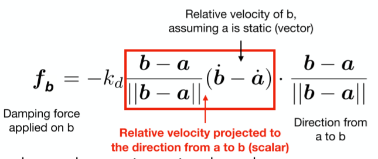
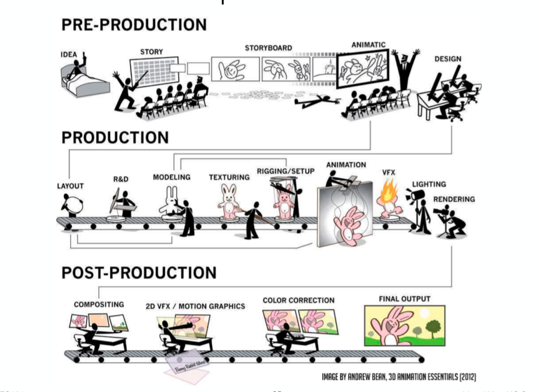
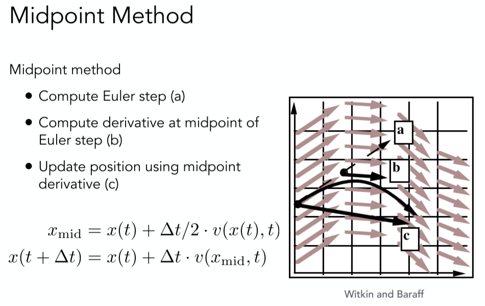
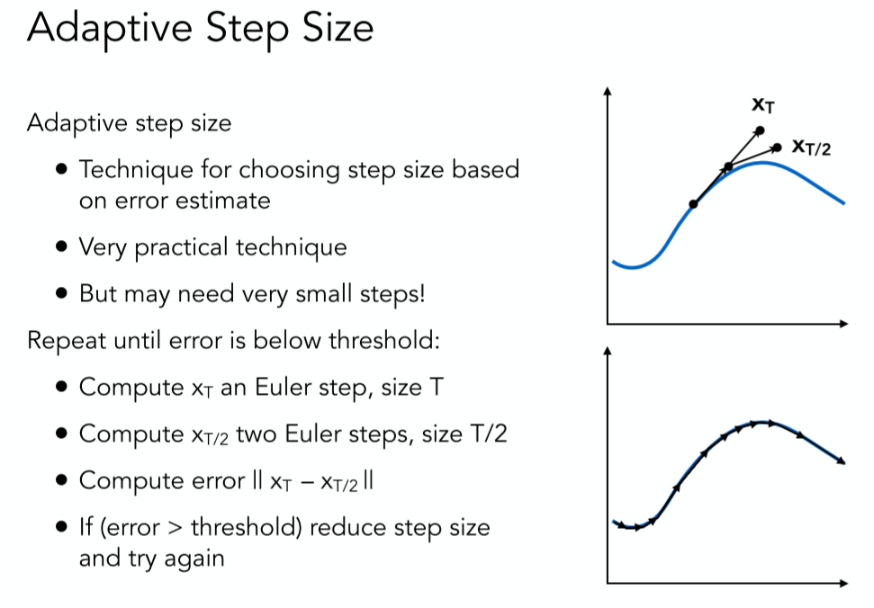
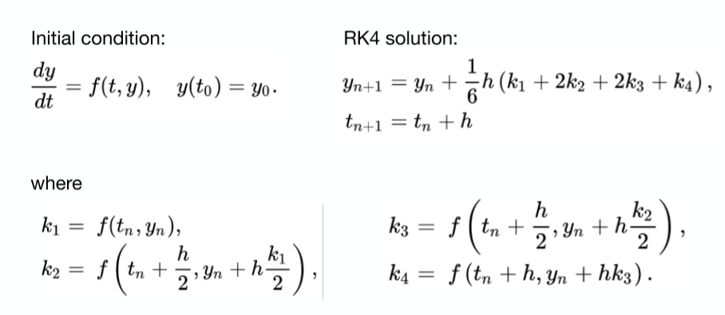

# Animation / Simulation
- 动画是一种信息传递的工具
    - 美学经常比技术重要
- 是模型的延伸→连续性
    - Represent scene models as a function of time
- 输出：sequence of images that when viewed sequentially provide a sense of motion
    - 电影：24FPS
    - 视频：30FPS、29.994FPS
    - VR：90FPS （不晕的基础要求）

## Keyframe animation关键帧动画

- Animator (e.g. lead animator) creates keyframes 关键帧
- Assistant (person or computer) creates in-between frames (“tweening”) 渐变帧

### 关键的技术难点 - Interpolation 插值

- Linear interpolation usually not good enough
- Recall splines for smooth / controllable interpolation

B样条……

## Physical Simulation物理模拟
* 模拟、仿真：推导、实现公式，模拟出物体应该怎么变化
* 例子：布料模拟、流体模拟

## 质点弹簧系统 Mass Spring System: Example of Modeling a Dynamic System
- A Simple Idealized Spring
    - 没有初始长度
    - 随着拉力线性增长/缩短，线性系数是spring coefficient: stiffness
    - Force pulls points together
    - Strength proportional to displacement (Hooke’s Law)
    - 问题：长度会倾向于0
- Non-Zero Length Spring
    - 初始长度Rest length不为零
    - Problem: oscillates forever 永远震荡

      $$\boldsymbol{f}_{a \rightarrow b}=k_{s} \frac{\boldsymbol{b}-\boldsymbol{a}}{\|\boldsymbol{b}-\boldsymbol{a}\|}(\|\boldsymbol{b}-\boldsymbol{a}\|-l)$$

      - $\frac{\boldsymbol{b}-\boldsymbol{a}}{\|\boldsymbol{b}-\boldsymbol{a}\|}$表示受力方向
      - $\|\boldsymbol{b}-\boldsymbol{a}\|-l$表示弹簧拉伸长度
- Dot Notation for Derivatives：(用点表示导数)

$$\begin{aligned} &\boldsymbol{x}\\ &\dot{\boldsymbol{x}}=\boldsymbol{v}\\ &\ddot{\boldsymbol{x}}=\boldsymbol{a} \end{aligned}$$

- Introducing Energy Loss
    - Simple motion damping 阻尼(对弹簧全局作用)

        $$\boldsymbol{f}=-k_{d} \dot{\boldsymbol{b}}$$

    - Behaves like viscous drag on
    - Slows down motion in the direction of velocity
    - $k_d$ is a damping coefficient
    - 问题：Slows down all motion
        - Want a rusty spring’s oscillations to slow down, but should it also fall to the ground more slowly? 跟全局速度挂钩
        - 无法表示弹簧内部的损耗

- Internal Damping for Spring

    
    - 相对运动越快,f就越大,所以跟局部加速度有关
    - 注意这里一定要将质量在相对加速度投影到弹簧ab方向,才是影响弹簧的力,比如旋转的时候加速度方向和弹簧方向垂直,不影响.

    - Viscous drag only on change in spring length
        - 粘性阻力仅在弹簧长度变化时
        - Won’t slow group motion for the spring system (e.g. global translation or rotation of the group)
          - 弹簧系统不会减慢群组运动（例如，群组的整体平移或旋转）
    - Note: This is only one specific type of damping 只是一种阻尼的近似

### Structures from Springs
* 通过质点弹簧系统来进行布料模拟
Step 1: Sheets

- This structure will not resist shearing切变会露馅
- This structure will not resist out-of-plane bending...

Step 2: 增加斜向方向弹簧

- This structure will resist shearing but has anisotropic bias 各向异性
- This structure will not resist out-of-plane bending either...

Step 3: 增加双斜向方向弹簧

- This structure will resist shearing. Less directional bias.
- This structure will not resist out-of-plane bending either... 弯折

Step 4: 增加横向和纵向 （skip connection）

- This structure will resist shearing. Less directional bias.
- This structure will resist out-of-plane bending （横向和纵向的弹簧力比斜向的弱很多）(对折)

***
有限元方法(FEM (Finite Element Method) Instead of Springs)

- 车辆碰撞

力传导扩散适合用有限元方法建模做

## Particle Systems
- 建模定义很多粒子
- 每个粒子有自己的属性

***

- Model dynamical systems as collections of large numbers of particles 
- Each particle’s motion is defined by a set of physical (or non-physical) forces
- Popular technique in graphics and games
  - Easy to understand, implement
  - Scalable: fewer particles for speed, more for higher complexity
***
- Challenges
  - May need many particles (e.g. fluids)
  - May need acceleration structures (e.g. to find nearest particles for interactions)

***
* 简易算法

```cpp
For each frame in animation
  [If needed] Remove dead particles
  Calculate forces on each particle
  Update each particle’s position and velocity
  [If needed] Create new particles
  Render particles
```
* 定义个体和群体之间的关系

### Particle System Forces
Attraction and repulsion forces

• Gravity, electromagnetism, …

• Springs, propulsion, … 

Damping forces

• Friction, air drag, viscosity, … 

Collisions

• Walls, containers, fixed objects, …

• Dynamic objects, character body parts, …

***

Example: Simulated Flocking as an ODE(常微分方程)

- 定义鸟儿之间交互的规则：个体对群体的观察
- Model each bird as a particle Subject to very simple forces:
- attraction to center of neighbors
- repulsion from individual neighbors
- alignment toward average trajectory of neighbors Simulate evolution of large particle system numerically Emergent complex behavior (also seen in fish, bees, ...)

Example: Molecular Dynamics

Example: Crowds + “Rock” Dynamics

## Kinematics
* 运动学：正向和反向

### Forward Kinematics 正向运动学

明确骨骼之间的运动关系→计算出各个部位的位置

Articulated skeleton

- Topology (what’s connected to what)
- Geometric relations from joints
- Tree structure (in absence of loops)

Joint types

- Pin (1D rotation)
- Ball (2D rotation)
- Prismatic joint (translation)

Strengths

- Direct control is convenient 
- Implementation is straightforward

Weaknesses

- Animation may be inconsistent with physics
- Time consuming for artists

### Inverse Kinematics 逆运动学
* 限制各个部位（通常只有终端）的位置、限制骨骼的运动方式→计算骨骼的运动
* 方便控制形体整体形状
* 解特别复杂，可能并不唯一,也可能无解

***

解法：随机化算法（优化方法，梯度下降）

Numerical solution to general N-link IK problem

• Choose an initial configuration

• Define an error metric (e.g. square of distance between goal and current position)

• Compute gradient of error as function of configuration

• Apply gradient descent (or Newton’s method, or other optimization procedure)

例子：Style-Based IK

### Rigging
通过控制点对三维物体进行控制(比如改变脸部表情,手势等)

* Rigging is a set of higher level controls on a character that allow more rapid & intuitive modification of pose, deformations, expression, etc.

* Important
  - Like strings on a puppet
  - Captures all meaningful character changes
  - Varies from character to character 
* Expensive to create
  - Manual effort 定控制点，拉控制点（应该怎么定、应该怎么拉 → 动画师）
  - Requires both artistic and technical training

### Blend Shapes 控制点间的位置插值计算
* Instead of skeleton, interpolate directly between surfaces
  - E.g., model a collection of facial expressions:
* Simplest scheme: take linear combination of vertex positions
* Spline used to control choice of weights over time

## Motion Capture
* 真人控制点反映到虚拟角色中去，需要建立真实和虚拟的联系

Data-driven approach to creating animation sequences

- Record real-world performances (e.g. person executing an activity)
- Extract pose as a function of time from the data collected

Strengths

- Can capture large amounts of real data quickly

- Realism can be high 

Weaknesses

- Complex and costly set-ups 复杂、花钱

- Captured animation may not meet artistic needs, requiring alterations 不符合艺术家要求，不可能实现的动作

- 捕捉条件限制

***
不同的捕捉方法：

- Optical (More on following slides)
    - Markers on subject
    - Positions by triangulation from multiple cameras
    - 8+ cameras, 240 Hz, occlusions are difficult
- Magnetic Sense magnetic fields to infer position / orientation. Tethered.
- Mechanical Measure joint angles directly. Restricts motion.

***
Challenges of Facial Animation

- Uncanny valley
    - In robotics and graphics
    - As artificial character appearance approaches human realism, our emotional response goes negative, until it achieves a sufficiently convincing level of realism in expression

## 动画的制作流程 The Production Pipeline


## Single Particle Simulation
* 假设粒子在的运动由速度场决定
  - 速度场是一个关于位置和时间的函数 $v(x,t)$
* 对于粒子我们知道在时间$t_{0}$的速度$v_{t0}$和位置$x_{t0}$
  - 我们要求的是任意时间$t_{1}$的位置$x_{t1}$

### Ordinary Differential Equation (ODE) 常微分方程
计算速度场内粒子的位置需要计算一阶常微分方程：

$$\frac{d x}{d t}=\dot{x}=v(x, t)$$

解一阶常微分方程：

- 连续：积分
- 离散：Euler’s Method欧拉方法
    - Explicit Euler method （forward 前向、显式）
        - 始终用前一帧的状态来更新后一帧

        $$\begin{array}{l} \boldsymbol{x}^{t+\Delta t}=\boldsymbol{x}^{t}+\Delta t \dot{\boldsymbol{x}}^{t} \\ \dot{\boldsymbol{x}}^{t+\Delta t}=\dot{\boldsymbol{x}}^{t}+\Delta t \ddot{\boldsymbol{x}}^{t} \end{array}$$

        - Simple iterative method
        - Commonly used
    - 问题:
        - Very inaccurate 很不准确:步长越大越不准确
            - With numerical integration, errors accumulate
            - Euler integration is particularly bad
        - Most often goes unstable 不稳定
            - 容易出现正反馈，离正确结果越来越远
            

## Instability and improvements 
Solving by numerical integration with finite differences leads to two problems:

Errors 误差 不是特别大的问题

- Errors at each time step accumulate. Accuracy decreases as simulation proceeds
- Accuracy may not be critical in graphics applications

Instability **不稳定性 很要命！**

- Errors can compound, causing the simulation to **diverge** even when the underlying system does not 收敛很重要！
- Lack of stability is a fundamental problem in simulation, and cannot be ignored

## Combating Instability
### Midpoint method
* 用一次欧拉方法得到a点
* 取起点到a点的终点b,得到对应的速度
* 在起始点应用b点的速度进行欧拉方法,得到c点



### Adaptive Step Size
* 用一次欧拉方法得到$X_{T}$点
* 在中点处再用欧拉方法得到$X_{T/2}$点
* 判断两个点之间的距离,超过一定距离递归的缩小步长



### Implicit Eulr Method
- Use the velocity at the next time step (hard)

$$\begin{array}{l} \boldsymbol{x}^{t+\Delta t}=\boldsymbol{x}^{t}+\Delta t \dot{\boldsymbol{x}}^{t+\Delta t} \\ \dot{\boldsymbol{x}}^{t+\Delta t}=\dot{\boldsymbol{x}}^{t}+\Delta t \ddot{\boldsymbol{x}}^{t+\Delta t} \end{array}$$

- 是一个方程组，有三个未知数，只能假设一个已知（猜）
- Use root-finding algorithm, e.g. Newton’s method
- Offers much better stability
- Implicit Euler has order 1, which means that
    - Local truncation error: O(h^2) and
    - Global truncation error: O(h) (h is the step, i.e. ∆t)

    O(h)的理解

    - If we halve h, we can expect the error to halve as well
    - 阶数越高越好，减小步长的情况下降低更快

### Runge-Kutta Families
* A family of advanced methods for solving ODEs
* Especially good at dealing with non-linearity
* It’s order-four version is the most widely used, a.k.a. **RK4**



更多：Numerical Analysis 对图形学有用 （其他的：信号处理）

### Position-Based / Verlet Intergation
- Constrain positions and velocities of particles after time step

假设弹簧无限大

Idea:

- After modified Euler forward-step, constrain positions of particles to prevent divergent, unstable behavior
- Use constrained positions to calculate velocity
- Both of these ideas will dissipate energy, stabilize

Pros / cons

- Fast and simple
- Not physically based, dissipates energy (error)

## Rigid body simulation

不会形变

Simple case

- Similar to simulating a particle
- Just consider a bit more properties 拓展

## Fluid Simulation
### A Simple Position-Based Method

模拟只需要输出物体的位置，其他的就是渲染的问题了

Key idea

- Assuming water is composed of small rigid-body spheres 水是由小球组成的
- Assuming the water cannot be compressed (i.e. const. density) 不可压缩
- So, as long as the density changes somewhere, it should be “corrected” via changing the positions of particles 密度有变化，就要想着改回去，移动小球位置
- You need to know the gradient of the density anywhere w.r.t. each particle’s position

    一个小球位置的变化对其周围密度的影响

- Update? Just gradient descent! 梯度下降

非物理

## 流体模拟中两种不同的思路：Eulerian vs. Lagrangian

Lagrangian：质点法，以每个元素为单位模拟

Eulerian：网格法，以空间为单位分割模拟

### Material Point Method (MPM)

Hybrid, combining Eulerian and Lagrangian views

- Lagrangian: consider particles carrying material properties 物质由粒子组成，粒子有属性
- Eulerian: use a grid to do numerical integration 网格上计算如何运动
- Interaction: particles transfer properties to the grid, grid performs update, then interpolate back to particles 网格属性写回网格内粒子上