# 计算机图形学概述
* Course Topics (mainly 4 parts)
  - Rasterization
  - Curves and Meshes
  - Ray Tracing
  - Animation / Simulation

# 向量与线性代数
## Dot Product in Graphics
### Find angle between two vectors
* 余弦定理

### Find projection of one vector on another


### Measure how close two directions are
* 两个单位向量点乘越接近1则越接近，越接近-1则越远离

### Decompose a vector
* 利用点乘投影


### Determine forward or backward
* 给定前向向量a,与向量b的点乘大于0则前向，小于0则后向


## Cross Product in Graphics
### Determine left/right
* 对应给定坐标系如图右下角,判断向量a与向量b的关系,可通过$\vec{a} X \vec{b}$,根据右手螺旋定则（右手握拳，从b向量转到a向量，则大拇指朝z轴负方向.）,则向量a在向量b的右边.


* 总结：任意两个向量a,b的叉乘
    -   结果为朝坐标轴正方向,a在b的左侧
    -   结果为朝坐标轴负方向,a在b的右侧

### Determine inside/outside
* 如果某一点p在三角形所有边的同一侧,则该点在三角形内部,否则在外部.


# 变换（二维与三维）
## 2D变换
* 2D旋转变换矩阵（逆时针）
$$
\left[
    \begin{matrix}
        cos\theta & sin\theta \\
        -sin\theta & cos\theta \\
    \end{matrix}
\right]
$$

* 线性变换：缩放、对称、错切、旋转
> 形式: $X^{'} = Mx$,变换能写成**同维**矩阵

### Homogeneous Coordinates（齐次坐标）
* 目的:让变换全部统一写成一个矩阵*一个向量

### 齐次坐标定义
* 2D point = $(x,y,1)^{T}$
* 2D vector = $(x,y,0)^{T}$

### w坐标的意义
* vector + vector = vector;
* point - point = vector;
* point + vector = point;
* point + point = 这两点的中点
> 齐次坐标$(x,y,w)^{T}$代表的2D点为$(x/w,y/w,1)^{T},w!=1$

### 仿射变换
* 仿射(Affine)变换 = 线性变换 + 平移

### 变换顺序
* 变换顺序不存在交换律.先平移后旋转和先旋转在平移结果不一样
* 数学解释：矩阵乘法不存在交换律
* 几何解释：进行变换的时候坐标轴也会一起变换，旋转后的坐标轴和旋转前的坐标轴以及不一样.

### 变换的分解
* 绕任一点P旋转:
    - T(-c):将旋转点平移到原点.
    - R(alpha):旋转
    - T(c):平移回去

### 仿射变换矩阵是先线性变换还剩先平移
* 先线性变换再平移
> 数学解释：可以利用分块矩阵的推导

## 3D变换
### 3D旋转
* 绕x,y,z轴旋转（右手系）
  


#### 为什么y的旋转矩阵是反的
* 如果坐标轴按x,y,z顺序,则x与y叉乘得到z,y和z叉乘得到x，**z和x叉乘得到y**
* 所以对于绕y轴旋绕与绕x轴与y轴是相反的.

* roll,pitch,yaw.

* Rodrigues' Rotation Formula(罗德里格旋转公式)
> 用于任意角度的旋转

### 四元数和万向结死锁
#### 四元数
* 待补

#### 万向结死锁
[3D游戏世界里的万向节锁](https://zhuanlan.zhihu.com/p/42519819)

* 万向结死锁就是一个物体在一个3D世界里面随着旋转顺序和旋转角度的改变，导致物体只能在一个固定的平面旋转，无法旋转到你预想的角度。由于物体的旋转，物体的坐标轴方向也发生了改变，导致其中2条坐标轴发生了重合。当你围绕着重合的坐标轴旋转时，物体的旋转方向始终在一个平面上旋转。

## Viewing（观测）变换
### Model（模型）变形
* 将物体从局部坐标系变换到世界坐标系.

### view（视图）变换
* how to define the camera
    - Position $\vec{e}$
    - Look-at /gaze direction $\hat{g}$
    - Up direction $\vec{t}$(assuming perp. to loo-at)


#### 相机摆放通用做法
    - The origin,up at Y,look at -Z
    - And transform the objects along with the camera

* 原因：为了方便之后的投影变换


* 如何操作
    - 平移直接操作
    - 旋转操作难以写出,先写逆变换，再算逆矩阵

## Proejection（投影）变换
### 正交投影
* 特点； 不会近大远小

* 方法: We want to map a cuboid [l, r] x [b, t] x [f, n] (注意越远z值越小) to
the “canonical (正则、规范、标准)” cube $[-1, 1]^{3}$
    - Center cuboid by translating
    - Scale into “canonical” cube


### 透视投影
* 特点：近大远小

* 方法：
    - First “squish（挤压）” the frustum（椎体） into a cuboid (n -> n, f -> f) ($M_{persp->ortho}$)
  - Do orthographic projection (Mortho, already known!)

* 透视投影变换矩阵
    $$M_{persp} = M_{ortho}M_{persp->ortho}$$

* 其中M_{persp->ortho}推导
    - 挤压规则
      - 近平面不变-(1)
      - 远平面z值不变-(2)
      - 远平面中点不变-(3)
    - 变换矩阵推导
      - 通过相似三角形求出变换矩阵第1,2,4行
      - 通过(2),(3)解出第三行参数
> 详细见ppt

$$
M_{persp->ortho} =
\left[
    \begin{matrix}
        n & 0 & 0 & 0 \\
        0 & n & 0 & 0 \\
        0 & 0 & n+f & -nf \\
        0 & 0 & 1 & 0 \\
    \end{matrix}
\right]
$$
* 其中n为近平面z值,f为远平面z值

#### 进行挤压后在近平面和远平面之间的点会这么移动？
* 待补

# 光栅化
## 透视投影补充
* fovY(field-of-view)(Y方向视角)
* aspect ratio(宽高比)


## viewport transform
* 将经过投影变换转换到裁剪空间的坐标通过视口变换转换到屏幕坐标

* 方法：
    - Irrelevant(忽略) to z
    - Transform in xy plane: $[-1, 1]^{2}$ to [0, width] x [0, height]


## 显示器
* CRT(阴极射线管)
    - 隔行扫描
* LCD(液晶)
* LED(发光二极管)
* Electrophoretic Display(墨水瓶)

## Triangle Meshes
* 优点
    - 最基本的多边形
      - 任何多边形都可以拆成多边形
    - 三角形内部一定是平面的
    - 三角形内外定义明确
    - 容易使用重心坐标插值

* Sampling(采样)
    - 连续函数离散化的过程

* 如何光栅化,判断每个像素点是否在三角形内部
    - 遍历像素点
    - 通过叉积判断点是否在三角形内部

* 如果点在三角形边界上,要么不处理要么特殊处理
* 可以通过包围盒减少需要采样的像素

## 反走样
* 走样定义：High-frequency signal is insufficiently sampled: samples erroneously appear to be from a low-frequency signal
Two frequencies that are indistinguishable at a given sampling rate are called “aliases”
> 高频信号采样不足：样本错误地显示为来自低频信号,在给定的采样率下无法区分的两个频率称为走样

### Sampling Artifacts（采样伪影）的表现
* Jaggies(锯齿) - Sampling in space
* Moire Patterns(摩尔纹) - understanding images
* Wagon wheel effect(倒着转的轮子) - sampling in time
*** 
* 产生走样的表现：Signals are changing too fast (high frequency), but sampled too slowly

### 频域
* Fourier Transform(傅里叶变换)
* spatial domain -> 傅里叶变换 -> frequency domain

### 滤波
* Filtering = Getting rid of certain frequency contents
* 一个图像可以通过傅里叶变换转换到频域空间
    - 高频信息是图像中的细节或边界
      - 高通滤波可以获取图像边界
    - 低筒信息是图像的其他信息
      - 低筒滤波获取的是缺少细节的图片

***

* Filtering = Convolution(=Averaging)
* 卷积定理
Convolution in the spatial domain is equal to multiplication in the frequency domain, and vice versa(反之亦然)
    - 卷积方法
      - Option 1: 
          - Filter by convolution in the spatial domain 
      - Option 2:
          - Transform to frequency domain (Fourier transform) 
          - Multiply by Fourier transform of convolution kernel 
          - Transform back to spatial domain (inverse Fourier)
* 反过来,时域上的乘积在频域上是卷积

***
* Box Filter = Low Pass Filter

$$
\frac{1}{9} *
\left[
    \begin{matrix}
    1 & 1 & 1 \\
    1 & 1 & 1 \\
    1 & 1 & 1 \\
    \end{matrix}
\right]
$$

* Wider Filter Kernel = Low Frequencies
> 卷积核越大，低通部分越少(考虑边界情况,卷积核越大越模糊，越模糊，越只有低通部分)

### 采样
* 采样 = Reapeating Frequency Contents
    - (c),(d)为在时域和频域上的冲击函数
    - 在时域上采样相当于在频域上将原始波形按照在频域上的冲击函数进行复制


* Aliasing = Mixed Frequency Contents
    - 在时域上采样越稀疏,在时域上复制的间隔就会越小,小到一定程度,波形之间就会产生堆叠,造成走样


### 反走样的方法
- Option 1: Increase sampling rate
    - increasing the distance between replicas in the Fourier domain
    - Higher resolution displays, sensors, framebuffers
    - costly & may need very high resolution
- Option 2: Antialiasing
    - Filtering out high frequencies before sampling
    - 于是就不会有重叠了：
      - 先Filter(滤波)再采样 -> Antianliasing(反走样)
        - 对图像进行模糊就说对图像进行高通滤波
      - 先采样再Filter -> Blurred Aliasing
        - 先采样后模糊（Filter）是不行的,波形重叠的情况下截断依然会有重叠

* 补充:
> 不论是高频的锯齿，还是低频的模糊，对于原信号来说，都是损失了信息。不同的是，不滤波直接采样的话对信息的提取是截断式的，它直接丢弃了原信号的一部分信息，所以你看上图右边图像信息出现了跳跃；而进行低通滤波是对原信号进行了加权平均，原信号携带的大部分信息多多少少以一定的比例存在于模糊后的信号中。信息多总比信息少好，此为什么要先滤波，后采样之原因之一。

> [渲染时采完样后为什么要移除高频部分后再采样，想问为什么要移除高频，直接重采样不就好了？](https://www.zhihu.com/question/351820035)

作者：幽玄
链接：https://www.zhihu.com/question/351820035/answer/870609167
来源：知乎
著作权归作者所有。商业转载请联系作者获得授权，非商业转载请注明出处。

* Antialiasing = Limiting, then repeating


### 抗锯齿方法
* 最理想的状态：像素的颜色为该像素内各颜色的均值。但是连续域的平均值是很难求的，计算量巨大
* SSAA
    - 比如4x ssaa,先渲染到4x的buffer上，然后每4个像素采样后取平均值，计算量和缓存都提高了4x.
* MSAA(做的是模糊这个操作,sample只是包含在了模糊操作内):
    - 在光栅化阶段,判断一个三角形是否被像素覆盖的时候会计算多个覆盖样本（Coverage sample）,在pixel shader着色阶段计算像素颜色的只计算一次,将该像素颜色定义为各个采样点颜色的均值.
    - 可以通过只检测边缘、检测点复用等方法提高效率.
    - 不兼容延迟渲染.
* FXAA(Fast Approximate AA)
    - 先得到带锯齿的图片，然后找到锯齿边界，替换带锯齿的边界.
      - 找到边界，换成没有锯齿的边界，（图像匹配）非常快
      - 方法和采样无关，采样虽然有误，但是这种方法可以弥补
* TAA(Temporal AA)
    - 时间抗锯齿
      - 静态场景，相邻两帧同一像素用不同的位置来sample
      - 把MSAA的Sampling分布在时间上
* 超分辨率
  - From low resolution to high resolution
  - Essentially still “not enough samples” problem 类似抗锯齿
  - DLSS (Deep Learning Super Sampling) 

## 可见性/遮挡
* 画家算法
> 将画从最远的地方开始画

> 不能解决场景中出现互相遮挡的情况


### Z-Buffer
* 方法:
    - 对每个像素多存一个深度
    - Frame buffer存储每个像素的颜色信息
    - depth buffer(z-buffer)存储每个颜色的深度信息
        - z总是正的(距离原点的距离),越小越近,越大越远

* 复杂度：O(n) for n triangles 并不是排序，而是只要最值

* 需要保证三角形进入顺序和结果无关

* 无法处理透明物体

* 结合msaa的话z-buffer需要对每个采样点记录深度

# shading(着色)
* shading:The process of applying a material to an object.

## Blinn-Phong Reflectance Model
* shading is Local
    -  shading  != shaow

### Diffuse Reflection
* Light is scattered uniformly in all directions
    -  Surface color is the same for all viewing directions
* Lambert's cosine law:定义物体接受到多少光照

$$
L_{d}=k_{d}\left(I / r^{2}\right) \max (0, \mathbf{n} \cdot \mathbf{l})
$$
* $L_{d}$:漫反射
* $k_{d}$:漫反射系数(定义该shading point的颜色(材质))
* $I/r^{2}$:到达着色点的能量大小
    - I:单位光照强度
    - r:距离
* $max(0,\mathbf{n} \cdot \mathbf{l})$:着色点接受的能量

***

* 漫反射跟view(观测方向)没有关系

### Specular 
* 高光的强度取决于光线的反射方向和人的观察方法之间的距离.
    - 镜面反射方向越接近观察方向就越亮

* 原始phong模型,计算镜面反射方向与观察方向的接近程度.
    - 缺点:计算复杂
* blinn-phong改进:比较半程向量和shaing poing的法线的接近程度.

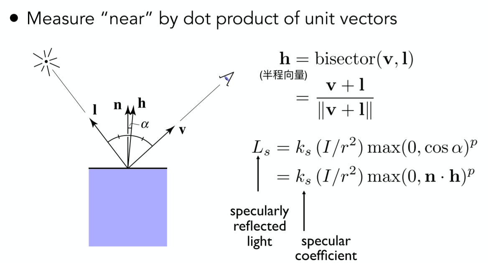

* $L_{s}$:高光
* $K_{s}$:高光系数:调节高光亮度.
* $p$:光泽度:一般100~200，调节高光区域大小.

### Ambient
* Add constant color to account for disregarded illumination and fill in black shadows
> 添加恒定的颜色以考虑忽略的照明并填充黑色阴影
* this is approximate / fake

$$L_{a} = k_{a}I_{a}$$

* $L_{a}$:环境光
* $k_{a}$:环境光系数:环境光颜色
* $I_{a}$:光照强度

***
* Blinn-Phong Reflection Model

$$ 
    L = L_{a} + L_{d} + L_{s} \\
     = K_{a}I_{a} + k_{d}(I/r^{2})max(0,\mathbf{n} \cdot \mathbf{l}) + k_{s}(I/r^{2})max(0,\mathbf{n} \cdot \mathbf{h})^{p})
$$

## Shading Frequencies 着色频率
* Flat shading
    - 恒定着色指的是根据多边形上某个像素的光照情况对整个多边形着色。换句话说，假设多边形是由一种材质构成的。
      - 每一个三角面一个法线,对每一个面进行一次着色.
    - 缺点:对于平面组成的物体，这种方法是可行的;但是对于由曲面组成的物体，使用多边形近似，这种方法导致物体看起来是由多边形组成的。
* Gouraud(高洛德) shading
    - Gouraud 着色是分别计算三角形三个顶点的光照情况，然后通过重心坐标插值的方式来决定三角形内每一点的颜色。
    - 缺点:对高光的插值不好，因为高光往往比较锐利，如果原本该面上有高光，但是顶点处没有高光，那么插值后，这个面就没有高光。
    - 优点：效果不错，计算量小
* Phong shading
    - phong着色通过插值计算屏幕空间多边形每个像素的法线，然后根据法线来执行光照计算。
    - 优点：它对每个像素执行光照计算，真实感比gouraud着色强些，提高了镜面反射效果。
    - 缺点：计算量比较大
> 参考:[着色模型(频率)](https://zhuanlan.zhihu.com/p/362201067)

* 几何足够复杂的情况下，用简单的Shading方法也可以达到好的效果
* 好的效果一般需要大的计算量

### 定义逐定点法线
* 相邻面的法线的加权平均(根据相邻三角面的面积进行加权)

### 定义逐像素法线
* Barycentric interpolation
    - 求出的法线需要归一化

## 渲染管线


* Vertex Processing
    - MVP Transform
    - Shading
        - Gouraud(高洛德) shading
* Rasterization Processing
    - Sampling triangle converage
* Fragment Processing
    - Z-Buffer Visiblity Tests
    - Shading
      - Phong shading

## 纹理映射(Texture Mapping)
* 三维物体表面都是二维的.
* 纹理：图，有弹性，可以映射到表面
* UV和物体的对应关系是美工干的事情
* UV坐标:在纹理上简历的坐标系
    -   $UV \in [0,1]^{2}$
- 一张纹理可以使用多次
- 纹理本身设计可以无缝衔接→tilable
    - 一种方法：Wang Tiling

## Barycentric Coordiantes(重心坐标)
* 插值目的: obtain smoothly varying values across triangles.
* 插值内容: texture coordinates.colors,normal vectors,...
* 插值方法: 重心坐标

$$(x,y) =  \alpha * \mathbf{A} + \beta * \mathbf{B} + \gamma * \mathbf{C} $$
$$ \alpha + \beta + \gamma = 1$$

* 如果三个系数都为非负 <=> (x,y)在三角形内部
    - 通过面积比求系数

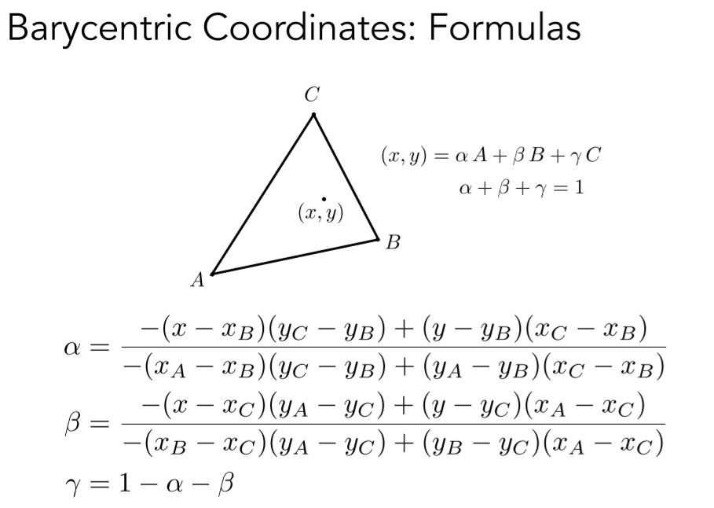

* 重心坐标在投影变换后不一定一样.
    - 深度
        -在空间中做插值,不能在投影后进行插值.

## Appying Textures.

```cpp
for each rasterized screen sample(x,y)//Usually a pixel's center.
    (u,v) = evaluate texture coordinate at (x,y);//重心坐标
    texcolor = texture.sample(u,v);
    set sample's color to texcolor;//Usually the diffuse albedo Kd
```

## Texture Magnidication - what if the texture is too small
* texel(纹理元素,纹素):A pixel on a texture(纹理上的像素)

* 多个pixel映射到了同一个texel
* 纹理查询时对于非整数uv坐标应该如何处理
    - Nearest(找最近的点)
    - Bilinear(双线性插值)
    - Bicubic(双向三次插值)
      - 周围16个点做三次插值
      - 运算量更大，结果更好

## Texture Magnification - What if the texture is too large
* 一个pixel对应了多个texel → 采样频率不足导致 摩尔纹+锯齿（走样）

* 方法
    - Supersampling
        - 太慢
    - Just need to get the average value within a range
        - Point Query vs. (Avg.) Range Query.
            - 点查询:线性插值.
            - 范围查询:范围内平均查询

### mipmap
* Allowing(fast,approx.,square(正方向))range queries
    - 方法:每一层把前一层高宽缩小一半.
    - 生成Mipmap要多1/3的存储量
* 计算Mipmap层级D
    - 通过待求像素和其邻居来求在纹理上纹素的范围.
        - 如果纹素为L*L为整数
            - 在$log_{2}L$层查询对应的某一个纹素.
        - 如果L不为整数.
            - 三线性插值.
                - 分别在floor(D)和ceil(D)上做Bilinear Interpolation取颜色值之后再插值

***

* overblur:mipmap的缺点,在远处模糊的太过损失细节.
    - 原因:方块查询,各种近似

* Anisotropic Filtering(各向异性过滤)
    - 各向异性:在各个方向表现不同
    - Ripmaps and summed area tables
    - Can look up axis-aligned rectangular zones
    - 长/宽/长和宽 各减半
    - 生成需要3倍的存储量
    - 2(4,8,16)x:长宽压缩2(4,8,16)倍
        - 存储逐渐收敛到3倍
* EWA filtering
    - 在形状分解为不同的圆形
    - 利用多次查询求平均值的方法来处理不规则区域

## Application of Texture
* In modern GPUs,texture = memory + range query(filtering)
  - General method to bring data to fragment calculations

Many applications

- Environment lighting - Environment Map
    - 环境光贴图:记录场景中的环境光
    - 例子：Utah Teapot
        - 经典：Stanford Bunny,Dragon，Cornell Box
    - Spherical Environment Map
        - 球心：世界中心
        - 一个问题：球面展开会发生拉伸,导致畸变
        - 解决方法：Cube Map
    - Cube Map：立方体表面，从球心到球面的投影向外
        - 扭曲更少，但是Need dir->face computation，计算量更大

Many applications
- Store microgeometry(储存微几何)
    - Textures can affect shading! → define height/normal → Bump / Normal Map
        - 两者类似，都可以以假乱真
        - 改变表面的法线

    - Bump Mapping 凹凸贴图

        Bump Mapping的Texture记录了高度移动

        - 不改变几何信息(不改变三角形信息)
        - 逐像素扰动法线方向
        - 高度 offset 相对变化，从而改变法线方向
        - 计算法线方向：切线的垂直方向

    - Displacement mapping 位移贴图
        - 输入相同（Texture与Bump Mapping可共用）
        - 改变几何信息，对顶点做位移
        - 相比上更逼真，要求模型足够细致，运算量更高
        - DirectX有Dynamic的插值法，对模型做插值，使得初始不用过于细致
    - Procedural textures
        - 3D Procedural Noise + Solid Modeling
            - 定义空间中任意点的颜色
            - 噪声+映射→
            - Perlin Noise
    - Provide Precomputed Shading
        - Ambient occlusion texture map
            - 计算好的环境光遮蔽贴图
            - 空间换时间
    - Solid modeling & Volume rendering
        - 三维渲染

## shaow mapping
光栅化下对全局光线传输、阴影的处理十分麻烦。
- draw shadows using rasterization
- An Image-space Algorithm
    - 不需要场景的几何信息
    - 有走样现象
    - 思想：the points NOT in shadow must be seen both by the light and by the camera

* 步骤
    - Pass1: Render from Light
      - generate depth image from light source
    - Pass2A: Render from Eye
      - generate Standrad image(with depth) from eye
    - Pass2B: Project to light
      - Project visible points in eye view back to light source

* 问题：
- 走样、分辨率
- 数值精度问题
    - Involves equality comparison of floating point depth values means issues of scale, bias, tolerance
        - 涉及浮点数深度值的相等性比较意味着比例、偏差、公差等问题
- 只能点光源、硬阴影
- Quality depends on shaow map resolution

# 几何
## 表示形式
* 隐式表示
    - 形式: $f(x,y,z) = 0$
    - based on classifying points
      - points satisfy some specified relationship
    - pros
        - compact description (e.g., a function)
        - certain queries easy (inside object, distance to surface)
        - good for ray-to-surface intersection (光线求交,more later)
        - for simple shapes, exact description / no sampling error
        - easy to handle changes in topology (e.g., fluid) 
    - cons
      - Sampling can be hard
      - difficult to model complex shapes
    - many implicit representations in graphics:
      - Algebraic surface
        - 最直接的，用数学公式
        - 不直观
      - Constructive solid geomentry(CSG)
        - 基本形状的布尔操作组合成复杂形状
        - Combine implicit geometry via Boolean operations
      - Distance Functions(距离场)
        - giving minimum distance(could be signed distance) from anywhere to object.
      - level set methods(s水平集)
        - store a grid of values approximating function
        - 例子：CT扫描,等高线
      - fractals
        - 自相似
        - 递归
* 显式表示
    - 形式:$f:R^{2} \rightarrow R^{3}; (u,v) \rightarrow (x,y,z)$
    - All points are given directly or via parameter mapping
    - Pros
      - Sampling is Easy
    - cons
      - Inside/outside Test Hard
    - many explicit Representations in Graphics
      - point cloud
        - 一堆点
        - 可以表示任何几何
        - Useful for LARGE datasets (>>1 point/pixel)
        - Often converted into polygon mesh
        - Difficult to draw in undersampled regions(在采样不足的区域很难绘制)
      - Polygon mesh
        - store vertices & polygons(often triangles or quads)
        - easier to do processing /simulation,adaptive sampling
        - more complicated data structures
        - perhaps most common representation in graphics
          - obj文件
      - subdivision surfaces
      - NURBS
      - Bezier surfaces

## 曲线 Curve

### Bézier Curves  贝塞尔曲线

一条由四个点（其实是任意≥3个点）定义的曲线：

- p0和p3定义起点和终点
- p1和p2定义起点与终点的切线方向（与p0和p3一起）

Evaluating Bézier Curves (de Casteljau Algorithm)

例子：(quadratic Bezier 二次贝塞尔曲线)


计算方法：


一些性质：


- 仿射变换前后统一
- 凸包性质：形成的曲线一定在控制点形成的凸包内

## piecewise Bezier Curves(分段贝塞尔曲线)
* 高阶bezier曲线不容易控制

* instead,chain many low-order bezier curve
    - Piecewise cubic bezier the most common technique

* 连续性
    - $C^{0}$连续:连接处值相等
    - $C^{1}$连续:连接处一阶可导
    - ...
    - $G^{0}$连续:等于$C^{0}$
    - $G^{1}$连续:

## 样条
* Spline (样条)：a continuous curve constructed so as to pass through a given set of points and have a certain number of continuous derivatives. （a curve under control）
> 样条曲线：一种连续曲线，构造成通过一组给定的点并具有一定数量的连续导数(控制下的曲线）

### B-splines
* bezier曲线缺点
    - 一旦确定特征多边形，就确定了曲线的阶次
    - Bezier曲线拼接复杂（需要满足几何连续性，参数连续性等）
    - Bezier曲线不能作局部修改（只能整体修改）

- basis splines 基函数样条
- 满足局部性
- 可能是图形学里面最复杂的一部分
- 是贝塞尔曲线的超集

* Further：B样条、NURBS（非均匀有理B样条）[https://www.bilibili.com/video/av66548502](https://www.bilibili.com/video/av66548502)

## 曲面
* 两个不同时间t（u,v）
    - 4x4个点，四条4个控制点的贝塞尔曲线，取同一时间（比如说u）获得四个控制点，取时间v，即获得最后的曲面上的点


## Mesh Subdivision
- Increase resolution

* 细分的应用场景：Displacement mapping 位移贴图 需要模型足够细致，于是需要细分（最好是动态细分）

### Loop Subdivision
**Loop是发明者名字，跟循环没关系**

- 局限
    需要三角形Mesh

步骤： 

1. create more triangles (vertices)

    Split each triangle into four

2. **tune their positions （形状需要有改变）**

    Assign new vertex positions according to weights

    New / old vertices updated differently 新老点分别改变


### Catmull-Clark Subdivision(General Mesh)
* 适用任何Mesh

* 方法


* 顶点调整


## Mesh Simplification
- Decrease resolution
- Try to preserve shape/appearance
***
* Goal: reduce number of mesh elements while maintaining the overall shape

### Edge collapse:边坍缩
- 哪些边合并？如何合并？
    - Quadric Error Metrics（⼆次误差度量）放在二次误差之和最小的地方
      - Quadric Error: new vertex should minimize its sum of square distance(L2 distance) to previously related triangle planes.

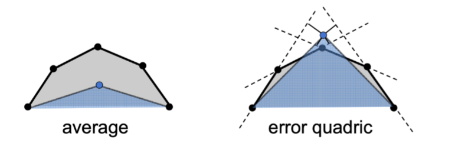


Simplification via Quadric Error

- Garland & Heckbert 1997.
- iteratively collapse edge with smallest score
- 有问题，一条边的操作会影响其它边，需要更新
    - 数据结构：优先队列 or 堆
- 贪心算法，非全局最优
- 可以有的放矢

## Mesh Regularizatiom
- （不会出现特别奇怪的三角形）
- Modify sample distribution to improve quality

# 光线追踪
使用光线追踪的原因:
* 光栅化不能很好的处理全局效果.
    - soft shadows
    - Glossy reflection
    - indriect Illumination
- 光栅化：快速近似、质量低
- 光线追踪：准确、非常慢
    - 实时,offline渲染
    - 实际生产中，渲染电影的一帧=～10000CPU小时

## Basic Ray-Tracing Algorithmn
* 关于光线的定义:
  - 假设近似直线传播（实际物理中光线有波粒二象性）
  - 光线交叉互不影响（实际物理存在交叉）
  - 从光源到人眼～从人眼到光源（光路可逆性）

Tracing：从相机出发，向场景投射光线

### Ray casting(appel 1968)
1. Generate an image by casting one ray per pixel

    从眼睛出发，经过像素点，射向场景

    判断最近碰撞物体，Shading计算颜色

2. Check for shadows by sending a ray to the light


### Recursive (Whitted-Style) Ray Tracing
光线弹射多次：Recursive (Whitted-Style) Ray Tracing
- Shading：每次折射点都计算一次颜色值，最后累加


### Ray-Surface Intersection
* Ray qeuation:

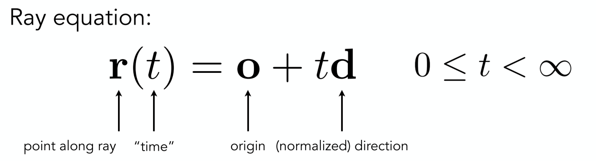

#### ray Intersection With Sphere
* 球方程:$\mathbf{p}: (\mathbf{p} - \mathbf{c})^{2} - R^{2} = 0$
* 交点求法:联立光线方程和球方程,得

$$(\mathbf{o}+t \mathbf{d}-\mathbf{c})^{2}-R^{2}=0$$

* 然后求根

### ray Intersection with 隐式表面

* 推广到隐式表面,联立下面方程求根
    $$\mathbf{p} : f(\mathbf{p}) = 0$$
    $$f(\mathbf{o}+t \mathbf{d})=0$$

### ray Intersection with 显式表面-Triangle Mesh
- 光线和三角形求交的作用
  - Rendering:Visibility,shaows,lighting
- Geometry:inside/outside test
  - 射线法:对于封闭区域,对任意一点p射出一条线,如果与封闭区域有奇数个交点则在区域内,否则在区域外
- 如何判断光线和物体相交.
  - simple idea:intersect ray with each triangle\
    - 缺点:slow
    - 加速方法:kdtree,bouding box

- 光线与三角形求交的方法
  - Triangle is in a plane
    - 平面定义:点法式 $\mathbf{p}:(\mathbf{p}-\mathbf{p'} )\cdot \mathbf{N} = 0$
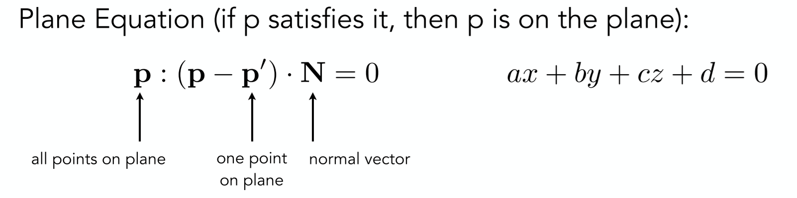
  - Get Ray-plane intersection
    - 联立平面方程和光线方程
    - Möller Trumbore Algorithm: 计算交点
        - A faster approach, giving barycentric coordinate directly
        - 判断合理：t为正
        - 判断在三角形内：重心坐标三个系数均为正
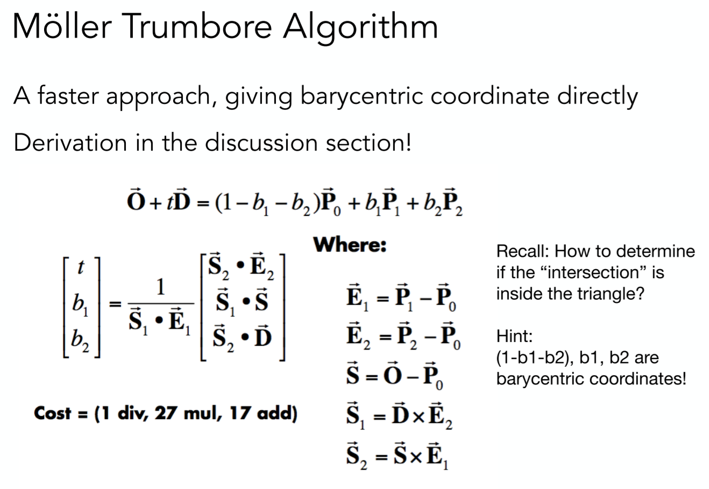
  - Test if hit point is inside triangle

## Accelerating Ray-Surface Intersection

原始：每根光线和每个三角形求交（太慢！）

加速：包围盒,kdtree

### Bounding Volumes 包围盒

- bound complex object with a simple volume
- 碰不到包围盒，就肯定碰不到里面的物体

We often use an **Axis-Aligned Bounding Box (AABB)**(轴对其包围盒)
> 三对面与坐标轴平行

* 有点
    - 光线与包围盒求相交的时候,只需要将光线分解为沿坐标轴的分量计算即可.

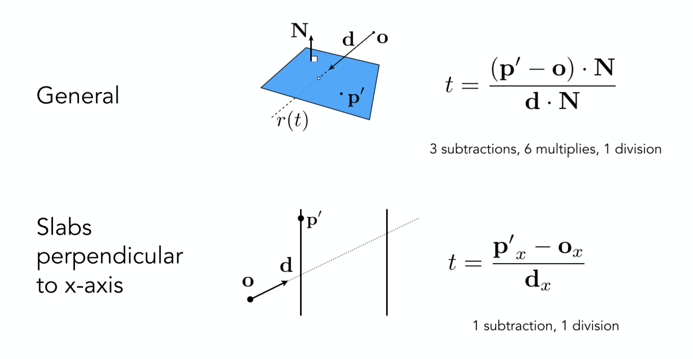

#### Ray Intersection with Axis-Aligned Box
- 原理：
    - The ray enters the box only when it enters all pairs of slabs.
    - The ray exits the box as long as it exits any pair of slabs
- 首先,求出三对面形成的交集 xmin, xmax, ymin, ymax, zmin, zmax
- 判断求交：光线与三对面的交点：三组(tmin,tmax) 如果有交集（即有同时在三对面内的时间），则与盒子有交
- $t_{enter} = max(t_{min})$
- $t_{exit} = min(t_{max})$

***

- If $t_{enter} < t_{exit}$
  - 光线在包围盒中停留了一段时间,光线与bb一定相交
- 光线是一条射线
  - should check whether t is negative for physical correctness!
- $t_{exit} < 0$
  - 包围盒在盒子后方,肯定没有交点
- $t_{exit} >= 0 and t_{enter} < 0$
  - 光源在包围盒内部

* ray and AABB intersect `iff` $t_{enter}< t_{exit}$ And $t_{exit} >= 0$


## How to use AABB to accelerate ray tracing?
- Uniform grids 均一网格
- Spatial partitions 空间划分

### Uniform grids Partitions 均一网格划分
Preprocess - Build Acceleration Grid

1. Find bounding box
2. Create grid
3. Store each object in overlapping cells

Ray-Scene Intersection

- Step through grid in ray traversal order(Bresenham 线扫描)
- For each grid cell
    - Test intersection  with all objects stored at that cell

注意：

- 格子不能太密集/稀疏
    - #cells(格子数) = C * #objs(物体数)
        - C ~ 27 in 3D
- Work in 当物体分布均匀时，还挺好用的
- Fail in “Teapot in a stadium” problem

#### 画线算法
* DDA
* bresenham

### Sptial Partition
* Oct-tree 
    - 八叉树（三维均匀切分）（与维数有关）

* **KD-Tree** 
    - **每次只沿某一个轴划分 二叉树like**
      - 3D情况下,第一次对X轴,第二次y轴,第三次z轴,然后反复

* BSP-Tree 
    - 每次取一个方向（非横平竖直）将空间分为两部分 （会很麻烦）
      - 三维需要用一个屏幕去划分

***

KD-Tree Pre-Processing

- 划分空间，存入二叉树
- 内部节点存储以下信息

    split axis: x-, y-, or Z-axis
    split position: coordinate of split plane along axis
    children: pointers to child nodes

- 叶节点存储

    list of objects
***
Traversing a KD-Tree

- 光线从根结点开始向下遍历，若有交点则深入（可能与其子节点都有交点，继续判断），若无交点则离开（不可能与其子节点有交点），碰到叶子节点则与其中所有物体求交


*  存在问题
    - 问题1：三角形与Bounding Box(即空间划分的区域)包含情况求解困难
      - （可能出现三角形三个顶点都不在Box内，三角形却有一部分在Box内的情况）
    - 问题2：一个物体可能存在于多个叶子节点中

### Object Partitions & BVH(Bounding Volume Hierarchy)(层次包围盒)
* 以object为单位划分空间

* 形式:二叉树，两个子节点分别存两部分物体的AABB

* 特点:一个物体只可能出现在一个包围盒中
    - 如何划分很有讲究，不好的划分会使包围盒重合，降低效率


***

* 算法:
1. Find bounding box 
2. Recursively split set of objects in two subsets 
    - Choose a dimension to split
    - Heuristic #1: Always choose the longest axis in node
    - Heuristic #2: Split node at location of median object(中位数）
        - 中位数
3. Recompute the bounding box of the subsets 
4. Stop when necessary 

    Heuristic: stop when node contains few elements (e.g. 5)

5. Store objects in each leaf node

***

* 数据结构:

Internal nodes store

- Bounding box
- Children: pointers to child nodes

Leaf nodes store

- Bounding box
- List of objects

Nodes represent subset of primitives in scene(节点表示场景中基本体的子集)

- All objects in subtree

***
* 动态场景需要每帧重新构建

***
* BVH Traversal

```cpp
Intersect(Ray ray,BVH node)
{
    if(ray missed node.bbox) return;
    if(node is a leaf node)
        test intersection with all objs;
        return closest intersection;

    hit1 = Intersect(ray,node.child1);
    hit2 = Intersect(ray,node.child2);

    return the closer of hit1,hit2;
}
```

***
* Spatial vs Object Partitions
    - Spatial partition(e.g. KD-tree)
      - Partition space into non-overlapping regions
      - An object can be contained in multiple regions
    - Object partition(e.g. BVH)
      - Partition set of objects into disjoint subsets
      - Bounding boxes for each set may overlap in space

# Basic radiometry(辐射度量学)
* Whitted Style Ray Tracing 无法保证正确性
* 辐射度量学：精准度量光的一系列物理量 → Physically Based
* 特点:
  - the basics of Path Tracing
  - Measurement system and units for illumination(照明测量系统和单位)
  - Accurately measure the spatial properties of light
      - New terms: Radiant flux, intensity, irradiance, radiance
  - Perform lighting calculations **in a physically correct manner**

## 各种物理量
* Radiant Energy[辐射能量]:   
    - 电磁辐射的能量
      - 每个光子都具有一定量的能量，和频率相关，频率越高，能量也越高。
      - 符号：Q
      - 单位：J（Joule焦耳）
***
* Radiant flux(power)[辐射功率=辐射通量]
    -  the energy emitted, reflected, transmitted or received, per unit time. （单位时间能量 → 功率）
       -  指单位时间内通过表面或者空间区域的能量的总量
       - 符号：ϕ （phi）
       - 单位：W（Watt），lm（lumen流明）
       - 单位时间 很重要
* flux:#photos flowing through a sensor in unit time(单位时间内接受到的光子数量)

***

* Radiant Intensity[辐射强度]
    -  Radiant(luminous) Intensity: the power per unit solid angle (立体角) emitted by a point light source.
        - 由点光源发射的单位立体角的的功率
    - 符号定义：$I(\omega) = \frac{\mathrm{d} \Phi}{\mathrm{d} \omega}$
    - 单位：W/sr，lm/sr=cd(candela坎德拉)
- 立体角
    - 弧度：弧长/半径
    - 弧度在三维的延伸→立体角：面积/半径^2，

    $$\Omega=\frac{A}{r^{2}}$$

    - 单位：sr, steradians
    - 球面=4pi sr
    - 单位(微分)立体角:
      - 在极点和赤道上$\theta$和$\phi$的变化造成的微分立体角的变化程度是不一样的。

    $$\mathrm{d} \omega=\frac{\mathrm{d} A}{r^{2}}=\sin \theta \mathrm{d} \theta \mathrm{d} \phi$$
    
    - 对于各向同性点光源(Istropic Point Source)
    
    $$I = \frac{\phi}{4\pi}$$

***

* Irradiance[辐照度=辐射通量密度]
    - power per unit area (perpendicular/ projected) incident on a surface point
        - 指单位时间内到达单位面积的辐射能量，或到达单位面积的辐射通量，也就是通量对于面积的密度
          - 投射到每单位投影面积上的功率
        - 要求光线垂直的表面
  - 符号定义:

    $$E(\mathbf{x}) \equiv \frac{\mathrm{d} \Phi(\mathbf{x})}{\mathrm{d} A^{\perp}}$$
    $,A^{\perp} = Acos\theta,即光线与该点法线的夹角$

  - 单位：$\frac{W}{m^{2}}$ or $\frac{lm}{m^{2}} = lux$
  - 需要注意，是垂直方向
      - Irradiance at surface is proportional to cosine of angle between light direction and surface normal.
        - 表面的Irradiance与光的方向和表面法线之间的角度的余弦成正比。
        - In general,power per unit area is proportional to $cos\theta = l \cdot n$
          - $E = \frac{\phi}{A}cos\theta$
      - 地球的四季:因为光照在地球不同位置的照射角度不同
      - Falloff: 点光源的能量散布,Intensity不衰减,衰减的是Irradiance
  - 无方向性

***

* Radiance[辐射率]
    -  Radiance is the fundamental field quantity that describes the distribution of light in an environment(Radiance是描述环境中光分布的基本场量)
       -  Radiance is the quantity associated with a ray(Radiance是与光线相关联的量)
       -  Rendering is all about computing radiance
    -  Radiance is the power per unit solid angle, per projected unit area.
       -  辐射率从一个微小面积表面出发，射向某个微小方向的通量（或者来自某个微小方向，照射到微小面积表面的通量）
          -  辐射率实际上可以看成是我们眼睛看到（或相机拍到）的物体上一点的颜色。在基于物理着色时，计算表面一点的颜色就是计算它的辐射率。
    -  公式表示:
        $$L(\mathrm{p}, \omega) \equiv \frac{\mathrm{d}^{2} \Phi(\mathrm{p}, \omega)}{\mathrm{d} \omega \mathrm{d} A \cos \theta}$$
        $,cos\theta$ accounts for projected surface
    - 单位:[$\frac{W}{sr \cdot m^{2}}$] [$\frac{cd}{m^{2}} = \frac{lm}{sr \cdot m^{2}} = nit$]
    - 某个单位面积往某个单位立体角辐射的能量密度
      - Radiance: **Irradiance** per solid angle
      - Radiance: **Intensity** per projected unit area
    - 入射Radiance(Incident Radiance)
      - Incident radiance is the irradiance per unit solid angle arriving at the surface. 某个小面接受来自某个方向的光线

        $$L(\mathrm{p}, \omega)=\frac{\mathrm{d} E(\mathrm{p})}{\mathrm{d} \omega \cos \theta}$$
        $,E(p)$:Irradiance  
        $,L_{i}(p,\omega)$:Radiance
      - Incident radiance和irradiance的区别是irradiance是单位面积内接受来自所有方向的Power,radiance是单位面积内接收来自某一方向的power.
    - Exiting Radiance[辐出度]
      - Exiting surface radiance is the intensity per unit projected area leaving the surface. 某个小面发出向某个方向的光线

        $$L(\mathrm{p}, \omega)=\frac{\mathrm{d} I(\mathrm{p}, \omega)}{\mathrm{d} A \cos \theta}$$
        $,I(p,\omega)$:Intensity  
        $,L_{i}(p,\omega)$:Radiance

***

* Irradiance vs. Radiance
    - Irradiance:total power received by area dA
    - Radiance:power received by area dA from "direction" d$\omega$  
    - 之间的关联(由入射Radiance(Incident Radiance)中的公式推导得):
        $$\begin{aligned} d E(\mathrm{p}, \omega) &=L_{i}(\mathrm{p}, \omega) \cos \theta \mathrm{d} \omega \\ E(\mathrm{p}) &=\int_{H^{2}} L_{i}(\mathrm{p}, \omega) \cos \theta \mathrm{d} \omega \end{aligned}$$
        ,对半球面上的所有角度积分  
       $,E(p,\omega)$:Irradiance  
       $,L_{i}(p,\omega)$:Radiance  
       $,H^{2}$：半球面

## Bidirectional Reflectance Distribution Function (BRDF) 双向反射分布函数
> 参考 [基于物理着色：BRDF]((https://zhuanlan.zhihu.com/p/21376124))

* 定义:BRDF用于描述表面入射光和反射光关系的。对于一个方向的入射光，表面会将光反射到表面上半球的各个方向，不同方向反射的比例是不同的，我们用BRDF来表示指定方向的反射光和入射光的比例关系
    - 反射的理解：光线打到某个点，（被吸收了）然后反弹（发出）到其他地方

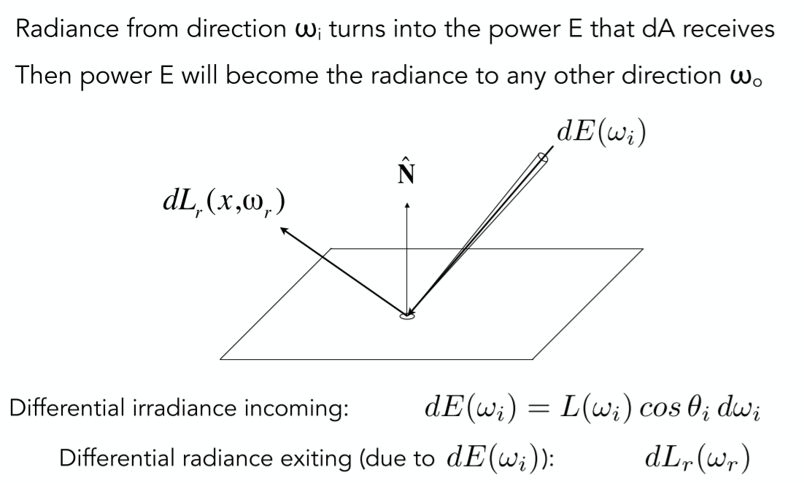
  
* BRDF定义:

    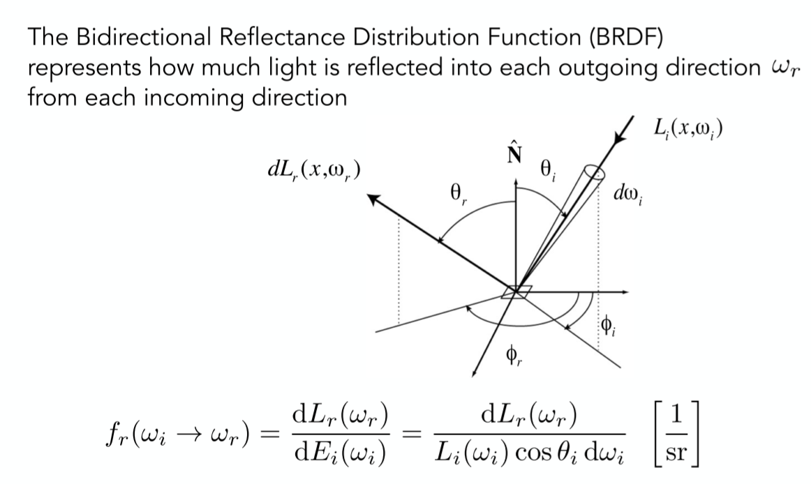

  - $f_{r}(\omega_{i} \rightarrow \omega_{r})$:表示从$\omega_{i}$方向的入射光线$L_{r}$照射到微表面x上,微表面x吸收入射光线的Radiance后,向$\omega_{r}$反射光线的Radiance的比例，即BRDF.
    - $\omega_{i}$为入射方向
    - $\omega_{r}$为出射方向
  - $dL_{r}(\omega_{r})$:是表面反射到$\omega_{r}$方向的反射光的微分辐射率(Randiance)。
    - 表面反射到$\omega_{r}$方向的反射光的辐射率为$L_{r}(\omega_{r})$，来自于表面上半球所有方向的入射光线的贡献，而微分辐射率$dL_{r}(\omega_{r})$特指来自方向$\omega_{i}$的入射光贡献的反射辐射率。
  - $dE_{i}(\omega_{i})$是表面上来自入射光方向$\omega_{i}$的微分辐照度(Irradiance)。
    - 表面接收到的辐照度为$E_{i}(\omega_{i})$，来自上半球所有方向的入射光线的贡献，而微分辐照度$dE_{i}(\omega_{i})$特指来自于方向$\omega_{i}$的入射光。
  - 表面对不同频率的光反射率可能不一样，因此BRDF和光的频率有关。在图形学中，将BRDF表示为RGB向量，三个分量各有自己的$f$(即BRDF)函数。

### 为什么BRDF要定义成辐射率和辐照度的比值，而不是直接定义为辐射率和辐射率比值?
[基于物理着色：BRDF](https://zhuanlan.zhihu.com/p/21376124)

## 反射方程
- 针对一个输出源（着色点），积分所有方向输入源（光照）的BRDF，获得最后的输出

$$L_{r}\left(\mathrm{p}, \omega_{r}\right)=\int_{H^{2}} f_{r}\left(\mathrm{p}, \omega_{i} \rightarrow \omega_{r}\right) L_{i}\left(\mathrm{p}, \omega_{i}\right) \cos \theta_{i} \mathrm{d} \omega_{i}$$

- 对于包含RGB分量的BRDF

    $$L_{r}\left(\mathrm{p}, \omega_{r}\right)=\int_{H^{2}} f_{r}\left(\mathrm{p}, \omega_{i} \rightarrow \omega_{r}\right) \otimes L_{i}\left(\mathrm{p}, \omega_{i}\right) \cos \theta_{i} \mathrm{d} \omega_{i}$$
    
    - 符号$\otimes$表示按向量的分量相乘，因为$f_{r}$和$L_{i}$都包含RGB三个分量

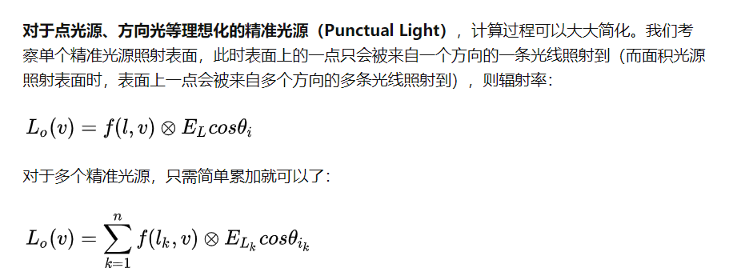

Challenge: Recursive Equation

- 不只有光源才是输入源，其他物体的反射光也有可能是输入源
- 递归的计算方式，计算量爆炸！

## The Rendering Equation 渲染方程（绘制方程）

**Rendering Equation (Kajiya 86) 跨时代**

Adding an Emission term to the reflection equation to make it general!

$$L_{o}\left(p, \omega_{o}\right)=L_{e}\left(p, \omega_{o}\right)+\int_{\Omega^{+}} L_{i}\left(p, \omega_{i}\right) f_{r}\left(p, \omega_{i}, \omega_{o}\right)\left(n \cdot \omega_{i}\right) \mathrm{d} \omega_{i}$$

- 包括了物体自己会发光的情况，包括了所有光线的传播情况
- assume that all directions are pointing outwards!
    - 所有光线朝向都是从照射点开始向外的
- $H^2$和$\Omega^{+}$ 都代表半球

* 对于一个点光源,渲染方程可写成:


* 对于多个点光源,渲染方程可写成:
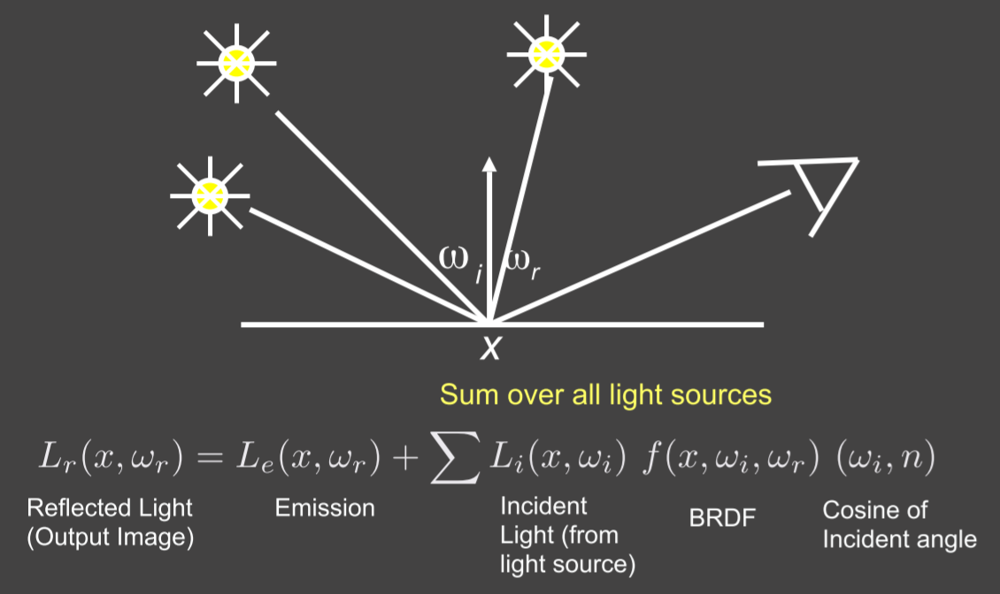

* 对于一个面光源,渲染方程可写成:
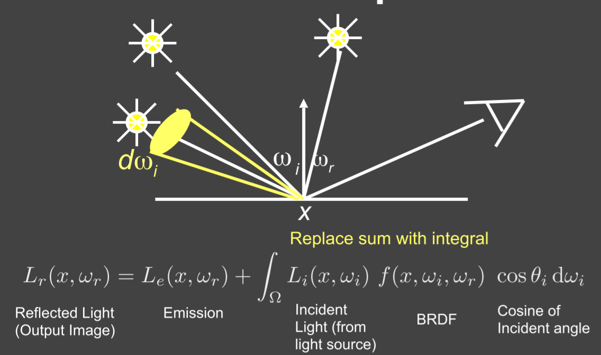

* 对于其他物体反射的面光源,渲染方程可写成:


### 渲染方程简化
$$L_{r}\left(x, \omega_{r}\right)=L_{e}\left(x, \omega_{r}\right)+\int_{\Omega} L_{r}\left(x^{\prime},-\omega_{i}\right) f\left(x, \omega_{i}, \omega_{r}\right) \cos \theta_{i} d \omega_{i}
$$

* 这个方程是 Fredholm Integral Equation of second kind [extensively studied numerically] with canonical form → 简写为如下形式:
  
$$I(u)=e(u)+\int l(v)K(u,v)dv$$

* 根据线性算子方程(Lineara Operator Equation)
    - $K(u,v)dv$是Kernal of equation,Light Transport Operator
* Can be discretized to a simple matrix equation [or system of simultaneous linear equations] (L, E are vectors, K is the light transport matrix)
  - 可以离散为一个简单的矩阵方程[或联立线性方程组]（L，E是向量，K是光传输矩阵）

    $$L = E + KL $$

    - L为未知数
    - k为反射算符

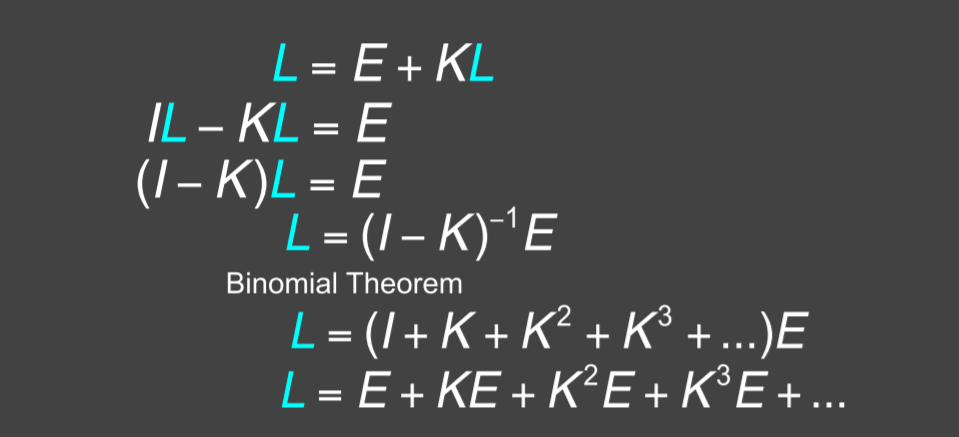
- Binomial Theorem:二项式定理
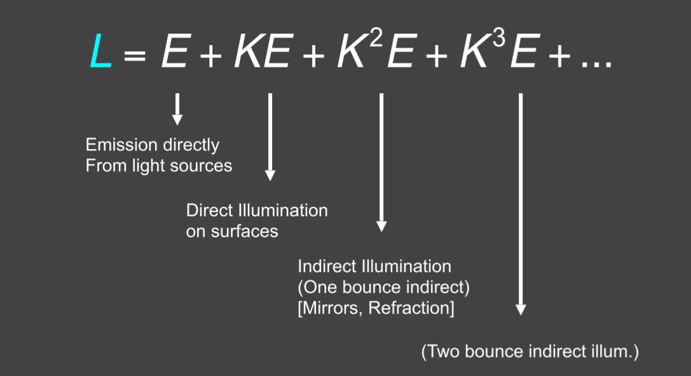
- 光栅化的着色过程只有直接光照（间接光照需要间接计算）
- 全局光照：直接和间接光照的集合
    - 会收敛到一个亮度

## Probability Review
- 随机变量$X$: 可能取很多数值的变量
- 随机变量的分布函数 $X \sim p(x)$: probability density function (PDF) 取不同数值的概率
    - 比如，uniform PDF, 骰子
    - 概率$p_i$的数值非负，和为1，注意和p(x)的概念不一样。是p(x)的输出。
- 期望：The average value that one obtains if repeatedly drawing samples from the random distribution. $E[X]=\sum_{i=1}^{n} x_{i} p_{i}$

连续情况下：

- 随机变量的分布函数 $X \sim p(x)$ 是连续的→**Probability Distribution Function (PDF)**
- 某一个x对应的概率 = p(x)dx （细长条）
- 概率密度函数的性质 $p(x) \geq 0$ and $\int p(x) d x=1$
- 期望：$E[X]=\int x p(x) d x$

随机变量的函数：

- 如果某个随机变量Y是随机变量X的函数：$Y=f(X)$
- 期望的关系：$E[Y]=E[f(X)]=\int f(x) p(x) d x$

# Monte Carlo Path Tracing
## Monte Carlo
* 一种近似积分方法
  - 有时候定积分很难精确计算（解析式求不出），使用数值方法
- 黎曼积分：分解成很多个长方形来积分

- Monte Carlo积分：随机采样
- 用任意一个PDF去采样，都可以用下面的式子(蒙特卡洛估计器)求出积分的近似数值

$$F_{N}=\frac{1}{N} \sum_{i=1}^{N} \frac{f\left(X_{i}\right)}{p\left(X_{i}\right)}$$

> 重要性采样
* 上述公式等价于定积分的证明
> [【图形学手记】蒙特卡洛积分](https://www.cnblogs.com/heben/p/10971235.html)

> [Monte Carlo Methods in Practice](https://www.scratchapixel.com/lessons/mathematics-physics-for-computer-graphics/monte-carlo-methods-in-practice/monte-carlo-integration)

- Uniform: p(x) = 1/(b-a)

$$\int f(x) \mathrm{d} x=\frac{1}{N} \sum_{i=1}^{N} \frac{f\left(X_{i}\right)}{p\left(X_{i}\right)} \quad X_{i} \sim p(x)$$

- N: 采样数
- 样本越多，结果越准
- 在x上采样的样本就要在x上积分

## Path Tracing
Motivation: Whitted-Style Ray Tracing
- Always perform specular reflections / refractions
- Stop bouncing at diffuse surfaces
- 这些简化不一定正确
  - Where should the ray be reflected for glossy materials? 
    - 反射到镜面对应的方向附近一圈，而非单单镜面反射,长生类似金属有点模糊的镜面效果
  - No reflections between diffuse materials? 漫反射不应停下，否则少了很多颜色
      - Color bleeding: 由于漫反射，颜色流到了其他面上
***
- Whitted-Style Ray Tracing is Wrong
- the rendering equation is correct (部分简化光线的性质)

    $$L_{o}\left(p, \omega_{o}\right)=L_{e}\left(p, \omega_{o}\right)+\int_{\Omega^{+}} L_{i}\left(p, \omega_{i}\right) f_{r}\left(p, \omega_{i}, \omega_{o}\right)\left(n \cdot \omega_{i}\right) \mathrm{d} \omega_{i}$$

    - 但是它包括了对半球面的积分，还有递归
    - 但是我们只需要solve this integral numerically → Monte Carlo

### 解直接光照下的渲染方程

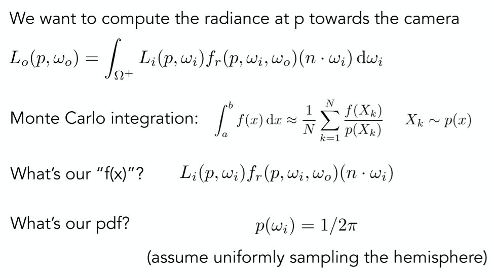

* 最简化：只考虑直接光照，只考虑非光源

$$\begin{aligned} L_{o}\left(p, \omega_{o}\right) &=\int_{\Omega^{+}} L_{i}\left(p, \omega_{i}\right) f_{r}\left(p, \omega_{i}, \omega_{o}\right)\left(n \cdot \omega_{i}\right) \mathrm{d} \omega_{i} \\ & \approx \frac{1}{N} \sum_{i=1}^{N} \frac{L_{i}\left(p, \omega_{i}\right) f_{r}\left(p, \omega_{i}, \omega_{o}\right)\left(n \cdot \omega_{i}\right)}{pdf\left(\omega_{i}\right)} \end{aligned}$$

* 算法:

```cpp
shape(p,wo)//p为着色点,wo为出射方向
  Randomly choose N directions wi~pdf // wi为入射放射,pdf为采样的概率密度函数
  Lo = 0.0//Lo为出射光线
  For each wi
    Trace a ray r(p,wi)
    If ray r hit the light
      Lo += (1/N) * L_i * f_r * cosine / pdf(wi)
    return Lo;
```

### 解间接光照下的渲染方程

* 算法:

```cpp
shape(p,wo)//p为着色点,wo为出射方向
  Randomly choose N directions wi~pdf // wi为入射放射,pdf为采样的概率密度函数
  Lo = 0.0//Lo为出射光线
  For each wi
    Trace a ray r(p,wi)
    If ray r hit the light
      Lo += (1/N) * L_i * f_r * cosine / pdf(wi)
    Else If ray r hit an object at q
      Lo += (1/N) * shade(q,-wi) * f_r * cosine / pdf(wi)//这是-wi指的是出射方向,记得所有的光线都定义为从着色点向外
    return Lo;
```

### 存在问题
#### Porblem 1 : Explosion of #rays as #bounces go up:
* 每次采样n条光线会导致间接光照按指数级递增,导致光线数量爆炸
* 解决方法:每次只射出一条光线(肯定会很noisy)
  - N = 1 是路径追踪
  - N > 1 是分布式光线追踪

```cpp
shape(p,wo)//p为着色点,wo为出射方向
  Randomly choose ONE directions wi~pdf // wi为入射放射,pdf为采样的概率密度函数
  Trace a ray r(p,wi)
  If ray r hit the light
    return  L_i * f_r * cosine / pdf(wi)
  Else If ray r hit an object at q
    return  shade(q,-wi) * f_r * cosine / pdf(wi)//这是-wi指的是出射方向,记得所有的光线都定义为从着色点向外
```
* 如何解决noisy问题
- 在像素中随机采样,然后从摄像机到该像素中的采样点生成不同的光线,每一个Pass执行一次路径追踪,最后平均.

```cpp
Ray_generation(camPos,pixel)
  Uniformly choose N sample position within the pixel
  pixel_radiance = 0.0
  For each smaple in the pixel
    shoot a ray r(camPos,cam_to_sample/*从摄像机到像素*/)
    If ray r hit the scence at p
      pixel += 1/N * shade(p, sample_to_cam/*点p到摄像机,注意着色点光线向外*/)
  return pixel_radiance
```

#### Porblem 2 : the light does not stop bouncing indeed
* 递归算法要有终止条件,不然会导致递归爆炸.
##### 方法一:设置终止层数(弹跳次数)
* 缺陷:结果能量损失

##### 方法二:Russian Roulette(RR)(俄罗斯轮盘赌)
- 设置一个随机变量P(比如0~1的均匀分布)
- With probability p,继续发出光线，**return the shading result divided by P: Lo / P** 
- With probability 1 - P, 停止计算，返回0
- 最后得到的Lo的期望:$E= P *\frac{Lo}{P} + (1-p)*0=Lo$
  - 采样到无穷大的时候,结果能收敛到Lo

```cpp
shape(p,wo)//p为着色点,wo为出射方向
  Manually specify a probability P_RR
  Randomly select ksi in a uniform dist. in [0,1]
  if(ksi > P_RR) return 0.0

  Randomly choose ONE directions wi~pdf // wi为入射放射,pdf为采样的概率密度函数
  Trace a ray r(p,wi)
  If ray r hit the light
    return  L_i * f_r * cosine / pdf(wi) /P_RR
  Else If ray r hit an object at q
    return  shade(q,-wi) * f_r * cosine / pdf(wi)/P_RR//这是-wi指的是出射方向,记得所有的光线都定义为从着色点向外
```
***
### Problem 3 ：it's not really efficient
* low SPP(sample per pixel) 会非常的noisy
  - 原因:均匀采样导致，环境当中光线的来源往往不是均匀的。a lot of rays are “wasted” if we uniformly sample the hemisphere at the shading point.
  - 在着色点对半球面进行采样,导致大量的采样光线not hit光源造成了浪费
***
* 解决方法:对光源进行采样.
  - 对光源积分是个很高效的想法，但是积分的对象和"Sample on x & integrate on x"的要求不匹配→只需要找到光源对应$\omega_i$的关系就行→改变积分域

  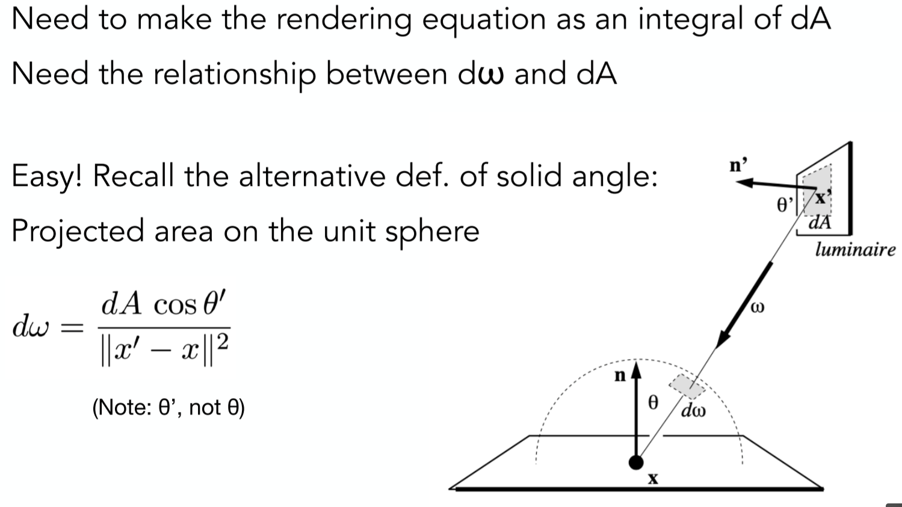

  - 该关系通过立体角定义(微分立体角 = 微分面积/距离的平方)得出

* 对光源采样的路径追踪
  $$
  \begin{aligned} L_{o}\left(x, \omega_{o}\right) &=\int_{\Omega^{+}} L_{i}\left(x, \omega_{i}\right) f_{r}\left(x, \omega_{i}, \omega_{o}\right) \cos \theta \mathrm{d} \omega_{i} \\ &=\int_{A} L_{i}\left(x, \omega_{i}\right) f_{r}\left(x, \omega_{i}, \omega_{o}\right) \frac{\cos \theta \cos \theta^{\prime}}{\left\|x^{\prime}-x\right\|^{2}} \mathrm{d} A \end{aligned}
  $$
  - $x$ ~ $pdf(x) = \frac{1}{A}$

***
* 算法：然后我们就可以consider the radiance coming from two parts:
  - 1. light source (direct, no need to have RR) 直接光照
  - 2. other reflectors (indirect, RR) 间接光照


```cpp
shape(p,wo)//p为着色点,wo为出射方向
  // Contribution from the light source.
  Uniformly sample the light at x_prime (pdf_light = 1 / A) // ' 读作 prime
  L_dir = L_i * f_r * cos_theta * cos_theta_prime / | x_prime - p | ^ 2 / pdf_light

  // Contribution from other reflections.
  L_indir = 0.0
  /*Test Russian Roulette with probability P_RR*/
  Manually specify a probability P_RR
  Randomly select ksi in a uniform dist. in [0,1]
  if(ksi > P_RR) return 0.0

  Uniformly sample the hemisphere towards wi(pdf_hemi = 1 / 2pi) // wi为入射放射,pdf为采样的概率密度函数
  Trace a ray r(p,wi)
  If ray r hit a non-emitting object at q
    L_indir +=  shade(q,-wi) * f_r * cos_theta / pdf_hemi /P_RR//这是-wi指的是出射方向,记得所有的光线都定义为从着色点向外
  
  return L_dir + L_indir
```

#### Problem 3 ：if object Block the light
* 首先从着色点发出一条射线到光源判断是否有遮挡

```cpp
// ...

// Contribution from the light source.
L_dir = 0.0
Uniformly sample the light at x_prime (pdf_light = 1 / A) // ' 读作 prime
shoot a ray from p to x_prime
If the ray is not blocked in the middle
  L_dir = //...

// Contribution from other reflections.
//...

````

Ray tracing 概念的区分：

- Previous：Ray tracing == Whitted-style ray tracing
- Modern
    - The general solution of light transport, including
        - (Unidirectional & bidirectional) path tracing
        - Photon mapping
        - Metropolis light transport
        - VCM / UPBP…

课上没讲的：

- Uniformly sampling the hemisphere
    - How? And in general, how to sample any function?(sampling)
- Monte Carlo integration allows arbitrary pdfs
    - What is the best choice? (importance sampling) **重要性采样理论**
- Do random numbers matter?
    - Yes! (low discrepancy sequences)比如蓝噪音
- I can sample the hemisphere and the light
    - Can I combine them? Yes! (multiple imp. sampling)
- The radiance of a pixel is the average of radiance on all paths passing through it
    - Why? (pixel reconstruction filter)
- Is the radiance of a pixel the color of a pixel?
    - No. (gamma correction（radiance到color的对应关系）, curves(HDR), color space)

# Material and Appearances
* [Manuka | Weta Digital](https://www.wetafx.co.nz/research-and-tech/technology/manuka/) 渲染器Renderer，支持40种材质。

* 以前只有Blinn Phong的时候，通过非物理的方式模拟出各种材质。

* Material(材质) == BRDF 决定光如何被反射

## 漫反射材质
* Diffuse / Lambertian Material (BRDF) 漫反射材质

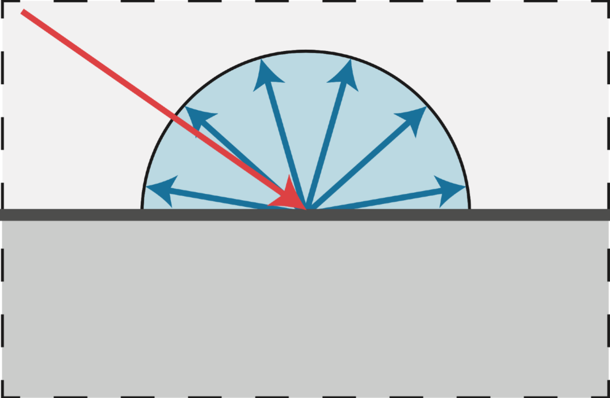

$$
\begin{aligned} L_{o}\left(\omega_{o}\right) &=\int_{H^{2}} f_{r} L_{i}\left(\omega_{i}\right) \cos \theta_{i} \mathrm{d} \omega_{i} \\ &=f_{r} L_{i} \int_{H^{2}} \cos \theta_{i} \mathrm{d} \omega_{i} \\ &=\pi f_{r} L_{i} \end{aligned}
$$

- 能量守恒：进出的irradiance相同（总量）
- 漫反射：出的radiance均匀→ $f_r = c$ （常量）
- 假设入射光和出射光都是均匀的→ $L_i = L_o$

$$f_{r}=\frac{\rho}{\pi}$$

- ρ: albedo(反射率), 0~1（1为完全不吸收能量）
- ρ可以是单通道的,也可以是RGB三通道的.

## Glossy Material
* 类似铜镜,是镜面反射但仍然有点粗糙

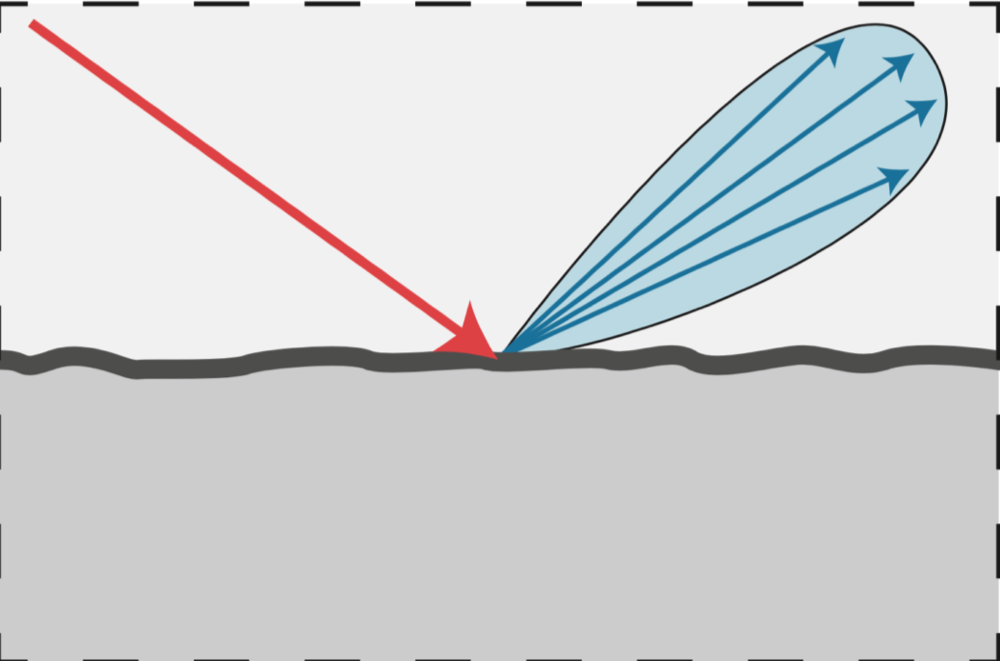

## Ideal reflective / refractive material (BSDF * )
* 玻璃和水等

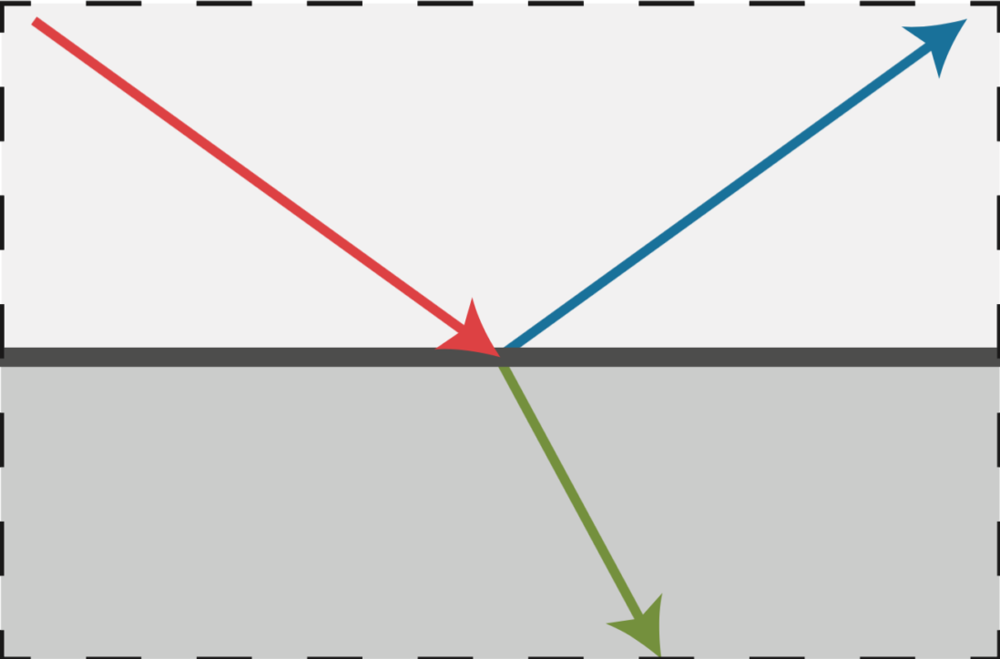

### 反射定律
* 出射角 == 入射角

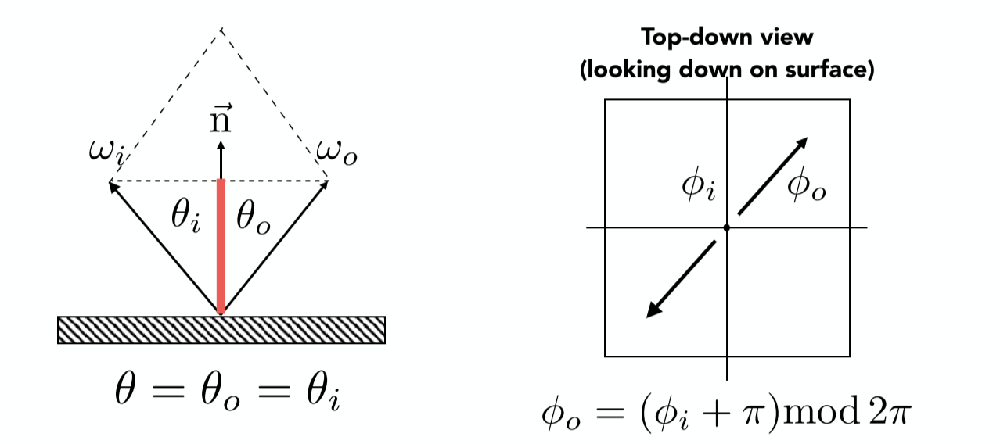
#### 求法1：根据入射角 == 出射角 
*  $\theta=\theta_{o}=\theta_{i}$
  - 然后根据四边形法则,四边形的斜边等于$\omega_{i}$在法线上投影的2倍.

$$
\begin{aligned} &\omega_{o}+\omega_{i}=2 \cos \theta \vec{n}=2\left(\omega_{i} \cdot \vec{n}\right) \vec{n}\\ &\omega_{o}=-\omega_{i}+2\left(\omega_{i} \cdot \vec{n}\right) \vec{n} \end{aligned}
$$

#### 求法2:将入射角和出射角 拆分成俯仰角和方位角.
  - 俯仰角相等且等于$\theta$
  - 方位角相差180度.

$$
\phi_{o}=\left(\phi_{i}+\pi\right) \bmod 2 \pi
$$

* 进行上述变换后在还原成出射角.

### 折射和折射定律
- 白光分解成彩虹：折射率不同
- Caustics (不合适的翻译：焦散，因为只有聚焦才能被看到)
- 折射定律（Snell’s Law）：

#### Snell`s Law(斯涅尔定律)
  $$\eta_{i}sin\theta_{i} = \eta_{t}sin\theta_{t}$$
  - $\eta_{i},\eta{t}$为入射材质折射率和折射材质折射率
  - $\theta_{i},\theta_{t}$为入射角和折射角

- 全反射：折射不可能发生的情况下，当入射介质折射率>出射介质折射率时可能发生。

- BSDF（散射） = BRDF（反射） + BTDF（折射）
  - Bidirectional scattering distribution function

### Fresnel Reflection / Term(菲涅尔项)
- Reflectance depends on incident angle (and polarization of light)
- 和normal法线方向越接近，越少光被反射
  - 光线的夹角对**绝缘体**的反射的程度影响大
    - 与物体垂直时基本全反射,与物体水平是光线基本全部透过物体.
  - 光线的夹角对**导体**的反射的程度影响小
- 因为光线有偏振现象,所以一般近似的时候取极化的平均

* 精确计算:十分复杂
- 近似：Schlick’s approximation

$$\begin{aligned} R(\theta) &=R_{0}+\left(1-R_{0}\right)(1-\cos \theta)^{5} \\ R_{0} &=\left(\frac{n_{1}-n_{2}}{n_{1}+n_{2}}\right)^{2} \end{aligned}$$

## Microfacet Material 微表面材质

基于如下假设：离得足够远的时候，微小的东西往往看不见，看见的是最后汇聚起来总体的样子

Rough surface

- Macroscale: flat & rough
  - 远处是粗糙的平面
- Microscale: bumpy & specular
  - 近处各种不规则的镜面

Individual elements of surface act like mirrors

- Known as Microfacets
- Each microfacet has its own normal

Microfacet BRDF 微表面模型

- the distribution of microfacets’ normals 法线
  - 根据微表面的法线分布来判断材质.
- Concentrated <==> glossy
- Spread <==> diffuse

- 微表面的BRDF计算：

  $$f(\mathbf{i}, \mathbf{o})=\frac{\mathbf{F}(\mathbf{i}, \mathbf{h}) \mathbf{G}(\mathbf{i}, \mathbf{o}, \mathbf{h}) \mathbf{D}(\mathbf{h})}{4(\mathbf{n}, \mathbf{i})(\mathbf{n}, \mathbf{o})}$$
  - $\mathbf{F}(\mathbf{i}, \mathbf{h})$: Fresnel term
    - 菲涅尔项,判断有多少光线被反射
  - $\mathbf{G}(\mathbf{i}, \mathbf{o}, \mathbf{h})$: shadowing-masking term，微表面互相遮挡的损耗
    - 几乎和表面平行的光线方向：Grazing Angle，损耗很大
    - 用于修正光线接近于Grazing Angle时,微表面自遮挡的亮度问题,不再这一项会导致边缘偏亮.
  - $\mathbf{D}(\mathbf{h})$: 基于h的法线Distribution, h是half vector，
    - 对于法线分布中的与半程向量重合的法线才能被反射过去(根据反射定律)

- 效果十分强大
- State-of-the-art
- PBR：Physically Based Rendering / Shading
- 缺点
  - Diffuse比较少，有时需要手动加
- 是统称，有很多不同的模型

### Isotropic / Anisotropic Materials (BRDFs)

电梯间的条状高光→磨过的表面，各向异性Anisotropic

- 关键区别**Key: directionality of underlying surface**

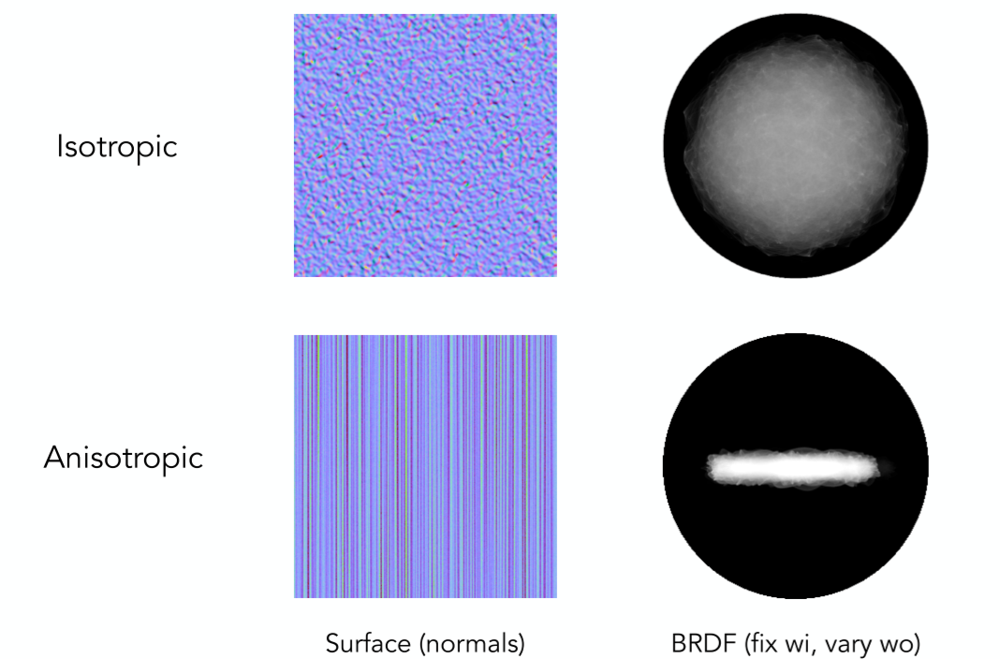

反映到BRDF上，各向异性的BRDF有如下性质：

$$f_{r}\left(\theta_{i}, \phi_{i} ; \theta_{r}, \phi_{r}\right) \neq f_{r}\left(\theta_{i}, \theta_{r}, \phi_{r}-\phi_{i}\right)$$

- 方位角不一样时，BRDF不保持一致(Reflection depends on azimuthal angle)
- 锅底 → 辐射状高光 （来自VRay 渲染器的一张例图）
- Nylon（编织）, Velvet（天鹅绒，可以人为造成各向异性）

### 微表面BRDF的属性
* Non-negativity:描述能量分布肯定是正的.
  - $f_{r}(\omega_{i} \rightarrow \omega_{r}) >=0$
* Linearity:
  - brdf的计算可以进行拆分,然后直接加起来
  - 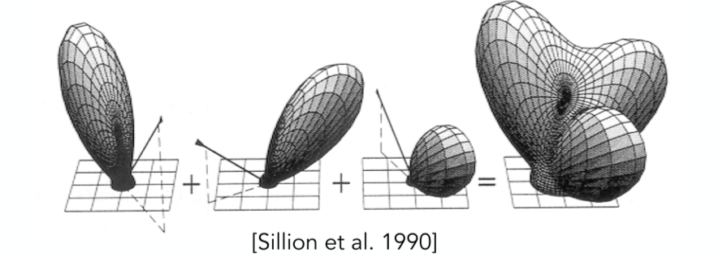
* Reciprocity principle (可逆性)
  - $f_{r}(\omega_{r} \rightarrow \omega_{i}) =f_{r}(\omega_{i} \rightarrow \omega_{r})$
* Energy conservation(能量守恒)
  - 入射能量 = 吸收能量 + 反射能量 + 折射能量
  - $\forall \int_{H^{2}}{f_{r}(\omega_{r} \rightarrow \omega_{i})cos\theta_{i}d\omega_{i}} \leq 1$
* 各向同性
    - $f_{r}\left(\theta_{i}, \phi_{i} ; \theta_{r}, \phi_{r}\right) = f_{r}\left(\theta_{i}, \theta_{r}, \phi_{r}-\phi_{i}\right)$
  - 从可逆性可得：
    - $f_{r}\left(\theta_{i}, \theta_{r}, \phi_{r}-\phi_{i}\right)=f_{r}\left(\theta_{r}, \theta_{i}, \phi_{i}-\phi_{r}\right)=f_{r}\left(\theta_{i}, \theta_{r},\left|\phi_{r}-\phi_{i}\right|\right)$

### Measuring BRDFs(测量BRDF)
* Motivation:
  - Avoid need to develop / derive models 不用费力推模型
  - Can accurately render with real-world materials
  - 实际和推算出来的经常会有很大差距

方法：

- Image-Based BRDF Measurement
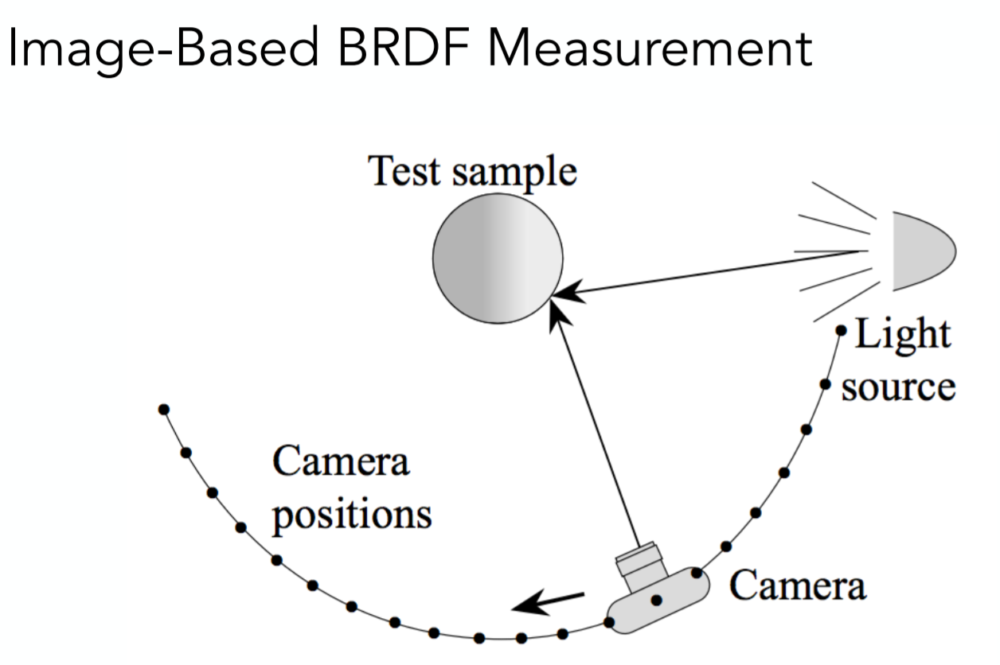

## 存储 BRDF

Desirable qualities

- Compact representation
- Accurate representation of measured data
- Efficient evaluation for arbitrary pairs of directions
- Good distributions available for importance sampling

一种方式：Tabular Representation

- Store regularly-spaced samples in $\left(\theta_{i}, \theta_{r},\left|\phi_{r}-\phi_{i}\right|\right)$
- Better: reparameterize angles to better match specularities
- Generally need to resample measured values to table
- Very high storage requirements
- 实例：MERL BRDF Database [Matusik et al. 2004] 90 * 90 * 180 measurements

# 高级光线传播
## Unbiased light transport methods
Biased vs. Unbiased Monte Carlo Estimators
- 无偏：An unbiased Monte Carlo technique does not have any systematic error
    - 无论取多少样本，期望永远是对的
- 有偏：其他情况
    - One special case, the expected value converges to the correct value as infinite #samples are used — consistent 有偏，但能收敛到无偏(叫做一致的)

### BDPT(Bidirectional Path Tracing 双向路径追踪)
- 实现方法:
  - Traces sub-paths from both the camera and the light (半路径)
  - Connects the end points from both sub-paths 半路径末端互相连接，形成通路

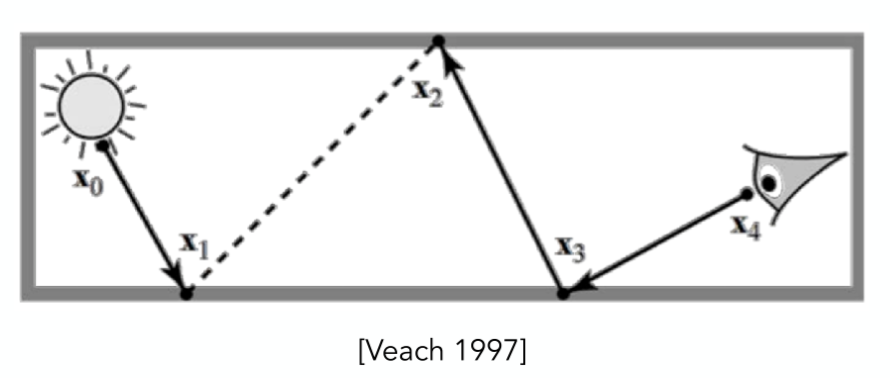

- 好处：Suitable if the light transport is complex on the light’s side
    - 对于路径追踪来说对于一个着色点需要计算直接光照和间接光照,对于间接光照我们是在着色点散射之后递归计算radiance的,在采样率低的情况下,光线打到光源的需要经过很多次弹射.
    - 对于双向路径追踪来说,通过光源半路径和相机半路径直接连接得到光路,可以节省很多次光线弹跳
- 缺点：Difficult to implement & quite slow 能做出来基本能自己写渲染器了

### Metropolis light transport (MLT 梅特波利斯光照传输)
- A Markov Chain Monte Carlo (MCMC) application
    - 马尔可夫链帮助采样
        - 马尔可夫链：根据当前样本，根据一个概率分布，生成下一个相近的样本
    - Jumping from the current sample to the next with some PDF
- 可以做到以任意形状的函数为pdf生成样本
  - 蒙特卡罗方法在采样跟被积函数形状一样的pdf的时候variance最小
- Key idea: Locally perturb an existing path to get a new path 有一个路径的情况下，可以生成相似的路径(局部方法)

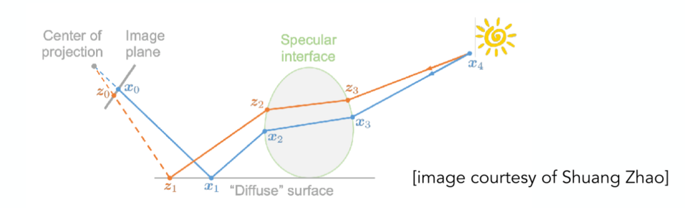

- 好处：Very good at locally exploring difficult light paths 有了种子，就能找到更多相似的
    - Caustics, Indirect Light Source
    - 越复杂的场景MLT做的越好
- 缺点：
    - Difficult to estimate the convergence rate
        - Monte Carlo可以估计Variance，可以量化
    - Does not guarantee equal convergence rate per pixel(局部方法,渲染过程中有些像素收敛了,有些没有收敛)
      - So, usually produces “dirty” results 看上去比较脏
      - Therefore, usually not used to render animations

## Biased light transport methods
- A biased approach & A two-stage method
- Very good at handling Specular-Diffuse-Specular (SDS) paths and generating caustics
  - caustics(焦散):间接照明光线（即光子）从光源发射出来后，先经过一次（或多次） Specular 表面反、折射作用，再投射到某个Diffuse表面上，最后以Diffuse的形式被摄影机 记录 。
    - 泳池波纹等

很多种实现方法，这里是其中一种：

Photon Mapping — Approach (variations apply)

- Stage 1 — photon tracing
    - 光源出发，Emitting photons from the light source, bouncing them around, finally recording photons on diffuse surfaces
- Stage 2 — photon collection (final gathering)
    - Shoot sub-paths from the camera, bouncing them around, until they hit diffuse surfaces
- Calculation — local density estimation 局部光子密度估计
    - Idea: areas with more photons should be brighter
    - For each shading point, find the nearest N photons (通过树状结构实现算法，N是固定的). Take the surface area they over 面积计算，然后光子密度=光子数量/面积
    - 光子数量少：面积大，噪声大；光子数量大：模糊
- 模糊是因为有偏
    - Local Density estimation dN / dA != ΔN / ΔA 光子密度估计在数量趋向无限时才与真正光子密度相等，所以biased but consistent!

有偏和无偏的实用辨别方法：

- 在渲染中：Biased == blurry
- 一致的Consistent == not blurry with infinite #samples

[如何理解 (un)biased render？ - 知乎](https://www.zhihu.com/question/26683585)

* 为什么用最近的n个光子计算光子密度而不用周围一定范围内的光子数量计算光子密度.
  - 前一种方法是有偏但一致的
  - 后一种方法是有偏且不一致的
    - 单位面积里求光子数量,随着光子变多,dA永远不会等于ΔA 

### Vertex connection and merging (VCM)   
- A combination of BDPT and Photon Mapping
  - 双向光线追踪+光子映射
- Key idea:  
  - Let’s not waste the sub-paths in BDPT if their end points cannot be connected but can be merged
  - Use photon mapping to handle the merging of nearby “photons”

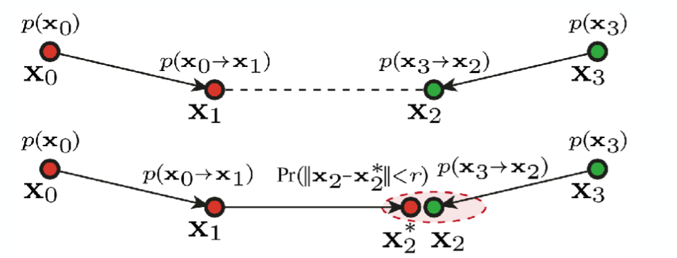

- 比如，$x_2$和$x^{*}_{2}$ 在同一个面上，但是没有重合，按照BDPT，这种就是浪费,因为无法通过一次弹射从$x_2$到$x^{*}_{2}$
- 但是VCM将$x_2$和$x^{*}_{2}$通过光子映射进行分析.

## Instant Radiosity(IR 实时辐射度)

- sometimes  also called many-light approaches 很多光源的方法
- Key idea: 
  - Lit surfaces can be treated as light sources 被照亮的表面就像是光源
    - 模拟从光源发出光线，打到的地方相当于二级光源。如果此时Sample某个场景点的颜色，那么遍历这些二级光源，叠加计算即可
- Approch:
  - Shoot light sub-paths and assume the end point of each sub-path is a Virtual Point Light (VPL)
  - Then Render the scene as usual using these VPLs

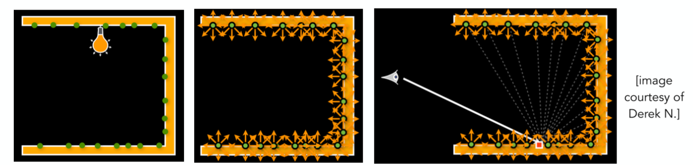

- Pros: 
  - fast and usually gives good results on diffuse scenes
- Cons:
    - Spikes will emerge when VPLs are close to shading points
      - 蒙特卡洛路径积分的时候，需要对光源进行采样,其中通过面积除以距离的平方计算立体角,当场景中某一点被当做2次光源时,距离这些2次光源近的地方,该项会特别大,导致积分出来的Radiance就特别大.
    - Cannot handle glossy materials

工业界：Path Tracing，不高端，但可靠

# 高级表面建模
## Non-surface models
### participating media(散射介质、参与介质):Fog,cloud
- At any point as light travels through a participating medium, it can be (partially) absorbed and scattered. （部分）吸收和散射
- 散射：Use **Phase Function** to describe the angular distribution of light scattering at any point x within participating media. 规定如何散射
- 如何渲染Rendering:
    - Randomly choose a direction to bounce
    - Randomly choose a distance to go straight
    - At each ‘shading point’, connect to the light

散射介质也有可能是巧克力酱、手指头（

### Hair / fur / fiber(BCSDF)
Kajiya-Kay Model

- 一根光线，打到圆柱（头发）上，散射出一个圆锥上，同时向四面八方散射（Diffuse+Specular）
- 效果不好，很假

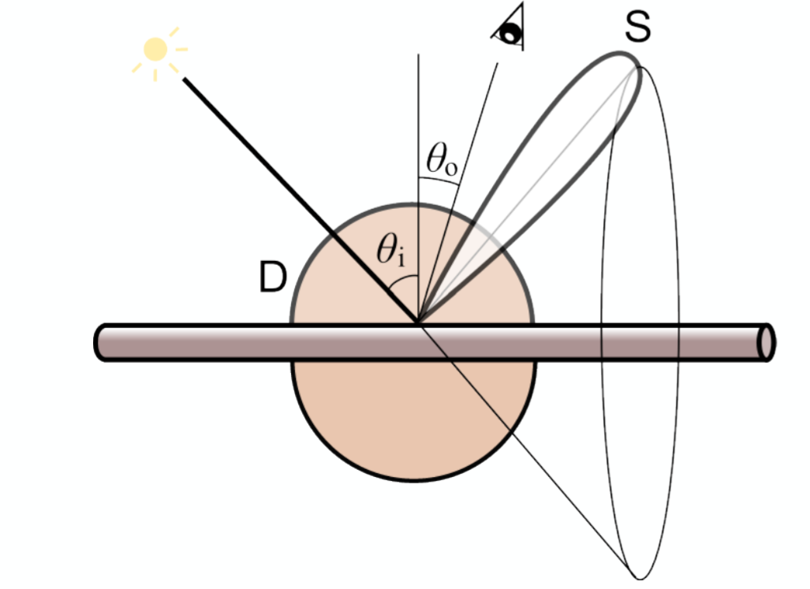

*** 
Marschner Model

- 把头发看作Glass-like cylinder，有色素，会吸收能量
- 3 types of light interactions: R, TT, TRT (R: reflection, T: transmission)
- 一部分直接反射（R）
- 一部分穿进头发，再穿出（TT）
- 一部分穿进，内部反射，再穿出TRT
- 效果不错
- 只是单次散射

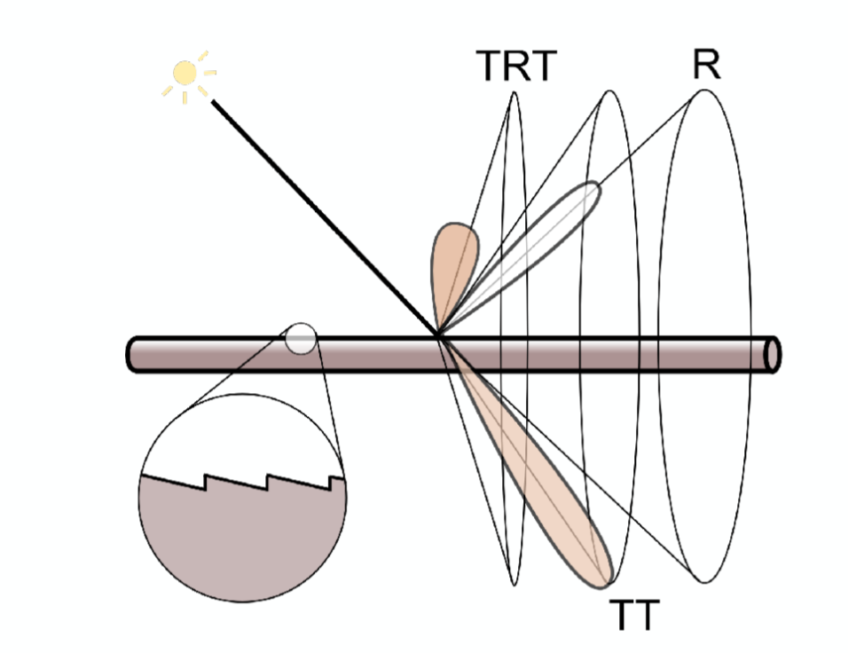

***
* 动物毛发
  - 不能直接把头发模型用到动物毛发上，两者有差别

* 动物毛发髓质(Medulla)很大，头发比较小，动物毛发忽略之后很明显

方法: Double Cylinder Model：描述了头发和髓质的双层结构

- R，TT，TRT
- TTs，TRTs：经过髓质，被散射过的光

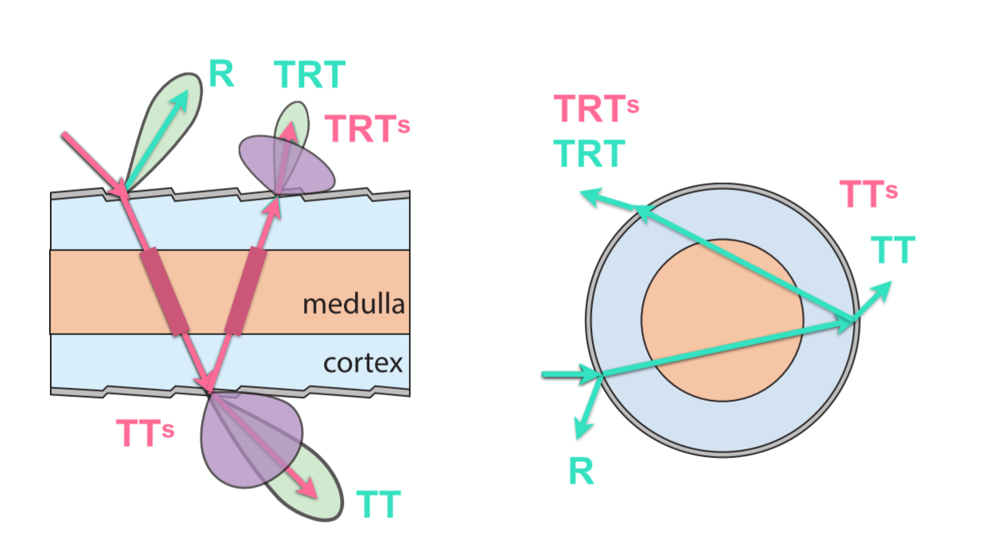

### Granular material(颗粒材质)

Can we avoid explicit modeling of all granules?

- Yes with procedural definition.

目前还没有很好的渲染优化

## Surface models
### Translucent material(BSSRDF)(半透明,透光性材质)

### Subsurface Scattering 次表面散射, BSSRDF

Translucent: 不仅仅是半透明，光线在内部还会有折射，比如玉石，水母，牛奶，人耳

物理上：Subsurface Scattering 次表面散射

- Visual characteristics of many surfaces caused by light exiting at different points than it enters
  - 在不同点处出现的光线引起的许多表面的视觉特征
- Violates a fundamental assumption of the BRDF → BSSRDF
  - 违反了BRDF→BSSRDF的基本假设

BSSRDF: generalization of BRDF; exitant radiance at one point due to incident differential irradiance at another point: $S\left(x_{i}, \omega_{i}, x_{o}, \omega_{o}\right)$ 进来和出去的点不一定一样

Generalization of rendering equation: integrating over all points on the surface and all directions 对表面其他地方进入的光线也要考虑，过于复杂

$$L\left(x_{o}, \omega_{o}\right)=\int_{A} \int_{H^{2}} S\left(x_{i}, \omega_{i}, x_{o}, \omega_{o}\right) L_{i}\left(x_{i}, \omega_{i}\right) \cos \theta_{i} \mathrm{d} \omega_{i} \mathrm{d} A$$

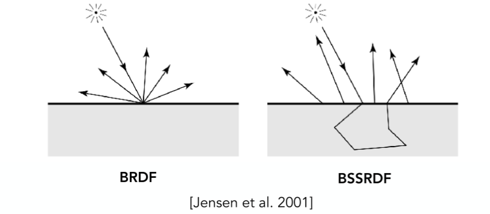

→ Dipole Approximation [Jensen et al. 2001]: Approximate light diffusion by introducing two point sources. 用两个光源模拟次表面散射

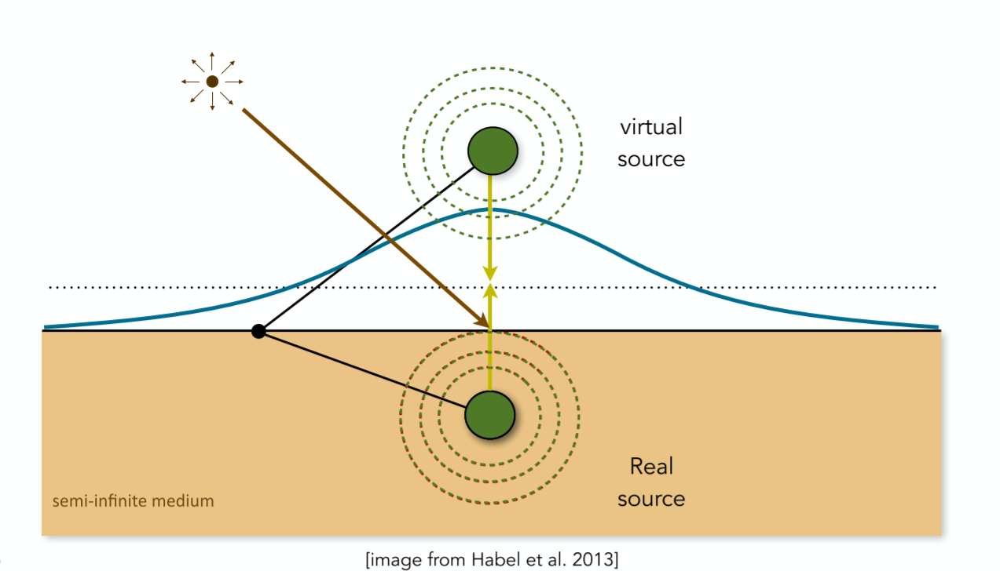

BSSRDF: Application

- 真实的皮肤
- [https://cgelves.com/10-most-realistic-human-3d-models-that-will-wow-you/](https://cgelves.com/10-most-realistic-human-3d-models-that-will-wow-you/)

### Cloth:Fiber
布：A collection of twisted fibers! 由纤维缠绕而成

- 每一根纱线是由纤维缠绕而成
- 每一股毛线是由纱线缠绕而成
- 规模很恐怖

Render as Surface

- Given the weaving pattern, calculate the overall behavior
- Render using a BRDF，根据不同的织法，给不同的BRDF
- 但是布料并不仅仅是表面，天鹅绒那样的效果无法展现

Render as Participating Media

- Properties of individual fibers & their distribution -> scattering parameters
- 空间中分布的体积→细小的格子，对每个格子里布料的性质进行采样，转化成对光线的渲染 （像对云的渲染那样）计算量很恐怖

Render as Actual Fibers

- Render every fiber explicitly!
- 计算量更恐怖

### Detailed material(non-statical BRDF)

Not looking realistic, 因为太过完美

真实情况下，有很多复杂，不完美的东西

回顾Microfacet BRDF

- Surface = Specular microfacets + statistical normals
- 法线分布(NDF)用了正态分布，其实没有那么完美
- 把法线分布改的复杂一点，就会获得更复杂的结果
- 法线贴图200k x 200k，获得很好的效果，但是运算量爆炸（甚至一张图要一个月）
- 这是因为在法线分布复杂的情况下，很难建立valid的光线通路（光源→表面→摄像机）

Solution: BRDF over a pixel

- 一个像素对应了一块表面，把整块范围内的法线分布整合起来获得（P-NDF），以此简化计算
- 小范围的P-NDF会有很多奇妙的样子

Application:

- Detailed / Glinty Material
- 海绵波光粼粼的效果

### Recent Trend: Wave Optics

之前所有的计算都把光线当作粒子来计算，但光具有波粒二象性，有很多只有在把光当作波的时候才会有的性质就会被忽略。

- 波动光学计算BRDF
    - 结果与几何光学类似，但不连续（干涉导致），不同波长也不一样

## procedural appearance
- Explicitly or Implicitly 不一定需要真的生成，可以查询

问题：三维模型，三维材质，存储量爆炸

Can we define details without textures?

- Yes! Compute a noise function on the fly.
- 3D noise -> internal structure if cut or broken
- Thresholding (noise -> binary noise)

Complex noise functions can be very powerful.

- Perlin Noise
    - 生成地形
    - 木头的三维生成
- ...

Houdini: 程序化生成材质(Explicitly)

# Camera,Lenses and Light Fields
Imaging = Synthesis + Capture
- Synthesis: raster | ray tracing 用合成的方法来成像
- Capture: 捕捉真实世界来成像
  - 最典型：相机
  - Transient Imaging: 研究光在极短时间内的传播
  - Computational Photography: 计算成像学

## Camera
- 小孔成像
  - 针孔相机 Pinhole Camera
    - 无虚化
    - 全部都是清晰的
- Lens 透镜成像

Shutter 快门，控制光进入相机

Sensor 传感器，Accumulates Irradiance During Exposure
  - 在曝光过程中的累积Irradiance

Why Not Sensors Without Lenses
- Each sensor point would integrate light from all points on the object,so all pixel values would he similar
  - 所有东西都会糊掉
- the sensor records(记录) irradiance

## Field of View(FOV 视场)
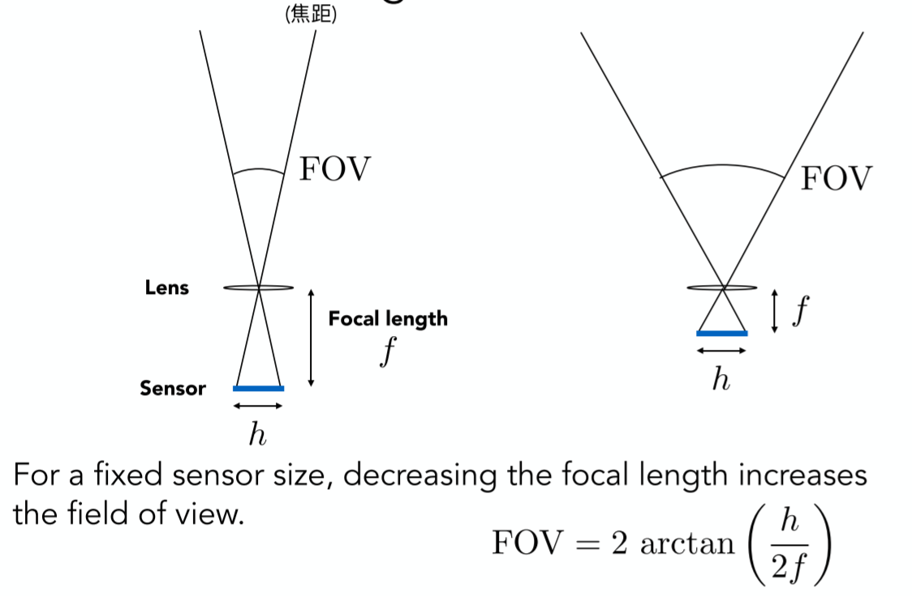

  $$FOV = 2arctan(\frac{h}{2f})$$
- h: 传感器高度
- f(focal length): 焦距，传感器与透镜的距离

同样大小的传感器，焦距越大，视场越窄

同样焦距，传感器越大，视场越宽

同样视场，焦距和传感器等比

传感器Sensor和胶片Film不一定一样

- 平时两者等价
- 在渲染器里面，Sensor收集irradiance，Film决定存成什么样的格式

***
通常以35mm(36 x 24mm)格式胶片为基准，通过定义焦距的方式来定义FOV：

- 17mm is wide angle 104° 广角镜头
- 50mm is a “normal” lens 47°
- 200mm is telephoto lens 12°

## Exposure
* $H=T \cdot E$

* Exposure = time x irradiance

* Exposure time (T) 

  - Controlled by shutter

* Irradiance (E)

  - Power of light falling on a unit area of sensor
  - Controlled by lens aperture（光圈） and focal length（焦距）

***
### Exposure Controls in photography
Aperture size 光圈大小

- Change the f-stop by opening / closing the aperture (if camera has iris control)
- 仿生学设计，模拟瞳孔
- F-Number (F-Stop)

Shutter speed 快门速度

- Change the duration the sensor pixels integrate light
- 越快，开放时间越短，相对越少光

ISO gain 感光度

- 后期处理,对接受到的光进行增益（比如乘以倍数）
- Change the amplification (analog and/or digital) between sensor values and digital image values
- 硬件上 调节传感器灵敏度 或者 软件上 调整数字信号

***
### 各个参数对expsoure的影像

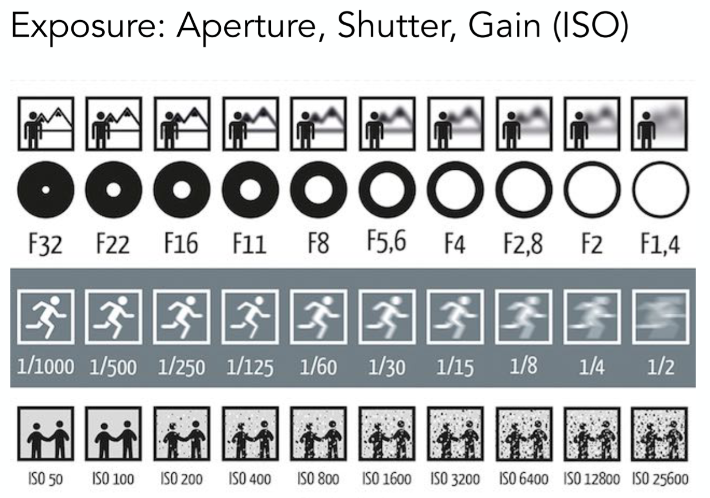

ISO:
- 通过ISO增益光线的同时也会放大噪声
- 为什么会有噪声？
  - 光子数量少
- Film: trade sensitivity for grain
- Digital: trade sensitivity for noise
  - Multiply signal before analog-to-digital conversion
  - Linear effect (ISO 200 needs half the light as ISO 100) 线性

F-Number(F-Stop):Exposure Levels 曝光等级 - 光圈大小
- 数字越小，光圈越大
- Written as FN or F/N. N is the f-number.
- Informal understanding: the inverse-diameter of a round aperture 简单地理解为直径的倒数

Side Effect of Shutter Speed 快门速度过慢

- Motion blur: handshake, subject movement(运动模糊)
- Doubling shutter time doubles motion blur
- motion blur is not always bad! 表现快 or anti-aliasing~

Rolling shutter: different parts of photo taken at different times

- 物理快门并非瞬间打开，而是以某种方式“缓慢“打开的
- 会导致高速运动的物体的成像与预想不一致

但是大光圈会有浅景深的效果，快门时间会导致运动模糊等效果，需要权衡

## Fast and Slow Photography

High-Speed Photography 每秒极高帧率

- 快门时间受限，
- Normal exposure = extremely fast shutter speed x (large aperture and/or high ISO)

Long-Exposure Photography 延时摄影

- 快门时间很长
- 光圈变小

## Thin Lens Approximation
[http://graphics.stanford.edu/courses/cs178-10/applets/gaussian.html](http://graphics.stanford.edu/courses/cs178-10/applets/gaussian.html)

Real Lens Designs Are Highly Complex

- 目前的相机都用透镜组来控制成像
- 真实的透镜并不那么理想：无法将光线聚于一点 Aberrations

Ideal Thin Lens – Focal Point

- 理想的透镜可将光聚于一点 - 焦点
- (1) All parallel rays entering a lens pass through its focal point.
- (2) All rays through a focal point will be in parallel after passing the lens.
- (3) Focal length can be arbitrarily changed (in reality, yes! → 透镜组).

***

通过透镜组之间的相对位置变化来模拟焦距的改变

The (Gaussian) Thin Lens Equation(物距,向距和焦距之间的关系): 


$$\frac{1}{f}=\frac{1}{z_{i}}+\frac{1}{z_{o}}$$

- 相似三角形证明

## Defocus Blur(散焦模糊)
* 产生散焦模糊的原因是因为物体不在Focal Plane上,这里假设在Focal Plane之后,导致成像在Image平面之前,由于光会一直传播,那物体上的一个点会在Sensor Plane上产生一个圆,产生弥散的现象.

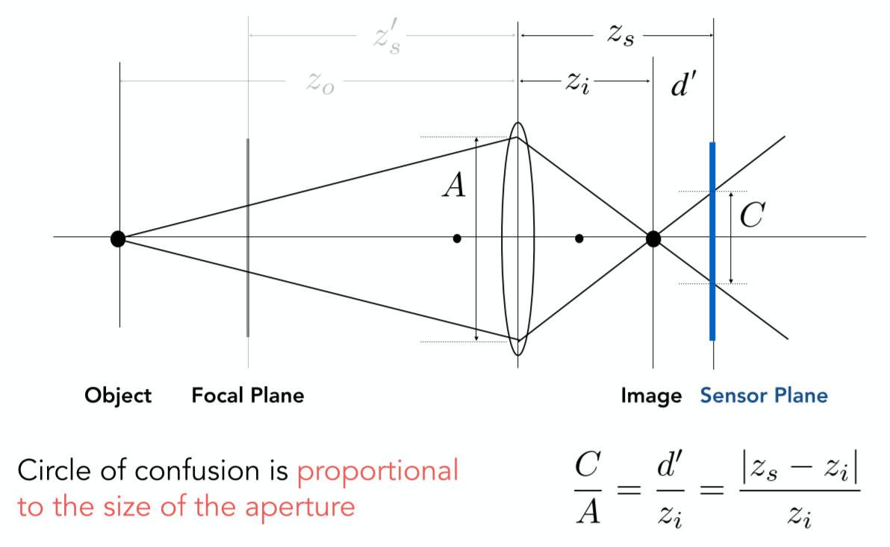

* 各种距离固定情况下，CoC 与光圈大小成正比！
  - 大光圈会导致弥散圆更大

## Revisiting F-Number
* F-Number (a.k.a. F-Stop) 's Formal definition: The f-number of a lens is defined as **the focal length divided by the diameter of the aperture **
  - 焦距/光圈直径

$$C=A \frac{\left|z_{s}-z_{i}\right|}{z_{i}}=\frac{f}{N} \frac{\left|z_{s}-z_{i}\right|}{z_{i}}$$
- A是光圈直径

## Ray Tracing Ideal Thin Lenses
(One possible) Setup:

- Choose sensor size, lens focal length and aperture size
- Choose depth of subject of interest $z_o$
- Calculate corresponding depth of sensor $z_i$ from thin lens equation

Rendering:

- For each pixel x’ on the sensor (actually, film (胶片))
- Sample random points x’’ on lens plane
- You know the ray passing through the lens will hit x’’’ (because x’’’ is in focus, consider virtual ray (x’, center of the lens))
- Estimate radiance on ray x’’ -> x’’’

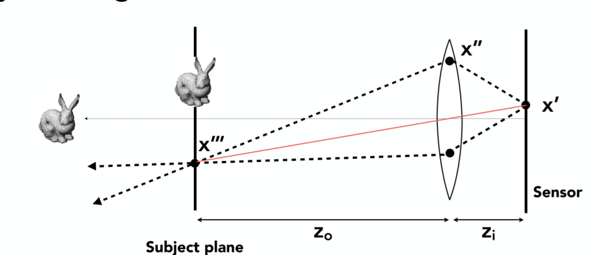

## Depth of Field(景深)[成像清晰的一段范围]

Set circle of confusion as the maximum permissible blur spot on the image plane that will appear sharp under final viewing conditions
  - 将CoC设置为图像平面上的最大允许模糊点，这将在最终观看条件下显得锐利

* depth range in a scene where the corresponding CoC is considered small enough.
  - 景深就是相应的COC被认为足够小的场景中的深度范围


首先，当CoC（Circle of Confusion）小到一定程度，认为是清晰的

$z_o$附近的一段距离内都可以看作清晰（CoC小到一定程度），关键是这段距离有多长。→景深

光圈越小，景深范围越大

焦距越大，景深范围越小

[http://graphics.stanford.edu/courses/cs178/applets/dof.html](http://graphics.stanford.edu/courses/cs178/applets/dof.html)

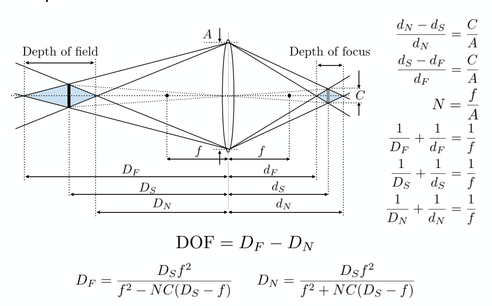

## Light Field / Lumigraph
### The Plenoptic Function(全光函数)
* 定义:the set of all things that we can ever see
***
- Grayscale snapshot(灰度快照)：$\boldsymbol{P}(\theta, \phi)$  is intensity of light
    - Seen from a single view point
    - At a single time
    - Averaged over the wavelengths of the visible spectrum → 没有具体的颜色
- Color snapshot：$\boldsymbol{P}(\theta, \phi, \lambda)$ is intensity of light
    - Seen from a single view point
    - At a single time
    - As a function of wavelength 彩色
- Movie：

    $$\boldsymbol{P}(\theta, \phi, \lambda, t)$$

    - is intensity of light
    - Seen from a single view point
    - Over time
    - As a function of wavelength 彩色
- Holographic movie 全息电影 or The Plenoptic Function

    $$\boldsymbol{P}\left(\theta, \phi, \lambda, t, V_X,V_Y,V_Z\right)$$

    - is intensity of light
    - Seen from ANY viewpoint 任何位置看都可以
    - Over time
    - As a function of wavelength 彩色
    - Can reconstruct every possible view, at every moment, from every position, at every wavelength
    - Contains every photograph, every movie, everything that anyone has ever seen! it completely captures our visual reality!

### 光场
要实现这样一个函数，需要：空间中任意一点的全方向光线信息

Ray 光线：

$$\boldsymbol{P}\left(\theta, \phi, V_X,V_Y,V_Z\right)$$

- 5D: 3D position + 2D direction

Ray Reuse

- 4D: 2D direction + 2D position（表面为二维）
- non-dispersive medium(non-dispersive medium)

* 要记录一个物体向四周展示的样子，只需要记录包围盒上表面各个点往各个方向发射的光线的信息：The surface of a cube holds all the radiance information due to the enclosed object. → 光场
  - 光场就是一个物体从任意方向看过去的radiance的场(场（field）在数学上是指一个向量到另一个向量或数的映射。).

光场记录的方式（四维）：

- 2D position + 2D direction
- 2D position + 2D position：用两个面上两个点来定义光线的方向→2 plane parameterization (u,v) → (s,t)
- 固定(u,v), 所有的(s,t)组成一张image，显示从(u,v)点看到的外部世界的样子。
    - Stanford camera array
- 固定(s,t), 所有的(u,v)组成一张image，显示同一个点上从不同方向看过去的样子
    - Integral Imaging (苍蝇的眼睛Lenslets)
    - 从同一个点，将不同方向打过来的光线经过折射记录在不同的位置上
    - Spatially-multiplexed light field capture using lenslets: Impose fixed trade-off between spatial and angular resolution
      - 利用透镜捕获空间复用光场：在空间分辨率和角度分辨率之间施加固定的折衷
    - 将单单记录Irradiance变成了不同方向的Radiance

## Light Field Camera
- Lytro: founded by Prof. Ren Ng (UC Berkeley)
    - Microlens design
    - Most significant function
        - Computational Refocusing

        (virtually changing focal length & aperture size, etc. after taking the photo)

    - Each pixel (irradiance) is now stored as a block of pixels (radiance)
        - 恢复：A simple case — always choose the pixel at the bottom of each block
            - Then the central ones & the top ones
            - Essentially “moving the camera around”
        - Computational / digital refocusing
            - Same idea: visually changing focal length, picking the refocused ray directions accordingly
    - The light field contains everything
- 缺点
    - Insufficient spatial resolution (same film used for both spatial and directional information) 分辨率不足
    - High cost (intricate designation of microlenses) 高成本、难设计
    - Computer Graphics is about trade-offs 调节更灵活↔分辨率更高

# physical Basis of Color
* 光=不同波长的电磁辐射（可见光光谱范围内400~700nm）

* 不同波长的光具有不同的折射率,产生不同的颜色

* Spectrum 光谱：光线的能量在不同波长上的分布
  - 一条光线对应一种光谱.

* Spectral Power Distribution (SPD) 谱功率密度：描述一束光在所有波长的分布

- 线性：可叠加

* 什么是颜色
  - 是人的一种感知，不是光线的一种根本属性 
    - a phenomenon of human perception; it is not a universal property of light
  不同波长的光不是颜色
    - Different wavelengths of light are not “colors”

## Biological Basis of Color
* 人眼的简单介绍
  - 瞳孔=光圈，晶状体=透镜，视网膜=感光元件

* 视网膜上的感光细胞 Retinal Photoreceptor Cells
  - Rods：视杆细胞，棒状，很多，感知光的强度（而非波长）
    - 生成灰度图
  - Cones：视锥细胞，锥形，较少，产生“颜色”的感觉
    - Three types of cones S, M, and L (corresponding to peak response at short, medium, and long wavelengths), each with different spectral sensitivity
    - 不同的人的视锥细胞分布大不一样 Fraction of Three Cone Cell Types Varies Widely

## Tristimulus Theory of Color(颜色的三色刺激理论?)

Spectral Response of Human Cone Cells

于是不同视锥细胞的信号强度=其对所有波长的光的响应的积分

$$\begin{aligned} S &=\int r_{S}(\lambda) s(\lambda) d \lambda \\ M &=\int r_{M}(\lambda) s(\lambda) d \lambda \\ L &=\int r_{L}(\lambda) s(\lambda) d \lambda \end{aligned}$$

  - $r(\lambda)$,不同视锥细胞对不同波长的光的响应曲线函数
  - $s(\lambda)$,在spd上的采样.

于是有 任何一束光 → (S,M,L) → Color 的对应，人眼只知道(S,M,L)，不知道原来的光线分布（SPD）

## Metamerism(同色异谱)
* 同⾊异谱：不同的SPD → 同样的(S,M,L) = 同样的Color

***

Metamers are two different spectra (∞-dim) that project to the same (S,M,L) (3-dim) response.

- These will appear to have the same color to a human 
  - The existence of metamers is critical to color reproduction(Matching)
- Don’t have to reproduce the full spectrum of a real world scene
- Example: A metamer can reproduce the perceived color of a real-world scene on a display with pixels of only three colors 通过显示器的三色光，也可以混合出现实中的种种色彩（虽然背后的光谱一般完全不一样）

## Color Reproductiom / Matching
* 加色系统:所有颜色混合变白
* 减色系统:所有颜色混合变黑
***
计算机的成像系统是加色系统：

- 给定一组主色（例如RGB）的光谱分布（S，M，L？）$s_{R}(\lambda), s_{G}(\lambda), s_{B}(\lambda)$
- 调整三种主色的强度并相加，得到一种颜色 $R s_{R}(\lambda)+G s_{G}(\lambda)+B s_{B}(\lambda)$
- 于是这种颜色就可以用(R,G,B)这三个标量表示。
- 于是也可以通过实验确定不同颜色的(R,G,B)表示->Additive Color Matching Experiment
***
* 有些颜色怎么混合也混不出来，但是通过给原色加色，就可以混合出来，那么将最后混合的颜色中减去加上的颜色，就是对这种颜色的表示→系数会有负数！

### CIE RGB Color Matching Experiment
* CIE：一个组织
* 主光 RGB 都是单一波长的光
* 测试光也都是单一波长的光

***
* 颜色匹配函数  color matching functions 
  - 描述了三种主光各自多少强度加起来会等于某单一波长的光的波长.
    - Graph plots how much of each CIE RGB primary light must be combined to match a monochromatic light of wavelength given on x-axis
    - Careful: these are not response curves or spectra! 

## Color Spaces 颜色空间

Standardized RGB (sRGB)
- makes a particular monitor RGB standard
- other color devices simulate that monitor by calibration(校准)
- widely adopted today
- gamut (⾊域) is limited

***

同样定义了**CIE XYZ color matching functions**但是并非实验测得，而是人造，虚拟的

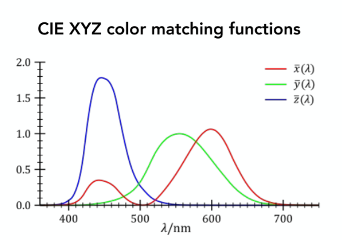

Imaginary set of standard color primaries X, Y, Z

- Primary colors with these matching functions do not exist
- **Y is luminance** (brightness regardless of color) (表示亮度)

为何如此设计？

- Matching functions are strictly positive 没有负数
- Span all observable colors 覆盖所有可见光

***
* 可视化CIE XYZ
  - 将(X,Y,Z) 归一化获得(x,y,z)（x + y + z = 1）, 然后对(x,y)做枚举，获得一张二维图像，表示在Y（亮度）固定的情况下，不同X，Z对应的颜色。
    - since x + y + z = 1, we only need to record two of the three
    - usually choose x and y, leading to (x, y) coords at a specific brightness Y
    - The curved boundary: spectral locus
    - Any color inside is less pure, mixed

***
Gamut (⾊域)：the set of chromaticities generated by a set of color primaries(由一组原色生成的色度集)

- Different color spaces represent different ranges of colors
- So they have different gamuts, i.e.
- they cover different regions on the chromaticity diagram(色度图)

## Perceptually Organized Color Spaces(感官组织的色彩空间)
### HSV Color Space (Hue-Saturation-Value)

Axes correspond to artistic characteristics of color 

Widely used in a “color picker” 拾色器

Hue(⾊调):不同类型的颜色

- the “kind” of color, regardless of attributes
- colorimetric correlate: dominant wavelength
- artist’s correlate: the chosen pigment color

Saturation (饱和度):颜色更接近白色还是单一颜色
- the “colorfulness”
- colorimetric correlate: purity
- artist’s correlate: fraction of paint from the colored tube

Lightness (or value,Brightness) (亮度)

- the overall amount of light
- colorimetric correlate: luminance
- artist’s correlate: tints are lighter, shades are darker

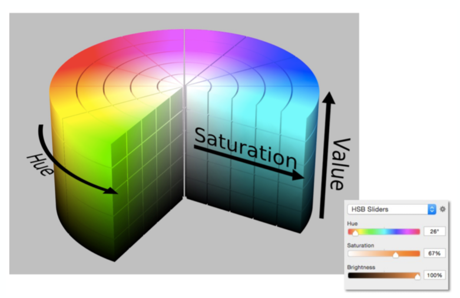

## CIELAB Space(AKA L*a*b)
A commonly used color space that strives for perceptual uniformity

- L* is lightness (brightness)
- a* and b* are color-opponent pairs
- a* is red-green 正方向：红色，负方向：绿色
- b* is blue-yellow:正方向：黄色,负方向:蓝色

基于互补色理论（Opponent Color Theory）

There’s a good neurological basis for the color space dimensions in CIE LAB

- the brain seems to encode color early on using three axes:
- white — black, red — green, yellow — blue
- the white — black axis is lightness; the others determine hue and saturation

one piece of evidence: you can have a light green, a dark green, a yellow-green, or a blue-green, but you can’t have a reddish green (just doesn’t make sense) 

• thus red is the opponent to green

another piece of evidence: afterimages (following slides)

***
人眼是奇怪的

- 视觉暂留
- 视错觉
- 颜色的相对性

***
## 减色系统

典型：CMYK: A Subtractive Color Space 

墨水越混越黑

- Cyan, Magenta, Yellow, and Key
- 靛蓝、品红、黄色、黑色

## 还有什么没提
- HDR
- Gamma Correction矫正：Radiance → 颜色，因为显示器上颜色显示是非线性的，需要抵消

# Animation
- 动画是一种信息传递的工具
    - 美学经常比技术重要
- 是模型的延伸→连续性
    - Represent scene models as a function of time
- 输出：sequence of images that when viewed sequentially provide a sense of motion
    - 电影：24FPS
    - 视频：30FPS、29.994FPS
    - VR：90FPS （不晕的基础要求）

## Keyframe animation关键帧动画

- Animator (e.g. lead animator) creates keyframes 关键帧
- Assistant (person or computer) creates in-between frames (“tweening”) 渐变帧

### 关键的技术难点 - Interpolation 插值

- Linear interpolation usually not good enough
- Recall splines for smooth / controllable interpolation

B样条……

## Physical Simulation物理模拟
* 模拟、仿真：推导、实现公式，模拟出物体应该怎么变化
* 例子：布料模拟、流体模拟

## 质点弹簧系统 Mass Spring System: Example of Modeling a Dynamic System
- A Simple Idealized Spring
    - 没有初始长度
    - 随着拉力线性增长/缩短，线性系数是spring coefficient: stiffness
    - Force pulls points together
    - Strength proportional to displacement (Hooke’s Law)
    - 问题：长度会倾向于0
- Non-Zero Length Spring
    - 初始长度Rest length不为零
    - Problem: oscillates forever 永远震荡

      $$\boldsymbol{f}_{a \rightarrow b}=k_{s} \frac{\boldsymbol{b}-\boldsymbol{a}}{\|\boldsymbol{b}-\boldsymbol{a}\|}(\|\boldsymbol{b}-\boldsymbol{a}\|-l)$$

      - $\frac{\boldsymbol{b}-\boldsymbol{a}}{\|\boldsymbol{b}-\boldsymbol{a}\|}$表示受力方向
      - $\|\boldsymbol{b}-\boldsymbol{a}\|-l$表示弹簧拉伸长度
- Dot Notation for Derivatives：(用点表示导数)

$$\begin{aligned} &\boldsymbol{x}\\ &\dot{\boldsymbol{x}}=\boldsymbol{v}\\ &\ddot{\boldsymbol{x}}=\boldsymbol{a} \end{aligned}$$

- Introducing Energy Loss
    - Simple motion damping 阻尼(对弹簧全局作用)

        $$\boldsymbol{f}=-k_{d} \dot{\boldsymbol{b}}$$

    - Behaves like viscous drag on
    - Slows down motion in the direction of velocity
    - $k_d$ is a damping coefficient
    - 问题：Slows down all motion
        - Want a rusty spring’s oscillations to slow down, but should it also fall to the ground more slowly? 跟全局速度挂钩
        - 无法表示弹簧内部的损耗

- Internal Damping for Spring

    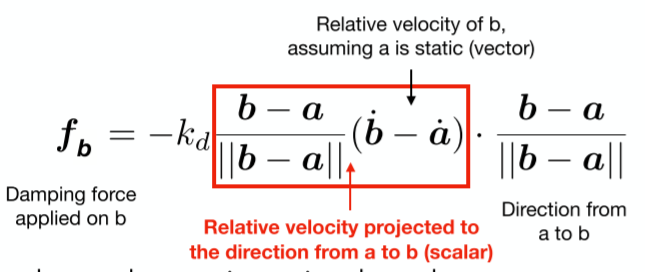
    - 相对运动越快,f就越大,所以跟局部加速度有关
    - 注意这里一定要将质量在相对加速度投影到弹簧ab方向,才是影响弹簧的力,比如旋转的时候加速度方向和弹簧方向垂直,不影响.

    - Viscous drag only on change in spring length
        - 粘性阻力仅在弹簧长度变化时
        - Won’t slow group motion for the spring system (e.g. global translation or rotation of the group)
          - 弹簧系统不会减慢群组运动（例如，群组的整体平移或旋转）
    - Note: This is only one specific type of damping 只是一种阻尼的近似

### Structures from Springs
* 通过质点弹簧系统来进行布料模拟
Step 1: Sheets

- This structure will not resist shearing切变会露馅
- This structure will not resist out-of-plane bending...

Step 2: 增加斜向方向弹簧

- This structure will resist shearing but has anisotropic bias 各向异性
- This structure will not resist out-of-plane bending either...

Step 3: 增加双斜向方向弹簧

- This structure will resist shearing. Less directional bias.
- This structure will not resist out-of-plane bending either... 弯折

Step 4: 增加横向和纵向 （skip connection）

- This structure will resist shearing. Less directional bias.
- This structure will resist out-of-plane bending （横向和纵向的弹簧力比斜向的弱很多）(对折)

***
有限元方法(FEM (Finite Element Method) Instead of Springs)

- 车辆碰撞

力传导扩散适合用有限元方法建模做

## Particle Systems
- 建模定义很多粒子
- 每个粒子有自己的属性

***

- Model dynamical systems as collections of large numbers of particles 
- Each particle’s motion is defined by a set of physical (or non-physical) forces
- Popular technique in graphics and games
  - Easy to understand, implement
  - Scalable: fewer particles for speed, more for higher complexity
***
- Challenges
  - May need many particles (e.g. fluids)
  - May need acceleration structures (e.g. to find nearest particles for interactions)

***
* 简易算法

```cpp
For each frame in animation
  [If needed] Remove dead particles
  Calculate forces on each particle
  Update each particle’s position and velocity
  [If needed] Create new particles
  Render particles
```
* 定义个体和群体之间的关系

### Particle System Forces
Attraction and repulsion forces

• Gravity, electromagnetism, …

• Springs, propulsion, … 

Damping forces

• Friction, air drag, viscosity, … 

Collisions

• Walls, containers, fixed objects, …

• Dynamic objects, character body parts, …

***

Example: Simulated Flocking as an ODE(常微分方程)

- 定义鸟儿之间交互的规则：个体对群体的观察
- Model each bird as a particle Subject to very simple forces:
- attraction to center of neighbors
- repulsion from individual neighbors
- alignment toward average trajectory of neighbors Simulate evolution of large particle system numerically Emergent complex behavior (also seen in fish, bees, ...)

Example: Molecular Dynamics

Example: Crowds + “Rock” Dynamics

## Kinematics
* 运动学：正向和反向

### Forward Kinematics 正向运动学

明确骨骼之间的运动关系→计算出各个部位的位置

Articulated skeleton

- Topology (what’s connected to what)
- Geometric relations from joints
- Tree structure (in absence of loops)

Joint types

- Pin (1D rotation)
- Ball (2D rotation)
- Prismatic joint (translation)

Strengths

- Direct control is convenient 
- Implementation is straightforward

Weaknesses

- Animation may be inconsistent with physics
- Time consuming for artists

### Inverse Kinematics 逆运动学
* 限制各个部位（通常只有终端）的位置、限制骨骼的运动方式→计算骨骼的运动
* 方便控制形体整体形状
* 解特别复杂，可能并不唯一,也可能无解

***

解法：随机化算法（优化方法，梯度下降）

Numerical solution to general N-link IK problem

• Choose an initial configuration

• Define an error metric (e.g. square of distance between goal and current position)

• Compute gradient of error as function of configuration

• Apply gradient descent (or Newton’s method, or other optimization procedure)

例子：Style-Based IK

### Rigging
通过控制点对三维物体进行控制(比如改变脸部表情,手势等)

* Rigging is a set of higher level controls on a character that allow more rapid & intuitive modification of pose, deformations, expression, etc.

* Important
  - Like strings on a puppet
  - Captures all meaningful character changes
  - Varies from character to character 
* Expensive to create
  - Manual effort 定控制点，拉控制点（应该怎么定、应该怎么拉 → 动画师）
  - Requires both artistic and technical training

### Blend Shapes 控制点间的位置插值计算
* Instead of skeleton, interpolate directly between surfaces
  - E.g., model a collection of facial expressions:
* Simplest scheme: take linear combination of vertex positions
* Spline used to control choice of weights over time

## Motion Capture
* 真人控制点反映到虚拟角色中去，需要建立真实和虚拟的联系

Data-driven approach to creating animation sequences

- Record real-world performances (e.g. person executing an activity)
- Extract pose as a function of time from the data collected

Strengths

- Can capture large amounts of real data quickly

- Realism can be high 

Weaknesses

- Complex and costly set-ups 复杂、花钱

- Captured animation may not meet artistic needs, requiring alterations 不符合艺术家要求，不可能实现的动作

- 捕捉条件限制

***
不同的捕捉方法：

- Optical (More on following slides)
    - Markers on subject
    - Positions by triangulation from multiple cameras
    - 8+ cameras, 240 Hz, occlusions are difficult
- Magnetic Sense magnetic fields to infer position / orientation. Tethered.
- Mechanical Measure joint angles directly. Restricts motion.

***
Challenges of Facial Animation

- Uncanny valley
    - In robotics and graphics
    - As artificial character appearance approaches human realism, our emotional response goes negative, until it achieves a sufficiently convincing level of realism in expression

## 动画的制作流程 The Production Pipeline


## Single Particle Simulation
* 假设粒子在的运动由速度场决定
  - 速度场是一个关于位置和时间的函数 $v(x,t)$
* 对于粒子我们知道在时间$t_{0}$的速度$v_{t0}$和位置$x_{t0}$
  - 我们要求的是任意时间$t_{1}$的位置$x_{t1}$

### Ordinary Differential Equation (ODE) 常微分方程
计算速度场内粒子的位置需要计算一阶常微分方程：

$$\frac{d x}{d t}=\dot{x}=v(x, t)$$

解一阶常微分方程：

- 连续：积分
- 离散：Euler’s Method欧拉方法
    - Explicit Euler method （forward 前向、显式）
        - 始终用前一帧的状态来更新后一帧

        $$\begin{array}{l} \boldsymbol{x}^{t+\Delta t}=\boldsymbol{x}^{t}+\Delta t \dot{\boldsymbol{x}}^{t} \\ \dot{\boldsymbol{x}}^{t+\Delta t}=\dot{\boldsymbol{x}}^{t}+\Delta t \ddot{\boldsymbol{x}}^{t} \end{array}$$

        - Simple iterative method
        - Commonly used
    - 问题:
        - Very inaccurate 很不准确:步长越大越不准确
            - With numerical integration, errors accumulate
            - Euler integration is particularly bad
        - Most often goes unstable 不稳定
            - 容易出现正反馈，离正确结果越来越远
            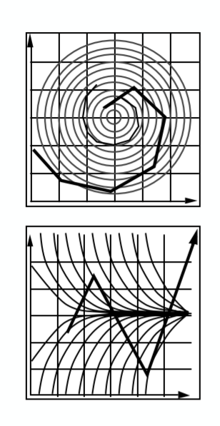

## Instability and improvements 
Solving by numerical integration with finite differences leads to two problems:

Errors 误差 不是特别大的问题

- Errors at each time step accumulate. Accuracy decreases as simulation proceeds
- Accuracy may not be critical in graphics applications

Instability **不稳定性 很要命！**

- Errors can compound, causing the simulation to **diverge** even when the underlying system does not 收敛很重要！
- Lack of stability is a fundamental problem in simulation, and cannot be ignored

## Combating Instability
### Midpoint method
* 用一次欧拉方法得到a点
* 取起点到a点的终点b,得到对应的速度
* 在起始点应用b点的速度进行欧拉方法,得到c点


### Adaptive Step Size
* 用一次欧拉方法得到$X_{T}$点
* 在中点处再用欧拉方法得到$X_{T/2}$点
* 判断两个点之间的距离,超过一定距离递归的缩小步长


### Implicit Eulr Method
- Use the velocity at the next time step (hard)

$$\begin{array}{l} \boldsymbol{x}^{t+\Delta t}=\boldsymbol{x}^{t}+\Delta t \dot{\boldsymbol{x}}^{t+\Delta t} \\ \dot{\boldsymbol{x}}^{t+\Delta t}=\dot{\boldsymbol{x}}^{t}+\Delta t \ddot{\boldsymbol{x}}^{t+\Delta t} \end{array}$$

- 是一个方程组，有三个未知数，只能假设一个已知（猜）
- Use root-finding algorithm, e.g. Newton’s method
- Offers much better stability
- Implicit Euler has order 1, which means that
    - Local truncation error: O(h^2) and
    - Global truncation error: O(h) (h is the step, i.e. ∆t)

    O(h)的理解

    - If we halve h, we can expect the error to halve as well
    - 阶数越高越好，减小步长的情况下降低更快

### Runge-Kutta Families
* A family of advanced methods for solving ODEs
* Especially good at dealing with non-linearity
* It’s order-four version is the most widely used, a.k.a. **RK4**


更多：Numerical Analysis 对图形学有用 （其他的：信号处理）

### Position-Based / Verlet Intergation
- Constrain positions and velocities of particles after time step

假设弹簧无限大

Idea:

- After modified Euler forward-step, constrain positions of particles to prevent divergent, unstable behavior
- Use constrained positions to calculate velocity
- Both of these ideas will dissipate energy, stabilize

Pros / cons

- Fast and simple
- Not physically based, dissipates energy (error)

## Rigid body simulation

不会形变

Simple case

- Similar to simulating a particle
- Just consider a bit more properties 拓展

## Fluid Simulation
### A Simple Position-Based Method

模拟只需要输出物体的位置，其他的就是渲染的问题了

Key idea

- Assuming water is composed of small rigid-body spheres 水是由小球组成的
- Assuming the water cannot be compressed (i.e. const. density) 不可压缩
- So, as long as the density changes somewhere, it should be “corrected” via changing the positions of particles 密度有变化，就要想着改回去，移动小球位置
- You need to know the gradient of the density anywhere w.r.t. each particle’s position

    一个小球位置的变化对其周围密度的影响

- Update? Just gradient descent! 梯度下降

非物理

## 流体模拟中两种不同的思路：Eulerian vs. Lagrangian

Lagrangian：质点法，以每个元素为单位模拟

Eulerian：网格法，以空间为单位分割模拟

### Material Point Method (MPM)

Hybrid, combining Eulerian and Lagrangian views

- Lagrangian: consider particles carrying material properties 物质由粒子组成，粒子有属性
- Eulerian: use a grid to do numerical integration 网格上计算如何运动
- Interaction: particles transfer properties to the grid, grid performs update, then interpolate back to particles 网格属性写回网格内粒子上