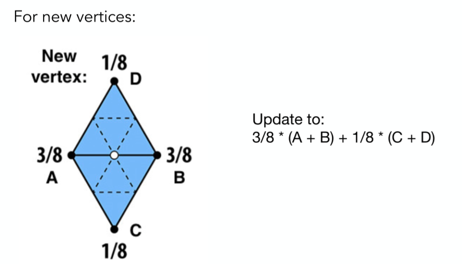
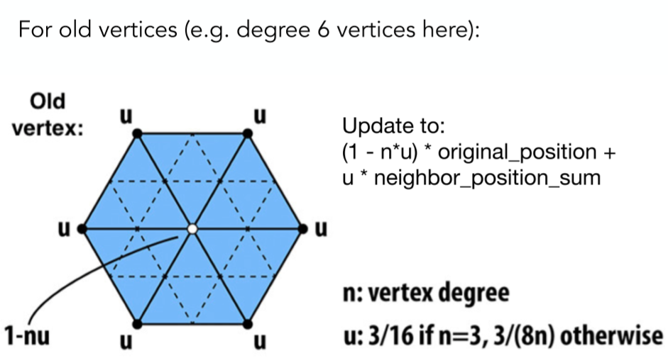
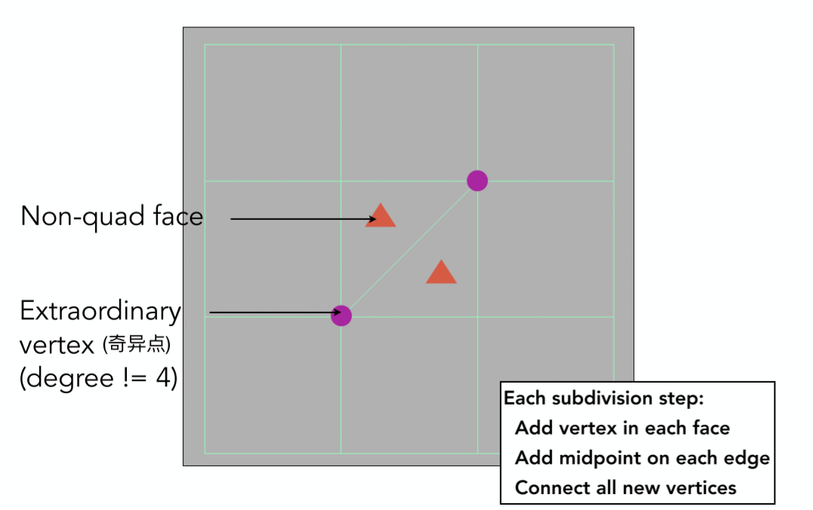
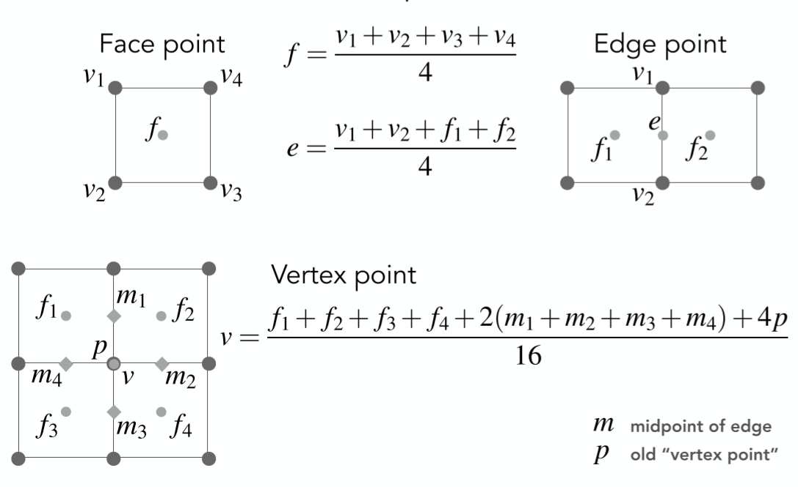
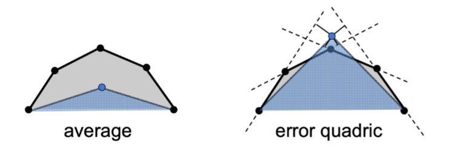

# 几何
## 表示形式
* 隐式表示
    - 形式: $f(x,y,z) = 0$
    - based on classifying points
      - points satisfy some specified relationship
    - pros
        - compact description (e.g., a function)
        - certain queries easy (inside object, distance to surface)
        - good for ray-to-surface intersection (光线求交,more later)
        - for simple shapes, exact description / no sampling error
        - easy to handle changes in topology (e.g., fluid) 
    - cons
      - Sampling can be hard
      - difficult to model complex shapes
    - many implicit representations in graphics:
      - Algebraic surface
        - 最直接的，用数学公式
        - 不直观
      - Constructive solid geomentry(CSG)
        - 基本形状的布尔操作组合成复杂形状
        - Combine implicit geometry via Boolean operations
      - Distance Functions(距离场)
        - giving minimum distance(could be signed distance) from anywhere to object.
      - level set methods(s水平集)
        - store a grid of values approximating function
        - 例子：CT扫描,等高线
      - fractals
        - 自相似
        - 递归
* 显式表示
    - 形式:$f:R^{2} \rightarrow R^{3}; (u,v) \rightarrow (x,y,z)$
    - All points are given directly or via parameter mapping
    - Pros
      - Sampling is Easy
    - cons
      - Inside/outside Test Hard
    - many explicit Representations in Graphics
      - point cloud
        - 一堆点
        - 可以表示任何几何
        - Useful for LARGE datasets (>>1 point/pixel)
        - Often converted into polygon mesh
        - Difficult to draw in undersampled regions(在采样不足的区域很难绘制)
      - Polygon mesh
        - store vertices & polygons(often triangles or quads)
        - easier to do processing /simulation,adaptive sampling
        - more complicated data structures
        - perhaps most common representation in graphics
          - obj文件
      - subdivision surfaces
      - NURBS
      - Bezier surfaces

## 曲线 Curve

### Bézier Curves  贝塞尔曲线

一条由四个点（其实是任意≥3个点）定义的曲线：

- p0和p3定义起点和终点
- p1和p2定义起点与终点的切线方向（与p0和p3一起）

Evaluating Bézier Curves (de Casteljau Algorithm)

例子：(quadratic Bezier 二次贝塞尔曲线)

计算方法：

一些性质：

- 仿射变换前后统一
- 凸包性质：形成的曲线一定在控制点形成的凸包内

## piecewise Bezier Curves(分段贝塞尔曲线)
* 高阶bezier曲线不容易控制

* instead,chain many low-order bezier curve
    - Piecewise cubic bezier the most common technique

* 连续性
    - $C^{0}$连续:连接处值相等
    - $C^{1}$连续:连接处一阶可导
    - ...
    - $G^{0}$连续:等于$C^{0}$
    - $G^{1}$连续:

## 样条
* Spline (样条)：a continuous curve constructed so as to pass through a given set of points and have a certain number of continuous derivatives. （a curve under control）
> 样条曲线：一种连续曲线，构造成通过一组给定的点并具有一定数量的连续导数(控制下的曲线）

### B-splines
* bezier曲线缺点
    - 一旦确定特征多边形，就确定了曲线的阶次
    - Bezier曲线拼接复杂（需要满足几何连续性，参数连续性等）
    - Bezier曲线不能作局部修改（只能整体修改）

- basis splines 基函数样条
- 满足局部性
- 可能是图形学里面最复杂的一部分
- 是贝塞尔曲线的超集

* Further：B样条、NURBS（非均匀有理B样条）[https://www.bilibili.com/video/av66548502](https://www.bilibili.com/video/av66548502)

## 曲面
* 两个不同时间t（u,v）
    - 4x4个点，四条4个控制点的贝塞尔曲线，取同一时间（比如说u）获得四个控制点，取时间v，即获得最后的曲面上的点

## Mesh Subdivision
- Increase resolution

* 细分的应用场景：Displacement mapping 位移贴图 需要模型足够细致，于是需要细分（最好是动态细分）

### Loop Subdivision
**Loop是发明者名字，跟循环没关系**

- 局限
    需要三角形Mesh

步骤： 

1. create more triangles (vertices)

    Split each triangle into four

2. **tune their positions （形状需要有改变）**

    Assign new vertex positions according to weights

    New / old vertices updated differently 新老点分别改变

### Catmull-Clark Subdivision(General Mesh)
* 适用任何Mesh

* 方法

* 顶点调整

## Mesh Simplification
- Decrease resolution
- Try to preserve shape/appearance
***
* Goal: reduce number of mesh elements while maintaining the overall shape

### Edge collapse:边坍缩
- 哪些边合并？如何合并？
    - Quadric Error Metrics（⼆次误差度量）放在二次误差之和最小的地方
      - Quadric Error: new vertex should minimize its sum of square distance(L2 distance) to previously related triangle planes.

Simplification via Quadric Error

- Garland & Heckbert 1997.
- iteratively collapse edge with smallest score
- 有问题，一条边的操作会影响其它边，需要更新
    - 数据结构：优先队列 or 堆
- 贪心算法，非全局最优
- 可以有的放矢

## Mesh Regularizatiom
- （不会出现特别奇怪的三角形）
- Modify sample distribution to improve quality
