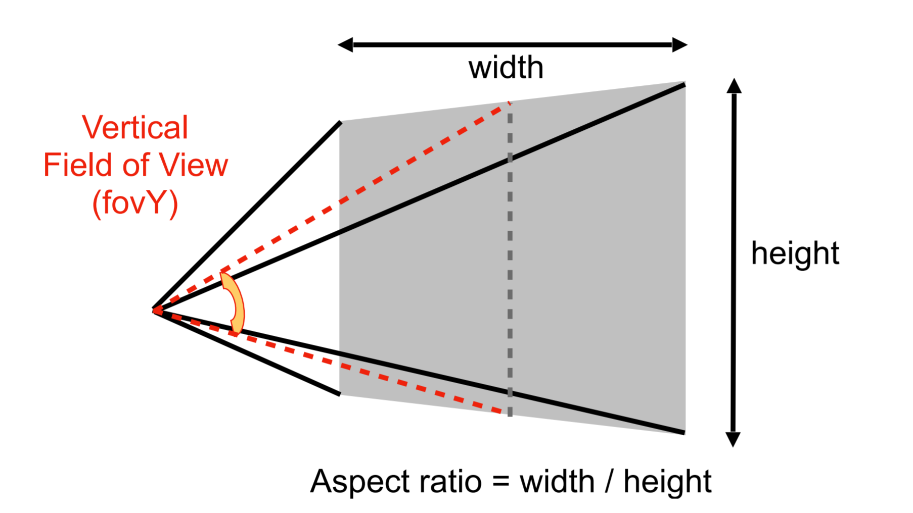
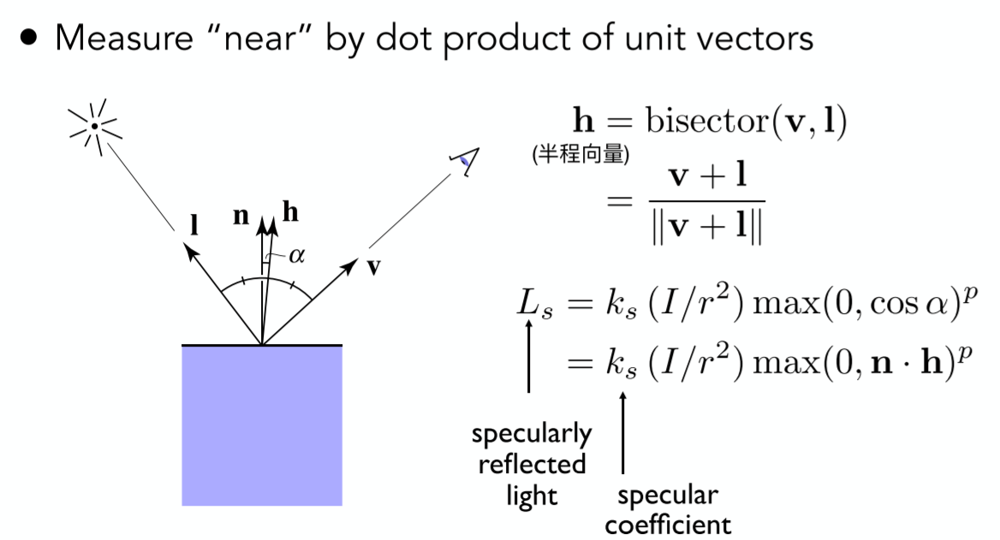
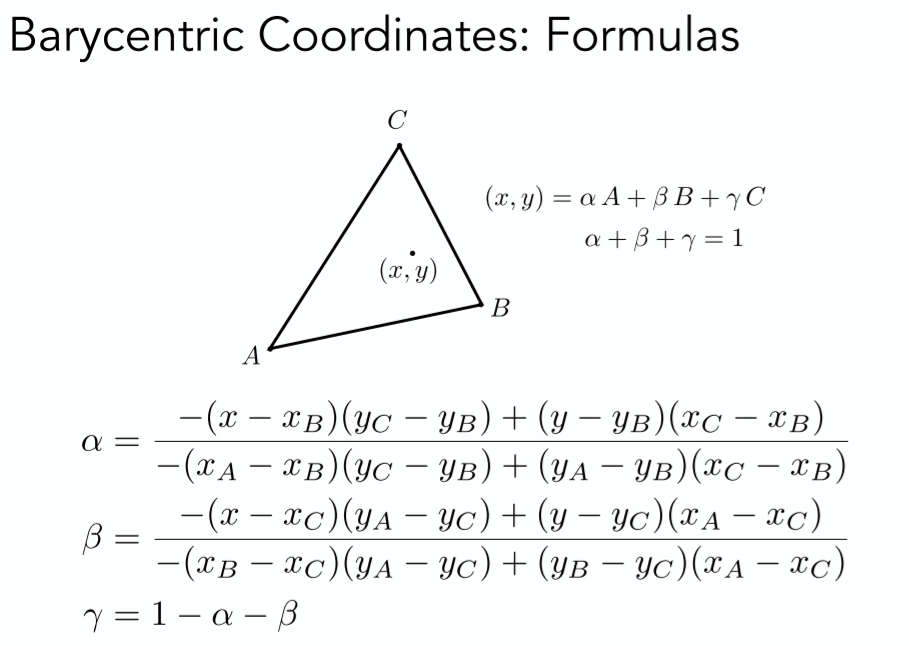

# 计算机图形学概述
* Course Topics (mainly 4 parts)
  - Rasterization
  - Curves and Meshes
  - Ray Tracing
  - Animation / Simulation

# 向量与线性代数
## Dot Product in Graphics
### Find angle between two vectors
* 余弦定理

### Find projection of one vector on another


### Measure how close two directions are
* 两个单位向量点乘越接近1则越接近，越接近-1则越远离

### Decompose a vector
* 利用点乘投影


### Determine forward or backward
* 给定前向向量a,与向量b的点乘大于0则前向，小于0则后向


## Cross Product in Graphics
### Determine left/right
* 对应给定坐标系如图右下角,判断向量a与向量b的关系,可通过$\vec{a} X \vec{b}$,根据右手螺旋定则（右手握拳，从b向量转到a向量，则大拇指朝z轴负方向.）,则向量a在向量b的右边.


* 总结：任意两个向量a,b的叉乘
    -   结果为朝坐标轴正方向,a在b的左侧
    -   结果为朝坐标轴负方向,a在b的右侧

### Determine inside/outside
* 如果某一点p在三角形所有边的同一侧,则该点在三角形内部,否则在外部.


# 变换（二维与三维）
## 2D变换
* 2D旋转变换矩阵（逆时针）
$$
\left[
    \begin{matrix}
        cos\theta & sin\theta \\
        -sin\theta & cos\theta \\
    \end{matrix}
\right]
$$

* 线性变换：缩放、对称、错切、旋转
> 形式: $X^{'} = Mx$,变换能写成**同维**矩阵

### Homogeneous Coordinates（齐次坐标）
* 目的:让变换全部统一写成一个矩阵*一个向量

### 齐次坐标定义
* 2D point = $(x,y,1)^{T}$
* 2D vector = $(x,y,0)^{T}$

### w坐标的意义
* vector + vector = vector;
* point - point = vector;
* point + vector = point;
* point + point = 这两点的中点
> 齐次坐标$(x,y,w)^{T}$代表的2D点为$(x/w,y/w,1)^{T},w!=1$

### 仿射变换
* 仿射(Affine)变换 = 线性变换 + 平移

### 变换顺序
* 变换顺序不存在交换律.先平移后旋转和先旋转在平移结果不一样
* 数学解释：矩阵乘法不存在交换律
* 几何解释：进行变换的时候坐标轴也会一起变换，旋转后的坐标轴和旋转前的坐标轴以及不一样.

### 变换的分解
* 绕任一点P旋转:
    - T(-c):将旋转点平移到原点.
    - R(alpha):旋转
    - T(c):平移回去

### 仿射变换矩阵是先线性变换还剩先平移
* 先线性变换再平移
> 数学解释：可以利用分块矩阵的推导

## 3D变换
### 3D旋转
* 绕x,y,z轴旋转（右手系）
  


#### 为什么y的旋转矩阵是反的
* 如果坐标轴按x,y,z顺序,则x与y叉乘得到z,y和z叉乘得到x，**z和x叉乘得到y**
* 所以对于绕y轴旋绕与绕x轴与y轴是相反的.

* roll,pitch,yaw.

* Rodrigues' Rotation Formula(罗德里格旋转公式)
> 用于任意角度的旋转

### 四元数和万向结死锁
#### 四元数
* 待补

#### 万向结死锁
[3D游戏世界里的万向节锁](https://zhuanlan.zhihu.com/p/42519819)

* 万向结死锁就是一个物体在一个3D世界里面随着旋转顺序和旋转角度的改变，导致物体只能在一个固定的平面旋转，无法旋转到你预想的角度。由于物体的旋转，物体的坐标轴方向也发生了改变，导致其中2条坐标轴发生了重合。当你围绕着重合的坐标轴旋转时，物体的旋转方向始终在一个平面上旋转。

## Viewing（观测）变换
### Model（模型）变形
* 将物体从局部坐标系变换到世界坐标系.

### view（视图）变换
* how to define the camera
    - Position $\vec{e}$
    - Look-at /gaze direction $\hat{g}$
    - Up direction $\vec{t}$(assuming perp. to loo-at)


#### 相机摆放通用做法
    - The origin,up at Y,look at -Z
    - And transform the objects along with the camera

* 原因：为了方便之后的投影变换


* 如何操作
    - 平移直接操作
    - 旋转操作难以写出,先写逆变换，再算逆矩阵

## Proejection（投影）变换
### 正交投影
* 特点； 不会近大远小

* 方法: We want to map a cuboid [l, r] x [b, t] x [f, n] (注意越远z值越小) to
the “canonical (正则、规范、标准)” cube $[-1, 1]^{3}$
    - Center cuboid by translating
    - Scale into “canonical” cube


### 透视投影
* 特点：近大远小

* 方法：
    - First “squish（挤压）” the frustum（椎体） into a cuboid (n -> n, f -> f) ($M_{persp->ortho}$)
  - Do orthographic projection (Mortho, already known!)

* 透视投影变换矩阵
    $$M_{persp} = M_{ortho}M_{persp->ortho}$$

* 其中M_{persp->ortho}推导
    - 挤压规则
      - 近平面不变-(1)
      - 远平面z值不变-(2)
      - 远平面中点不变-(3)
    - 变换矩阵推导
      - 通过相似三角形求出变换矩阵第1,2,4行
      - 通过(2),(3)解出第三行参数
> 详细见ppt

$$
M_{persp->ortho} =
\left[
    \begin{matrix}
        n & 0 & 0 & 0 \\
        0 & n & 0 & 0 \\
        0 & 0 & n+f & -nf \\
        0 & 0 & 1 & 0 \\
    \end{matrix}
\right]
$$
* 其中n为近平面z值,f为远平面z值

#### 进行挤压后在近平面和远平面之间的点会这么移动？
* 待补

# 光栅化
## 透视投影补充
* fovY(field-of-view)(Y方向视角)
* aspect ratio(宽高比)



## viewport transform
* 将经过投影变换转换到裁剪空间的坐标通过视口变换转换到屏幕坐标

* 方法：
    - Irrelevant(忽略) to z
    - Transform in xy plane: $[-1, 1]^{2}$ to [0, width] x [0, height]


## 显示器
* CRT(阴极射线管)
    - 隔行扫描
* LCD(液晶)
* LED(发光二极管)
* Electrophoretic Display(墨水瓶)

## Triangle Meshes
* 优点
    - 最基本的多边形
      - 任何多边形都可以拆成多边形
    - 三角形内部一定是平面的
    - 三角形内外定义明确
    - 容易使用重心坐标插值

* Sampling(采样)
    - 连续函数离散化的过程

* 如何光栅化,判断每个像素点是否在三角形内部
    - 遍历像素点
    - 通过叉积判断点是否在三角形内部

* 如果点在三角形边界上,要么不处理要么特殊处理
* 可以通过包围盒减少需要采样的像素

## 反走样
* 走样定义：High-frequency signal is insufficiently sampled: samples erroneously appear to be from a low-frequency signal
Two frequencies that are indistinguishable at a given sampling rate are called “aliases”
> 高频信号采样不足：样本错误地显示为来自低频信号,在给定的采样率下无法区分的两个频率称为走样

### Sampling Artifacts（采样伪影）的表现
* Jaggies(锯齿) - Sampling in space
* Moire Patterns(摩尔纹) - understanding images
* Wagon wheel effect(倒着转的轮子) - sampling in time
*** 
* 产生走样的表现：Signals are changing too fast (high frequency), but sampled too slowly

### 频域
* Fourier Transform(傅里叶变换)
* spatial domain -> 傅里叶变换 -> frequency domain

### 滤波
* Filtering = Getting rid of certain frequency contents
* 一个图像可以通过傅里叶变换转换到频域空间
    - 高频信息是图像中的细节或边界
      - 高通滤波可以获取图像边界
    - 低筒信息是图像的其他信息
      - 低筒滤波获取的是缺少细节的图片

***

* Filtering = Convolution(=Averaging)
* 卷积定理
Convolution in the spatial domain is equal to multiplication in the frequency domain, and vice versa(反之亦然)
    - 卷积方法
      - Option 1: 
          - Filter by convolution in the spatial domain 
      - Option 2:
          - Transform to frequency domain (Fourier transform) 
          - Multiply by Fourier transform of convolution kernel 
          - Transform back to spatial domain (inverse Fourier)
* 反过来,时域上的乘积在频域上是卷积

***
* Box Filter = Low Pass Filter

$$
\frac{1}{9} *
\left[
    \begin{matrix}
    1 & 1 & 1 \\
    1 & 1 & 1 \\
    1 & 1 & 1 \\
    \end{matrix}
\right]
$$

* Wider Filter Kernel = Low Frequencies
> 卷积核越大，低通部分越少(考虑边界情况,卷积核越大越模糊，越模糊，越只有低通部分)

### 采样
* 采样 = Reapeating Frequency Contents
    - (c),(d)为在时域和频域上的冲击函数
    - 在时域上采样相当于在频域上将原始波形按照在频域上的冲击函数进行复制


* Aliasing = Mixed Frequency Contents
    - 在时域上采样越稀疏,在时域上复制的间隔就会越小,小到一定程度,波形之间就会产生堆叠,造成走样


### 反走样的方法
- Option 1: Increase sampling rate
    - increasing the distance between replicas in the Fourier domain
    - Higher resolution displays, sensors, framebuffers
    - costly & may need very high resolution
- Option 2: Antialiasing
    - Filtering out high frequencies before sampling
    - 于是就不会有重叠了：
      - 先Filter(滤波)再采样 -> Antianliasing(反走样)
        - 对图像进行模糊就说对图像进行高通滤波
      - 先采样再Filter -> Blurred Aliasing
        - 先采样后模糊（Filter）是不行的,波形重叠的情况下截断依然会有重叠

* 补充:
> 不论是高频的锯齿，还是低频的模糊，对于原信号来说，都是损失了信息。不同的是，不滤波直接采样的话对信息的提取是截断式的，它直接丢弃了原信号的一部分信息，所以你看上图右边图像信息出现了跳跃；而进行低通滤波是对原信号进行了加权平均，原信号携带的大部分信息多多少少以一定的比例存在于模糊后的信号中。信息多总比信息少好，此为什么要先滤波，后采样之原因之一。

> [渲染时采完样后为什么要移除高频部分后再采样，想问为什么要移除高频，直接重采样不就好了？](https://www.zhihu.com/question/351820035)

作者：幽玄
链接：https://www.zhihu.com/question/351820035/answer/870609167
来源：知乎
著作权归作者所有。商业转载请联系作者获得授权，非商业转载请注明出处。

* Antialiasing = Limiting, then repeating


### 抗锯齿方法
* 最理想的状态：像素的颜色为该像素内各颜色的均值。但是连续域的平均值是很难求的，计算量巨大
* SSAA
    - 比如4x ssaa,先渲染到4x的buffer上，然后每4个像素采样后取平均值，计算量和缓存都提高了4x.
* MSAA(做的是模糊这个操作,sample只是包含在了模糊操作内):
    - 在光栅化阶段,判断一个三角形是否被像素覆盖的时候会计算多个覆盖样本（Coverage sample）,在pixel shader着色阶段计算像素颜色的只计算一次,将该像素颜色定义为各个采样点颜色的均值.
    - 可以通过只检测边缘、检测点复用等方法提高效率.
    - 不兼容延迟渲染.
* FXAA(Fast Approximate AA)
    - 先得到带锯齿的图片，然后找到锯齿边界，替换带锯齿的边界.
      - 找到边界，换成没有锯齿的边界，（图像匹配）非常快
      - 方法和采样无关，采样虽然有误，但是这种方法可以弥补
* TAA(Temporal AA)
    - 时间抗锯齿
      - 静态场景，相邻两帧同一像素用不同的位置来sample
      - 把MSAA的Sampling分布在时间上
* 超分辨率
  - From low resolution to high resolution
  - Essentially still “not enough samples” problem 类似抗锯齿
  - DLSS (Deep Learning Super Sampling) 

## 可见性/遮挡
* 画家算法
> 将画从最远的地方开始画

> 不能解决场景中出现互相遮挡的情况


### Z-Buffer
* 方法:
    - 对每个像素多存一个深度
    - Frame buffer存储每个像素的颜色信息
    - depth buffer(z-buffer)存储每个颜色的深度信息
        - z总是正的(距离原点的距离),越小越近,越大越远

* 复杂度：O(n) for n triangles 并不是排序，而是只要最值

* 需要保证三角形进入顺序和结果无关

* 无法处理透明物体

* 结合msaa的话z-buffer需要对每个采样点记录深度

# shading(着色)
* shading:The process of applying a material to an object.

## Blinn-Phong Reflectance Model
* shading is Local
    -  shading  != shaow

### Diffuse Reflection
* Light is scattered uniformly in all directions
    -  Surface color is the same for all viewing directions
* Lambert's cosine law:定义物体接受到多少光照

$$
L_{d}=k_{d}\left(I / r^{2}\right) \max (0, \mathbf{n} \cdot \mathbf{l})
$$
* $L_{d}$:漫反射
* $k_{d}$:漫反射系数(定义该shading point的颜色(材质))
* $I/r^{2}$:到达着色点的能量大小
    - I:单位光照强度
    - r:距离
* $max(0,\mathbf{n} \cdot \mathbf{l})$:着色点接受的能量

***

* 漫反射跟view(观测方向)没有关系

### Specular 
* 高光的强度取决于光线的反射方向和人的观察方法之间的距离.
    - 镜面反射方向越接近观察方向就越亮

* 原始phong模型,计算镜面反射方向与观察方向的接近程度.
    - 缺点:计算复杂
* blinn-phong改进:比较半程向量和shaing poing的法线的接近程度.



* $L_{s}$:高光
* $K_{s}$:高光系数:调节高光亮度.
* $p$:光泽度:一般100~200，调节高光区域大小.

### Ambient
* Add constant color to account for disregarded illumination and fill in black shadows
> 添加恒定的颜色以考虑忽略的照明并填充黑色阴影
* this is approximate / fake

$$L_{a} = k_{a}I_{a}$$

* $L_{a}$:环境光
* $k_{a}$:环境光系数:环境光颜色
* $I_{a}$:光照强度

***
* Blinn-Phong Reflection Model

$$ 
    L = L_{a} + L_{d} + L_{s} \\
     = K_{a}I_{a} + k_{d}(I/r^{2})max(0,\mathbf{n} \cdot \mathbf{l}) + k_{s}(I/r^{2})max(0,\mathbf{n} \cdot \mathbf{h})^{p})
$$

## Shading Frequencies 着色频率
* Flat shading
    - 恒定着色指的是根据多边形上某个像素的光照情况对整个多边形着色。换句话说，假设多边形是由一种材质构成的。
      - 每一个三角面一个法线,对每一个面进行一次着色.
    - 缺点:对于平面组成的物体，这种方法是可行的;但是对于由曲面组成的物体，使用多边形近似，这种方法导致物体看起来是由多边形组成的。
* Gouraud(高洛德) shading
    - Gouraud 着色是分别计算三角形三个顶点的光照情况，然后通过重心坐标插值的方式来决定三角形内每一点的颜色。
    - 缺点:对高光的插值不好，因为高光往往比较锐利，如果原本该面上有高光，但是顶点处没有高光，那么插值后，这个面就没有高光。
    - 优点：效果不错，计算量小
* Phong shading
    - phong着色通过插值计算屏幕空间多边形每个像素的法线，然后根据法线来执行光照计算。
    - 优点：它对每个像素执行光照计算，真实感比gouraud着色强些，提高了镜面反射效果。
    - 缺点：计算量比较大
> 参考:[着色模型(频率)](https://zhuanlan.zhihu.com/p/362201067)

* 几何足够复杂的情况下，用简单的Shading方法也可以达到好的效果
* 好的效果一般需要大的计算量

### 定义逐定点法线
* 相邻面的法线的加权平均(根据相邻三角面的面积进行加权)

### 定义逐像素法线
* Barycentric interpolation
    - 求出的法线需要归一化

## 渲染管线


* Vertex Processing
    - MVP Transform
    - Shading
        - Gouraud(高洛德) shading
* Rasterization Processing
    - Sampling triangle converage
* Fragment Processing
    - Z-Buffer Visiblity Tests
    - Shading
      - Phong shading

## 纹理映射(Texture Mapping)
* 三维物体表面都是二维的.
* 纹理：图，有弹性，可以映射到表面
* UV和物体的对应关系是美工干的事情
* UV坐标:在纹理上简历的坐标系
    -   $UV \in [0,1]^{2}$
- 一张纹理可以使用多次
- 纹理本身设计可以无缝衔接→tilable
    - 一种方法：Wang Tiling

## Barycentric Coordiantes(重心坐标)
* 插值目的: obtain smoothly varying values across triangles.
* 插值内容: texture coordinates.colors,normal vectors,...
* 插值方法: 重心坐标

$$(x,y) =  \alpha * \mathbf{A} + \beta * \mathbf{B} + \gamma * \mathbf{C} $$
$$ \alpha + \beta + \gamma = 1$$

* 如果三个系数都为非负 <=> (x,y)在三角形内部
    - 通过面积比求系数



* 重心坐标在投影变换后不一定一样.
    - 深度
        -在空间中做插值,不能在投影后进行插值.

## Appying Textures.

```cpp
for each rasterized screen sample(x,y)//Usually a pixel's center.
    (u,v) = evaluate texture coordinate at (x,y);//重心坐标
    texcolor = texture.sample(u,v);
    set sample's color to texcolor;//Usually the diffuse albedo Kd
```

## Texture Magnidication - what if the texture is too small
* texel(纹理元素,纹素):A pixel on a texture(纹理上的像素)

* 多个pixel映射到了同一个texel
* 纹理查询时对于非整数uv坐标应该如何处理
    - Nearest(找最近的点)
    - Bilinear(双线性插值)
    - Bicubic(双向三次插值)
      - 周围16个点做三次插值
      - 运算量更大，结果更好

## Texture Magnification - What if the texture is too large
* 一个pixel对应了多个texel → 采样频率不足导致 摩尔纹+锯齿（走样）

* 方法
    - Supersampling
        - 太慢
    - Just need to get the average value within a range
        - Point Query vs. (Avg.) Range Query.
            - 点查询:线性插值.
            - 范围查询:范围内平均查询

### mipmap
* Allowing(fast,approx.,square(正方向))range queries
    - 方法:每一层把前一层高宽缩小一半.
    - 生成Mipmap要多1/3的存储量
* 计算Mipmap层级D
    - 通过待求像素和其邻居来求在纹理上纹素的范围.
        - 如果纹素为L*L为整数
            - 在$log_{2}L$层查询对应的某一个纹素.
        - 如果L不为整数.
            - 三线性插值.
                - 分别在floor(D)和ceil(D)上做Bilinear Interpolation取颜色值之后再插值

***

* overblur:mipmap的缺点,在远处模糊的太过损失细节.
    - 原因:方块查询,各种近似

* Anisotropic Filtering(各向异性过滤)
    - 各向异性:在各个方向表现不同
    - Ripmaps and summed area tables
    - Can look up axis-aligned rectangular zones
    - 长/宽/长和宽 各减半
    - 生成需要3倍的存储量
    - 2(4,8,16)x:长宽压缩2(4,8,16)倍
        - 存储逐渐收敛到3倍
* EWA filtering
    - 在形状分解为不同的圆形
    - 利用多次查询求平均值的方法来处理不规则区域

## Application of Texture
* In modern GPUs,texture = memory + range query(filtering)
  - General method to bring data to fragment calculations

Many applications

- Environment lighting - Environment Map
    - 环境光贴图:记录场景中的环境光
    - 例子：Utah Teapot
        - 经典：Stanford Bunny,Dragon，Cornell Box
    - Spherical Environment Map
        - 球心：世界中心
        - 一个问题：球面展开会发生拉伸,导致畸变
        - 解决方法：Cube Map
    - Cube Map：立方体表面，从球心到球面的投影向外
        - 扭曲更少，但是Need dir->face computation，计算量更大

Many applications
- Store microgeometry(储存微几何)
    - Textures can affect shading! → define height/normal → Bump / Normal Map
        - 两者类似，都可以以假乱真
        - 改变表面的法线

    - Bump Mapping 凹凸贴图

        Bump Mapping的Texture记录了高度移动

        - 不改变几何信息(不改变三角形信息)
        - 逐像素扰动法线方向
        - 高度 offset 相对变化，从而改变法线方向
        - 计算法线方向：切线的垂直方向

    - Displacement mapping 位移贴图
        - 输入相同（Texture与Bump Mapping可共用）
        - 改变几何信息，对顶点做位移
        - 相比上更逼真，要求模型足够细致，运算量更高
        - DirectX有Dynamic的插值法，对模型做插值，使得初始不用过于细致
    - Procedural textures
        - 3D Procedural Noise + Solid Modeling
            - 定义空间中任意点的颜色
            - 噪声+映射→
            - Perlin Noise
    - Provide Precomputed Shading
        - Ambient occlusion texture map
            - 计算好的环境光遮蔽贴图
            - 空间换时间
    - Solid modeling & Volume rendering
        - 三维渲染

## shaow mapping
光栅化下对全局光线传输、阴影的处理十分麻烦。
- draw shadows using rasterization
- An Image-space Algorithm
    - 不需要场景的几何信息
    - 有走样现象
    - 思想：the points NOT in shadow must be seen both by the light and by the camera

* 步骤
    - Pass1: Render from Light
      - generate depth image from light source
    - Pass2A: Render from Eye
      - generate Standrad image(with depth) from eye
    - Pass2B: Project to light
      - Project visible points in eye view back to light source

* 问题：
- 走样、分辨率
- 数值精度问题
    - Involves equality comparison of floating point depth values means issues of scale, bias, tolerance
        - 涉及浮点数深度值的相等性比较意味着比例、偏差、公差等问题
- 只能点光源、硬阴影
- Quality depends on shaow map resolution
