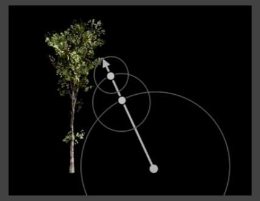
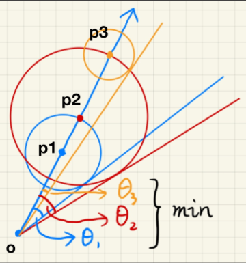
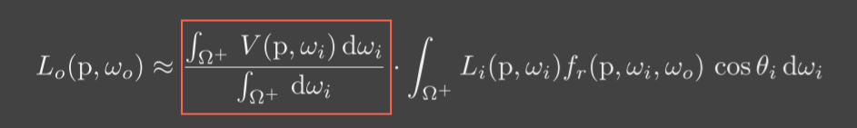
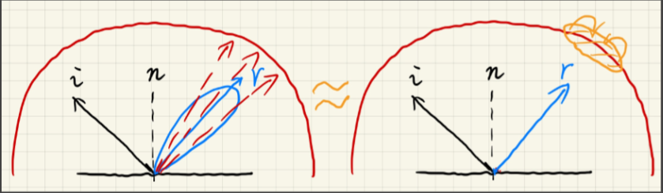
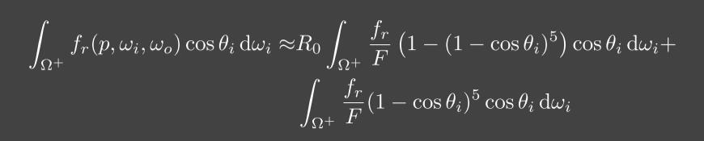

# 实时渲染概述
* Real-Time High Quality Rendering
  - Real-Time
    - Speed:more tham 30 FPS(frame per second)
      - VR/AR : 90 FPS
    - Interactivity: Each frame generated `on the fly`(运行中)
  - High Quality
    - Realism:advanced approaches to make rendering more realistic
    - Dependability:all-time correctness(exact or approximate),no tolerance to (uncontrollable) failures
  - Rendering
    - 将虚拟场景通过计算方式投射到屏幕上
***
* 课程内容
    - Shadows(and env)
    - Global Illum.(Scene/image space,precomputed)
    - Physically-based shading
    - Real-time ray tracing
* 课程不包括
    - 3d modeling or game engine
    - 离线渲染
    - Neural Rendering
    - Using Opengl
    - Scene /Shader optimization
    - Reverse enginerring of shaders
    - High performace computing
***
* Render-time rendering = fast & approximate offline rendering + systematic engineering
    - Fact:in real-time rendering technologies,the industry is way ahead of the academia
***
* Technological and Algorithmic Milestones
    - Programmable graphics hardware(shaders)(可编程着色器)(20 years ago)
    - Precomputation-based methods(15 years ago)
      - Complex visual effects are (partially) pre-computed
      - Minium rendering cost at run time
      - Precomputation-based methods:Light
        - fix geometry
        - fix viewpoint
        - dynamically change light
    - Interactive Ray Tracing(8-10 years ago:CUDA+OPtiX)
      - Hardware development allows ray tracing on GPUs at low sampling rates(~1 samples per pixel(SSP))
      - Followed by post precessing to denoise

# Recap of CG Basics
## Grapics(Hardware) Pipeline
* Vertex Processing
  - MVP Transform
* Triangle Processing
* Rasterization
  - Sampling Triangle converage
* Fragment Processing
  - Shading
  - Texture mapping & interpolation
* Framebuffer Operations
  - Z - Buffer Visibility 

## Opengl
* 略

## GLSL
* 略

## The Rendering Equation
* Most Impoartant equation in rendering
  - Descring light transport


***
* In RTR(real-time rendering)
  - Visibility is often explicitly considered
    - Visibility 实时渲染会考虑到物体会不会被光源找到，就引入Visibility 的概念。
    - 在实时渲染中incident light单指从光源发出的光线
      - 那间接光呢？
  - BRDF is often considered together with cosine term
    - brdf可能指原始brdf也可能指cosine-weighted brdf


* 这样定义便于理解环境光照
  - 对于任意一个shading point只要判断这点与光源之间是否可见
    - 将incident light和有没有光线照到这个点拆开

***
全局光照 = 直接光照 + 间接光照

## 课堂答疑整理

* 1.问：怎么定义哪些点连接成三角形? 
* 答：比如obj格式是先编号一系列点，再定义面，每个面都带着三个点的编号的下标。
***
* 2.问：有无适合全局光照的管线？
* 答：无，但光线追踪渲染管线很完善。
***
* 3.问：纹理坐标怎么参数化的？
* 答：可以理解成物体外面有个盒子，把盒子挤压到物体上，盒子上的uv是好确定的。
***
* 4.问：几个光源就需要几个shadowmap吗？光源也需要深度测试吗？* 答：是
***
* 5.问：opengl支持optix吗？
* 答：可以，但不要指望shader能调用一个光线一个场景怎么运作。
***
* 6.问：纹理是不是是个buffer？
* 答：opengl里两者定义不一样，但也可以这样理解，都是显存里的一块缓存区域。
***
* 7.问：一个pass就是一个frambuffer渲染一次吗？
* 答：一个场景渲染一次
***
* 8.问：不同shader里定义里的变量会通用吗？
* 答：不是

# Real-time Shadows 
## shadow Mapping

* A 2-Pass Algorithm
    - The light pass generates the SM
    - the camera pass uses the SM(recall last lecture),(真正的渲染)

* An image-space algorithm
  - Pro:no knowledge of scene's geometry is required
  - Con:casuing self occlusion(自遮挡) and aliasing issues(走样)

***
### Shaow Mapping 方法
* Pass1:Render from light
  - output a "depth texture" from the light source
* Pass2:Render from eye
  - Render a standard image from eye
    - 如果眼睛看到的深度等于shaow map的深度说明被光线照到
    - 如果眼睛看到的深度大于shaow map的深度说明在阴影里

### Issues in Shadow Mapping
#### Self occlusion && detached shadow
* Self occlusion(自遮挡问题)
  - 表现:地面上的奇怪纹路,也叫阴影失真(Shadow Acne)


* 原因:
  - 由于shadowmap记录的深度是不连续的，是一个一个像素的深度值组成的，如下图右，眼睛观察到的像素会误认为深度在前面的像素后面，形成遮挡，产生错误的阴影。当light和平面趋于平行时最严重。

* 解决方法
  - 通过一个shaow bias(阴影偏移)，使得在shading point上shadow map中的深度和从eye看到的深度在一定范围内的时候,不算遮挡住

  ```cpp
  float bias = 0.005;
  float shadow = currentDepth - closestDepth > bias ? 1.0 : 0.0;
  ```
  - 在grazing angle(几乎是平行)的时候self occlusion问题最严重,在光线垂直投射的时候最不严重,可以将bias设计的与光线夹角有关.

  ```cpp
  float bias = max(0.05 * (1.0 - dot(normal, lightDir)), 0.005);
  ````

* 新问题:detached shadow
  - 忽略一定的深度的情况下,肯定会将一些本来就差距很小的阴影给舍弃掉,如下图脚后跟的阴影
  - 也叫悬浮(Peter Panning)，因为物体看起来轻轻悬浮在表面之上
  

* 一种解决方法:Second-depth shadow mapping
  - Using the midpoint between first and second depths in SM
    - 可以在第一个pass时，可以在渲染一张light看到最近深度的图同时渲染一张次近的图（个人理解是透过最近的深度的像素再渲染一张最近深度），将两个深度的中间深度来算遮挡阴影。
  - Unfortunately,requires objects to be watertight
    - 一个是场景内的物体必须都是watertight（非面片
  - And the overhead may not worth it
    - 算的复杂，开销太大，实时渲染不相信复杂度。


#### Aliasing(走样)

## The Math behind shaow mapping
* there are a lot of useful inequalities in calculus
* but in RTR,we care more about "approximately equal"
  - 微积分在实时渲染中更关心近似相等，把不等式当约等于来用
* An important approximation throughout RTR

  $$\int_{\Omega}f(x)g(x)dx\approx\frac{\int_{\Omega}f(x)dx}{\int_{\Omega}dx}\cdot\int_{\Omega}g(x)dx$$

  - 除以一个积分是为了式子拆分以后，不希望得到的能量波动太大，就需要除以一个积分归一化。

  - what is it (more) accurate?
    - 当g的积分的范围很小的时候或者g这个函数足够光滑(低频,变化不大)的时候就会比较准确。

### shaow mapping的理论基础
* Recall the rendering equation with explicit visibility


* 有了这个方法就能把the rendering equation拆开来写，把V拆出来，这样式子就变成了左边是visibility(遮挡)右边是shading，这样就和shadowmap的思路相吻合。

* when is it accurate?(两个满足一个即可)
  - Small support(g(x)的函数不为0的区域比较小)
    - point / directional light
    - 当只有点光源的时候和方向光源的时候，积分范围小到基本没积分什么事，这个式子就成立。
  - Smooth integrand(g(x)函数比较平滑)
    - 低频,变化不大
       - diffuse(漫反射
       - bsdf(=brdf+btsd)
       - constant radiance area light
    - 当在光源的radiance恒定(uniform)情况下，就比如一个面光源，当brdf是diffuse的情况下(glossy就不行)，右边的函数足够光滑，得到的结果也正确的。

## Percentage closer soft shadows(PCSS)
### Percentage Closer Filtering(PCF)
* Provides `anti-aliasing` at shadows' edge
  - Not for soft shadows(PCSS is,introducing later)
  - Filtering the results of shadow comparisons
* 不是对shadow map进行filitering
  - 如果直接在shadow map上filtering就会造成阴影和物体交界直接糊起来
    - Texture filitering just averages color componets,i.e. you will get blurred shadow map first
  - 做深度测试的时候,判断结果任然是非0即1的(任然是阴影硬)
    - Averaging depth vlaues,then comparing,you still get a binary visibility
* 不是对最后得到有锯齿的阴影硬图做filtering
  - 这样做只能得到模糊的带锯齿的图,还剩没有阴影硬也没有去掉锯齿
    - 具体可以回顾GAMES101中的抗锯齿

    

***

* Solution[Reeves,SIGGAPRH 87]
  - Perform multiple(e.g. 7*7) depth comparsions for each fragment
    -对着色点周围一圈的像素与改点在shadow map中记录的深度做比较
  - Then，averages results of comparisons
    - 对这些比较结果做平均得到一个在0~1之间的值

***
* filitering size ->
  - Small -> sharper
  - Large -> softer

### PCSS(Percentage Closer Soft Shadows)
* 在面光源下,什么地方产生阴影硬,什么地方产生软阴影
  - Filter size <-> blocker distance
    - 遮挡物和阴影接受物的距离
  - More accurately,`relative` `average` projected blocker depth
    - 更准确，相对平均投影阻挡深度
  - A mathematical "translation"
    - 可以用相似三角形得出，filtering的范围大小可以通过遮挡物到被遮挡面的距离除以遮挡物到光源的距离乘以光源面积得到。
    - $W_{penumbra} = (d_{Receiver} - d_{Blocker}) \cdot w_{Light} / d_{Blocker}$

    

***
* Now the only question:
  - what's the blocker dpeth $d_{Blocker}$
    - 对于场景中的物体,遮挡物一般是不是一个点或者一个平面,收益对于某一着色点Blocker的$d_{Blocker}$需要对周围一定范围内的被遮挡物求平均,计算平均遮挡深度.

* The complete algorithm of PCSS
  - Step 1:Blocker serch
    - getting the average blocker depth `in a certain region`
      - 只对能够遮挡住的像素求平均
  - Step 2:Penumbra estimation(半影估计)
    - use the average blocker depth to determine filter size
  - Step 3:Percentage Closer Filtering

* 注意面光源无法生成Shadow map,这里生成shadow map通过将light放在面光源中心,当做点光源生成shadow map

* which region to perform blocker search?
  - can be set constant (e.g. 5*5),but can be better heuristics(启发式)

* which region(on the shadow map) to perform blocker serach?
  - depends on the light size
  - and receiver's distance from the light
>  可以把shader point连向light，看在shadow map(就是视锥体的近平面,就说用于光栅化的平面，在第一个PASS用于生成shadow map)所占范围来确定，因为离光源越远，遮挡物也会更多。


### 答疑

1.纯工业界问题最后一节说

2.2倍的n不太能接受。 的确，会慢很多，还是很在乎常数的，不止复杂度

3.离线渲染有这样用近似的吗。 好像没见过。

4.有误差公式吗？ 没有必要

5.smooth对左右两个函数都有要求吗。 只要一个

6点光源怎么用pcss。 点光源本身生成的就是硬阴影，不用pcss

7.shadow maping好处就是说任何一帧你都知道那个物体在哪，反正阴影都是重新算的，shodow map也是重新算的，和运动物体没关系。

### More on PCF and PCSS(A Deeper Look at PCF)
* The math behind PCF
  - Filtering / convolution:
    - $[ w * f](p) = \Sigma_{q \in N(p)} w(p,q)f(q)$
      - 这个卷积公式,取p点领域内的所有点q,根据权值项w(p,q)对所有的f(q)进行加权平均
      - w(p,q):根据p,q之间距离的一种权值
  - PCSS
    - $V(x) = \Sigma_{q \in N(p)} w(p,q) \cdot \chi^{+}[D_{SM}(q) - D_{scene}(x)]$
      - $\chi^{+}[]$:为符号函数
      - 这个公式将shading point点x对应shadow map上点p周围领域上的所有点q进行判断,这个点q是否能遮挡住shading point点x(即在shadow map上q点的深度是否小于p点的深度),并对所有的判断进行加权平均
    
  - PCSS不是filteringshadow map
    - $V(X) \neq \chi^{+}\{[w * D_{sm}](q) - D_{scene}(x)\}$
  - PCSS不是对最后生成的图进行filtering
    - $V(x) \neq \Sigma_{y \in N(x)}w(x,y)V(y)$

***
* in PCSS,which step(s) can be slow?
  - Looking at very texel inside a region(step 1 and 3)
    - 都要对区域内所有像素进行比较
  - Softer -> larger filtering region -> slower

## VSSM(Variance Soft Shadow Mapping)
* 特点
  - Fast blocker search(对应pcss第一步)
  - Fast filtering(对应pcss第二步)

### 解法第三步的问题
* 第三步就是PCF，PCF要和周围一圈进行深度比较得出是否被遮挡，进一步就可以理解成有多少texels比取的点深度浅或深度深
  - 就可以比喻成一个人的成绩在班上能排在多少。要知道一个人的成绩排多少，就要知道全班人的成绩，这就是之前PCF的做法。

* VSSM的做法就说避免遍历周围所有的texels进行比较.
  - 为了避免把所有人成绩看一遍，可以通过值方图得到一个相对精确的排名
  - 不需要那么准的话就可以当做一个正态分布
    - 正态分布就只需要方差和平均值就能得出
  - Variance soft shadow mapping的思路就是这样，通过正态分布来得到结果。
***
* VSSM Key idea
  - Quickly compute the mean(均值) and variance(方差) of depths in an area
* quicklye compute mean
  - Hardware `mipmap`ing
    - 缺点: 只能方形查询,通过三线性插值获得近似得到值不准
  - 改进方法: Summed Area Tables(SAT)
*  quicklye compute Variance
  - $Var(x) = E(X^{2}) - E^{2}(X)$
    - 范围平均查询得到是就是E(X)
  - So you just need the man of ($depth^2$)
    - Just generate a "square-dpeth map" along with the shadow map!
      - $E(X^{2})$通过生成某一张shadow map里面存储距离的平方,再用范围平均查询就能得到$E(X^{2})$
***
* Back to the question
  - 通过mean(均值)和variance(方差)就可以构造出正态分布,就可以通过算面积得出有多少texels深度比shadow point的点小
  - 对于通用的高斯的PDF，可以把积分的值打成表，积分的值就是误差函数（error function）。这个积分没有解析解，只有数值解，c++有个内置函数就是erf就能做CDF。
    - PDF：概率密度函数（probability density function）, 在数学中，连续型随机变量的概率密度函数（在不至于混淆时可以简称为密度函数）是一个描述这个随机变量的输出值，在某个确定的取值点附近的可能性的函数。
    - CDF : 累积分布函数 (cumulative distribution function)，又叫分布函数，是概率密度函数的积分，能完整描述一个实随机变量X的概率分布。
      - CDF(X)就是x~pdf(x)下的概率
    - [概率论中PDF、PMF和CDF的区别与联系](https://blog.csdn.net/yzcjwddbdgg/article/details/88063677)
***
* it doesn't have to be too accurate!
  - Chebychev's inequality(one-tailed version,for t > mu)(切比雪夫不等式，要求t在均值右边)

  

  - 特点
    - 适用于任何pdf,但要求pdf函数比较简单.
    - 值适用于t在mean右边的情况.
    - rtr一般把不等当成约等

***
* VSSM性能
  - Shadow map generation
    - "square depth map":pararllel,along wtih shadow map,#pixels
      - 生成shadow map的时候,在这张shadow map的其他通道存储距离的平方,这样可以节省空间.
  - Runtime
    - Mean of depth in a range:O(1)
    - Mean of depth square in a range:O(1)
    - chebychev:O(1)
    - No samples / loops needed
* step 3(filtering) solved perfectly

### 解决第一步的问题
* Back to Step1 : Blocker search(with an area)
  - Also require sampling(loop) earlier,also inefficient
  - The average depth of blockers
  - Not the average depth $Z_{avg}$(不是整块面积的平均)
  - The average depth of those texels whose depth z < t(是所有遮挡物的平均)

***
* key idea
  - Blocker(z < t),avg.$Z_{occ}$:遮挡像素的平局值
  - Non-blocker(z > t),avg. $Z_{unocc}$：未遮挡像素的平均值
  - 其满足等式:
    $\frac{N_{1}}{N}z_{unocc} + \frac{N_{2}}{N}z_{occ} = z_{Avg}$
    - N:总像素数
    - N1:未遮挡像素数
    - N2:遮挡像素数
    - $z_{Avg}$:整块面积的平均像素
  - Approximation:$\frac{N_{1}}{N} = P(x > t)$(切比雪夫)
  - Approximation:$\frac{N_{2}}{N} = 1- P(x > t)$
  - $z_{unocc},we really don't know$
    - Approximation:$z_{unocc} = t (i.e. shadow receiver is a plane$
      - 大多数阴影接受的都是平面
  - Step1 solved with negligible additional cost

### Mipmap and Summed-Area Variance Shadow Maps
* 为了快速求得一个区域的均值和方差,需要对shadow map中的任意矩形区域进行范围查询
  - MIPMAP 和 Summed Area Table(SAT)

* 原理:前缀和

## Moment shadow mapping 
* VSSM问题
  - VSSM做了很多假设，假设不对的时候会有问题。比如右图，只有三个片的遮挡的情况下，那么深度的分布就在这三个遮挡度深度周围，形成了三个峰值，自然就会出现假设描述的不准。


* Issues if the dpeth distribution is inaccurate
  - 当shadow分布不是正太分布时效果差，产生漏光的现象.
  - 接受面是非平面时会造成阴影断裂的现象.
  - 切比雪夫不等式实际只在$t > Z_{avg}$时有效


***
* MSM
  - Goal:Represent a distribution more accurately(but still not too costly to store)
  - Idea:use higher order moments to represent a distribution

* Moments
  - 简单定义:$x,x^{2},x^{3},x^{4},....$
  - So,VSSM is essentially using the first two orders of moments

* What can moments do?
  - Conclusion:如果保留前M阶的矩，就能描述一个阶跃函数，阶数等2/M,就等于某种展开。越多的阶数就和原本的分布越拟合。一般来说4阶就够用。
  
  - Restore the CDF during blocker search & PCF

***
* Pro:very nice results
* Cons
  - Costly storage(might be fine)
  - Costly performace(in the reconstrcution)
    - 如何从多个矩计算PCF,非常复杂

***
* 问题集合：
  - 1.接收平面是曲面怎么办。 不只是曲面，甚至和光源不平行就会出问题。
  - 2.VSSM是PCSS的快速版吗？ 可以这么理解，但不能替换。
  - 3.每次算shadowmap 都要算SAT还是比较花时间的。

## Distance field soft shadows
* 速度快但存储成本高.
***
* 定义:
  - At any point,giving the minium distance (could be signed distance) to the closest location on an object.
  - 空间任何一个点到物体表面的最小距离，通过数值正负得到是否在物体内部，就是距离场（SDF）。
  - SDF引用在3D场景的话，需要存储一整个3d格子，这样存储开销就很大。

* SDF的特点
  - 可以方便对运动的物体做线性插值.
    - 如下上面一组图,如果对A和B逐像素的进行插值,将会产生错误的效果.
    - 如下下面一组图,通过定义SDF,对SDF插值可以帮助我们对这种运动边界的插值.
    
  - Can blend any two distance functions d1,d2

* 底层原理:最优传输理论

*** 
### SDF的应用:Ray Marching
* Ray marching (sphere tracing) to perform ray-SDF intersection
* Very smart idea behind this:
  - The value of SDF == a "safe" distacne around
* therefore,each time at p,just travel SDF(p) distance.



* 当我们已经获得整个场景里物体SDF，有一根光线需要和SDF定义的物体隐含表面进行求交，最简单的求交方式就是sphere tracing。当光线于任意一点时，通过sdf就能得出一个安全范围内，这个光线在安全距离可以任意地向前走，在到达新的点的时候又可以通过sdf确定新的安全距离。当这个光线的距离场足够小的时候就可以很方便地和物体表面求交，或者这个光线走的足够远的时候就可以放弃这个光线的追踪。

### SDF的应用:Soft Shadow
* Use SDF to determine the (approx.不准的) percentage of occlusion
  - 通过sdf可以获得大概有多少的范围被挡住
* the value of SDF -> a `safe` angle seen from the eye
  - 将安全距离的概念进行延伸，在任意一点通过sdf可以获得一个安全角度。把shading point和光源相连，所得到的安全角度越小，被遮蔽的可能越高，就可以认为安全角度越小，阴影越黑，安全角度够大就视为不被遮挡没有阴影。
* observation
  - Smaller "safe" angle <-> less visibility



* During ray marching
  - Calculate the "safe" angle from the eye at every step
    - 利用SDF进行ray marching,计算每一步的安全角度.
  - Keep the minimum
    - 做完ray marching后,取这条光线下最小的安全角度作为生成软阴影的依据.
  - How to compute the angle
    - 利用三角函数 
      - $arcsin(\frac{SDF(P)}{||P-O||})$
        - 问题:计算代价大.
    - 近似
      - $min{\frac{k \cdot SDF(P)}{||P-O||},1.0}$
        - k的作用:Larger k <-> earlier cutoff of pernumnbra <-> harder
          -用于控制阴影的软硬程度

### 优缺点
* Pros
  - Fast*:在ray marching的体系下,生成软阴影和阴影硬的计算代价相当
  - High quality
* Cons
  - Need precomputation
    - 生成sdf时间消耗大
  - Need heavy storage
  - Artifact?

# Environment Lighting
## Shading from environment lighting
* Recap:Environment Lighting
  - An image representing distant lighting(无限远的光线) from all directions
    - 场景中的不同位置的物体接受到的环境光照相同的
  - Spherical map vs. cube map

* 在环境光照和不考虑遮挡,计算物体的shading叫做IBL(Image-Based Lighting)
* How to use it to shade a point (without shadows)?
  - Solving the rendeing equation.
  - $L_{o}(p,\omega) =\int_{\Omega^{+}}L_{i}(p,\omega_{i})f_{r}(p,\omega_{i},\omega_{o})cos\theta_{i}V({p,\omega_{i})d\omega_{i}}$
    - 在IBL中不考虑渲染方程的Visbility项
      - 再次强调一遍,在RTR中,渲染方程中拆出Visbility项的目的是,令$L_{i}$表示从光源发出的光线
    - 根据渲染方程的定义,只接受来自上半球的光线

***

* 渲染方程的通常解法:
  - General solution - Monte Carlo integration
    - Numerical
    - Large amount of samples required
  - Problem - can be slow
    - In general,sampling is not preferred in shaders*
      - 蒙特卡洛积分有个问题，就是需要采样，如果每个shading point都要采样就太慢了。通常上只要shader中只要有sampling就不能用在实时渲染（但近几年技术的提升，可以在实时渲染使用sampling有了可行性），在这里我们要解决的是能不能不用采样的方式来算。


## Split Sum
### The Split Sum: 1st Stage
* 对于BRDF如果它是glossy的,他的support范围是很小的lobe形状(如下左图)
* 对于BRDF如果它是diffuse的,他的函数是smooth的


* 根据在软阴影中的数学原理那章的积分不等式可以讲渲染方程进行近似
  - 约等式: $\int_{\Omega}f(x)g(x)dx\approx\frac{\int_{\Omega_{G}}f(x)dx}{\int_{\Omega_{G}}dx}\cdot\int_{\Omega}g(x)dx$
    - 注意这里拆出来的f(x)项的积分只需g(x) support的范围,因为在g(x)在support范围才有值(函数不等于0)
      - 用$\Omega_{G}$代替可以使结果更准确一点(？猜测)
* 将约等式应用到渲染方程中
  $$L_{o} \approx \frac{\int_{\Omega_{f_{r}}}L_{i}(p,\omega_{i})d\omega_{i}}{\int_{\Omega_{fr}}d\omega_{i}} \cdot \int_{\Omega^{+}}f_{r}(p,\omega_{i},\omega_{o})cos\theta_{i}d\omega_{i}$$
  - 这样可以将光照项(这里就是指环境光照)和brdf项拆出来.
* 类比一下shadow map中的近似方法.
  

***
* 对于拆出来的光照项:$\frac{\int_{\Omega_{f_{r}}}L_{i}(p,\omega_{i})d\omega_{i}}{\int_{\Omega_{fr}}d\omega_{i}}$可以看作是对环境光照(Spherical map or cube map)的filtering(滤波 == 模糊)
* 如何理解？
  - $L_{i}(p,\omega_{i})$项是由光源发出的入射光线$\omega_{i}$照到p点(shading point)的radiance,由于积分域有brdf的support决定,相当于不同filter size,而整个拆出来的项就是对BRDF不为0的区域进行加权平均，这就是filtering.

* Prefiltering of the environment lighting
  - pre-generating a set of differently filtered environemnt lighting
    - 而对于屏幕上的每一个像素(不同的$\omega_{o}$)进行光照项计算,得到的就是一张Prefiltering map.
  - Filter size in-between can be approximated via trilinear interp.
    - 通过与计算这些Prefiltering map,可以在进行IBL计算时候,直接查询渲染方程的光照项,对于某些特点filter size的值,可以通过mipmap中的三线性插件的方法作用与Prefiltering map得到.

* Then query the pre-filtering environment lighting at the `r(mirror reflected) direction`
  
  -  对于真实的IBL计算是通过蒙特卡洛方法,通过采样加权得到.这和先预计算filtering,然后根据入射方向的镜面反射去查询prefiltering map的值近似,这个查询到值就是周围所有需采样的light的加权平均.这样就可以通过一次查询得到周围一圈在brdf lobe中的light的加权平均.

*** 

* HDRI map 是 Spherical Map.

* Spherical Map的需要对球面上进行filtering，需要计算从球面上的filte size到像素上的对应范围

* diffuse light是对整个environment map的平均,可以对normal方向Prefiltering map

* 一般brdf反射出来的范围都比较像一个lobe(花瓣形状)

### The Split Sum: 2st Stage
* 第一步解决了拆出来的左侧的项的计算问题,还需要求右侧brdf的积分.


* 要想使用不采样的方法,一般通过与计算.假设为微表面,得到根据微表面原理的BRDF项(具体见Games101):
$$f(\mathbf{i}, \mathbf{o})=\frac{\mathbf{F}(\mathbf{i}, \mathbf{h}) \mathbf{G}(\mathbf{i}, \mathbf{o}, \mathbf{h}) \mathbf{D}(\mathbf{h})}{4(\mathbf{n}, \mathbf{i})(\mathbf{n}, \mathbf{o})}$$
  - 菲涅尔项F通过Schlick近似计算
  $$\begin{aligned} R(\theta) &=R_{0}+\left(1-R_{0}\right)(1-\cos \theta)^{5} \\ R_{0} &=\left(\frac{n_{1}-n_{2}}{n_{1}+n_{2}}\right)^{2} \end{aligned}$$
  - 发现分布D的公式如下:
    $$D(h) = \frac{e^{\frac{tan^{2}\theta_{h}}{a^{2}}}}{\pi a^{2}cos^{4}\theta_{h}}$$
    - a为粗糙度,
    - $\theta$为半程向量(可以近似成入射角度相关的数)与法线夹角

* 如果直接做与计算,我们需要处理`菲尼尔项(颜色)F`,`粗糙度`，`不同的入射角度个出射角度`等,需要建立高维的表存储,不太行.

***

* 我们通过Schlick近似和D(h)计算将BRDF压缩为3维数(基础反射率$R_{0}$,半程向量与法线夹角$\theta$,粗糙度$a^{2}$)
* 然后将Schlick近似带入渲染方程的右边一项,可以再将常数R0项提取出来,这样需要积分的变量只有roughnes和入射角度，这样就可以预计算存成一个二维的数组，这样就又没有采样了。



#### 课后问题
* 计算空间中某个点的距离场要遍历所有物体吗。

  - 不用，每个物体单独算距离场，取所有物体距离场最小的值就行。

* 感觉都是近似

  - 没错，这节课后面所有内容也都是近似，取这些近似都是为了算得更快，并不牺牲太多质量，这些近似都是很聪明的需要学习。

* sdf有什么问题

  - 有，sdf生成的物体表面不好贴纹理，uv不好得到

*  frenel需要预计算吗

  - frenel项被拆开了，避免了对变量的依赖性

* 这张预计算是固定的吗？

  - 是固定的。

* Microfacet在ggx中会多参数吗

 - 不会

* 深度学习在实时渲染中有什么应用吗

  - 深度学习在实时渲染中并不成功，太慢了。

## Shadow from environemnt lighting
* In general,very difficult for real-time rendering
* Different persepctives of view
  - As a many-light problem: Cost of SM is linearly to #light
    - 在实时渲染下，环境光照下的阴影很难做到。可以把环境光照认为成很多光源的光照，想得到一个场景的阴影就要得到每一个光源的shadowmap,这样开销就很大。
  - As a sampling problem: Visibility term V can be arbitrarily complex and V cannot be easily spearated from the environemnt.
    - shading point，在采样各个方向的光照,更难的是并不知道任何一个shading point看向任何一个方向的visibility term是什么，需要大量采样的样本.另外brdf可能是非常高频的glossy brdf,不容易把brdf给拆分开来。

*** 

* Industrial solution
  - Generate one(or a little bit more) shadows from the brightest light sources

* Related reserach
  - Imperfect shadow maps
    - 这篇文章并不是专门讲环境光照下的阴影，研究的是全局光照下的阴影。
  - Light cuts
    - 把场景中的反射物当做小光源，把这些光源归类，近似出怎么照亮一个点的结果。
  - RTRT (might be the ultimate solution)
    - RTRT（实时光追）可能是最终解决方案。
  - Precomputed radiance transfer
    - prt可以得到非常准确的环境光的阴影，但有一定代价，本节课会详细讲解。

## Real-time environment lgihting(& global illumination)
### Background knowledge
* 傅里叶变换:Represent a function as a weighted sum of sines and cosines
* filtering = Getting rid of certain frequency contents
* 卷积：取周围一定区域进行平均就是卷积，进行卷积的范围大小就是卷积核，卷积操作也能起到模糊的效果。把原图的频域和卷积核的频域相乘再逆傅里叶变化就能得到模糊后的结果。
***
*  两种函数相乘的积分可以认为成一个卷积(滤波)操作。其中只要有一个函数是低频的，得到的结果也是低频，低频也就是smooth(函数变化没有那么剧烈)。
* The frequency of the intergral is the lowest of any individual's
  - 因为两个频谱在频域相乘,高频部分为0相乘后就为0.

### Basis Functions(基函数)  
* A set of functions that can be used to represent other functions in general
  - 基函数（Basis Functions）就是一个函数可以用不同函数的组合来表达。傅里叶变化就是基函数。
  $$f(x) = \Sigma_{i} c_{i} \cdot B_{i}(x)$$
* The Fourier series is a set of basis functions
* The polynomial series can also be a set of basis functions
  - 函数的多项式展开

### Spherical Harmonics(SH 球面谐波函数)
